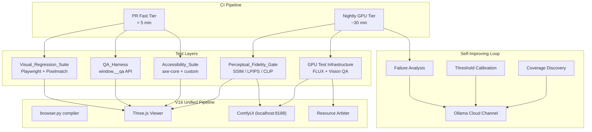
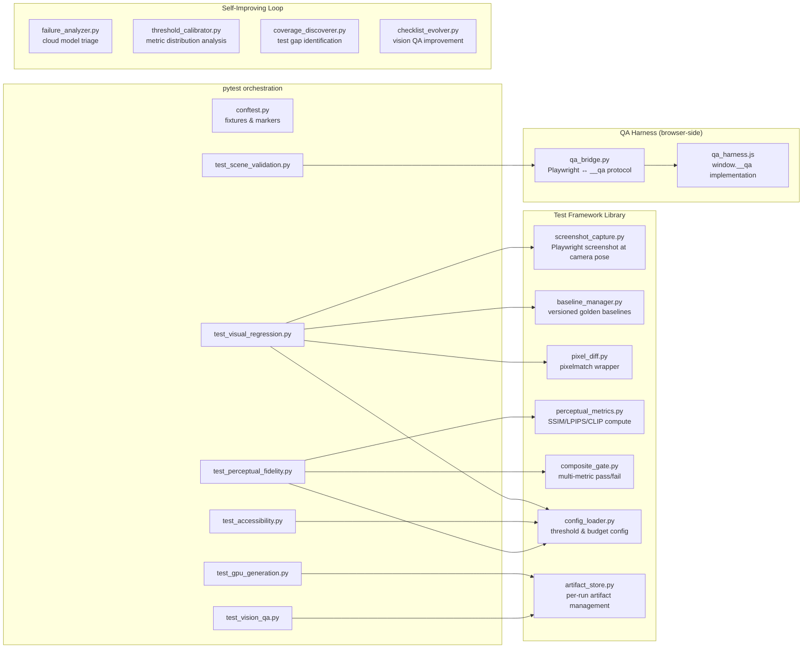
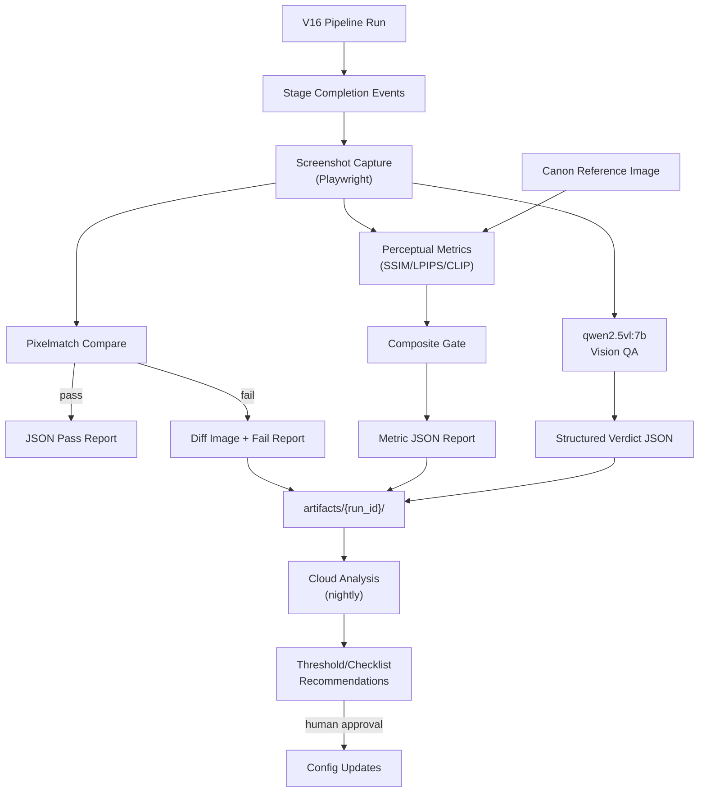

# Design Document — Comprehensive E2E Testing Framework

## Overview

This design specifies a five-layer end-to-end testing framework that validates the V16 Unified World Pipeline from conversation input to walkable 3D world output. The framework layers atop the existing functional E2E tests in `tests/e2e/test_v16_full_pipeline.py` and adds:

1. **Visual Regression Suite** — Playwright screenshot capture + pixelmatch comparison against golden baselines
2. **Perceptual Fidelity Gate** — SSIM/LPIPS/CLIP composite metric validation of Canon-to-World identity
3. **QA Harness** — `window.__qa` JavaScript API for programmatic 3D scene introspection
4. **Accessibility Suite** — axe-core + custom assertions for WCAG 2.1 AA compliance
5. **GPU Test Infrastructure** — Real FLUX generation, vision model semantic QA, and VRAM scheduling

The framework splits into two CI tiers:
- **PR Fast Tier** (< 5 min): Visual regression, QA harness validation, accessibility
- **Nightly GPU Tier**: Perceptual fidelity, real FLUX generation, vision QA, cloud model analysis

## Architecture

### System Context Diagram



### Integration Points

| Component | Existing Code | Integration Method |
|-----------|---------------|-------------------|
| Visual_Regression_Suite | `tests/e2e/test_v16_full_pipeline.py` | Extends existing Playwright fixtures |
| QA_Harness | `src/unified_pipeline/compilers/browser.py` | Injected into compiled viewer.js output |
| Perceptual_Fidelity_Gate | `src/unified_pipeline/canon_compare.py` | Reuses FidelityVerdict enums and comparison patterns |
| GPU Tests | `src/photo_pipeline/comfyui_client.py` | Uses existing ComfyUIClient with health_check() |
| VRAM Scheduling | `src/unified_pipeline/resource_arbiter.py` | Extends ResourceKind enum with test-specific consumers |
| Frontend Under Test | `src/web/static/unified_v16.js` | Tested via Playwright at `http://localhost:8000/?v=16` |

## Components and Interfaces

### Component Diagram



### QA Harness API Design (`window.__qa`)

**Decision: Compile-time injection into browser.py output**

The QA harness is injected at compile time by `browser.py` when the `?qa=1` parameter is detected at viewer initialization, rather than runtime injection via Playwright `addScriptTag()`. Rationale:
- The harness needs access to internal Three.js scene graph references (scene, camera, renderer) that are module-scoped in the viewer IIFE
- Runtime injection would require exposing these as globals, breaking the viewer's encapsulation
- Compile-time injection keeps the QA code co-located with the scene setup, making it version-stable

**Implementation:** The `_VIEWER_JS` template in `browser.py` gains a conditional block at the end:

```javascript
// QA Harness — only active when ?qa=1 is in the URL
if (new URLSearchParams(location.search).has("qa")) {
  window.__qa = Object.freeze({
    getObjectCount: () => Number,
    getObjectPosition: (objectId: string) => { x: Number, y: Number, z: Number } | null,
    getLighting: () => Array<{ type: string, position: {x,y,z}, color: string, intensity: number }>,
    triggerInteraction: (objectId: string, action: string) => Promise<{ success: boolean, state: object }>,
    getSceneGraph: () => Array<{ objectId: string, meshCount: number, position: {x,y,z} }>,
    captureFrame: () => Promise<string>,  // base64 PNG from preserveDrawingBuffer
    getRendererInfo: () => { antialias: boolean, preserveDrawingBuffer: boolean, seed: number },
  });
}
```

**Return Types:**

| Method | Returns | Notes |
|--------|---------|-------|
| `getObjectCount()` | `number` | Count of ObjectInstance meshes loaded |
| `getObjectPosition(id)` | `{x, y, z} \| null` | World-space position; null if not found |
| `getLighting()` | `Array<LightInfo>` | All active lights with type, position, color (#RRGGBB), intensity |
| `triggerInteraction(id, action)` | `Promise<InteractionResult>` | Triggers action, waits for physics settle, returns new state |
| `getSceneGraph()` | `Array<SceneNode>` | Full scene inventory for contract comparison |
| `captureFrame()` | `Promise<string>` | Base64 PNG of current frame (deterministic render) |
| `getRendererInfo()` | `RendererConfig` | Current renderer settings for determinism verification |

### Key Technical Decisions

#### 1. QA Harness Injection Strategy

**Decision:** Compile-time injection in `browser.py` viewer output, gated by URL parameter check at runtime.

The `BrowserCompiler.compile()` method appends the QA harness code block to the emitted `viewer.js`. The harness code is always present in the compiled output but only activates (`window.__qa` assignment) when `?qa=1` is detected in `location.search`. This means:
- No conditional compilation logic needed — one viewer build serves both production and test
- Zero overhead in production (the `if` check is negligible)
- Full access to module-scoped `scene`, `camera`, `renderer`, `contract`, and `manifest` variables

#### 2. VRAM Scheduling for Tests

**Decision:** Extend `ResourceKind` enum with `PERCEPTUAL_LPIPS`, `PERCEPTUAL_CLIP`, and `VISION_QA` kinds. Tests use the existing `UnifiedResourceArbiter.claim()` context manager.

Schedule ordering for nightly GPU tests:
1. ComfyUI FLUX generation (12 GB) — `ResourceKind.DREAM_FLUX`
2. Wait for FLUX completion + model unload via `hard_release()`
3. LPIPS model load (2 GB) — `ResourceKind.PERCEPTUAL_LPIPS`
4. CLIP model load (2 GB) — can coexist with LPIPS (total 4 GB)
5. Release perceptual models
6. Vision QA qwen2.5vl:7b (8 GB) — `ResourceKind.VISION_QA`

This sequential scheduling avoids the FLUX (12 GB) + vision (8 GB) = 20 GB combined requirement that would exceed typical 24 GB VRAM.

#### 3. Deterministic Screenshots Across GPU Drivers

**Decision:** Force a deterministic render configuration and accept driver-specific baselines.

Deterministic rendering requires:
- `antialias: false` on WebGLRenderer
- `preserveDrawingBuffer: true`
- Fixed random seed for any shader noise (passed as uniform)
- Fixed viewport size matching `CameraContract.raster_width/height`
- `renderer.outputColorSpace = THREE.SRGBColorSpace` (explicit, not driver default)

Golden baselines are hardware-specific. The baseline directory structure includes a hardware identifier (GPU model + driver version hash) so different CI runners with different GPUs maintain separate baseline sets. When a developer runs tests locally on different hardware, the system creates a new baseline rather than false-failing.

#### 4. Baseline Storage Strategy

**Decision:** Local directory under `tests/e2e/baselines/` committed to the repository, with baselines excluded from git LFS initially.

Rationale:
- Golden baselines are small PNGs (typically 50-200 KB each at 1920x1080)
- The pipeline has ~4 stages × a few camera poses = ~10-15 baseline images per model version
- Total baseline storage is manageable (< 5 MB per model version)
- Git LFS adds complexity without benefit at this scale
- DVC is overkill for deterministic screenshots that don't change often

If the baseline corpus grows beyond 50 MB, migrate to git LFS with `.gitattributes` rules for `tests/e2e/baselines/**/*.png`.

#### 5. Self-Improving Loop Cloud Communication

**Decision:** Use Ollama MCP tools (`ollama_chat` / `ollama_generate`) with cloud model routing.

The `Test_Improvement_Loop` communicates with cloud models via the existing Ollama infrastructure:
- **Failure analysis:** `glm-5.2:cloud` or `deepseek-v3.1:671b-cloud` for triage
- **Coverage discovery:** `qwen3-coder:480b-cloud` or `gpt-oss:120b-cloud` for test generation
- **Calibration:** `deepseek-v3.1:671b-cloud` for statistical analysis

All cloud interactions are:
- Triggered only by nightly/weekly schedules (never in PR CI)
- Bounded to specific prompt templates with structured JSON output schemas
- Stored as advisory artifacts requiring human approval before any change takes effect
- Rate-limited to avoid API cost spikes

## Data Models

### Data Flow Diagram



### Configuration Schema

```python
# tests/e2e/config/e2e_config.yaml
@dataclass
class VisualRegressionConfig:
    """Per-stage thresholds and capture settings."""
    stages: dict[str, StageConfig]  # stage_name → config
    default_viewport: tuple[int, int]  # (width, height)
    deterministic_seed: int  # Fixed RNG seed for shaders
    hardware_id: str  # Auto-detected GPU+driver hash

@dataclass
class StageConfig:
    """Configuration for a single pipeline stage."""
    camera_pose: CameraPose  # {position, target, up, vfov}
    diff_threshold_pct: float  # max % diff pixels (0.1 for Canon, 1.0 for Dream)
    enabled: bool  # skip stages not yet producing stable output

@dataclass
class PerceptualConfig:
    """Composite gate thresholds."""
    ssim_threshold: float  # default 0.85
    lpips_threshold: float  # default 0.3
    clip_cosine_threshold: float  # default 0.9
    calibration_corpus_dir: str  # path to known-good pairs

@dataclass
class VisionQAConfig:
    """Vision model oracle settings."""
    model_name: str  # "qwen2.5vl:7b"
    confidence_threshold: float  # 0.8
    checklist_path: str  # path to active checklist JSON
    blocking: bool  # false = advisory, true = fail on vision reject

@dataclass
class TimeBudgetConfig:
    """Execution time limits per layer."""
    visual_regression_s: int  # 120
    scene_validation_s: int  # 60
    accessibility_s: int  # 30
    perceptual_s: int  # 300 (nightly only)

@dataclass
class CloudConfig:
    """Self-improving loop settings."""
    failure_analysis_model: str  # "glm-5.2:cloud"
    coverage_model: str  # "qwen3-coder:480b-cloud"
    calibration_model: str  # "deepseek-v3.1:671b-cloud"
    calibration_trigger_runs: int  # 50
    evolution_trigger_verdicts: int  # 20
```

### Configuration File (`tests/e2e/config/e2e_config.yaml`)

```yaml
visual_regression:
  deterministic_seed: 42
  default_viewport: [1920, 1080]
  stages:
    dream_preview:
      diff_threshold_pct: 1.0
      enabled: true
    blockout:
      diff_threshold_pct: 1.0
      enabled: true
    canon:
      diff_threshold_pct: 0.1
      enabled: true
    world:
      diff_threshold_pct: 0.1
      enabled: true

perceptual:
  ssim_threshold: 0.85
  lpips_threshold: 0.3
  clip_cosine_threshold: 0.9
  calibration_corpus_dir: "tests/e2e/calibration_corpus/"

vision_qa:
  model_name: "qwen2.5vl:7b"
  confidence_threshold: 0.8
  checklist_path: "tests/e2e/config/vision_qa_checklist.json"
  blocking: false

time_budgets:
  visual_regression_s: 120
  scene_validation_s: 60
  accessibility_s: 30
  perceptual_s: 300

cloud:
  failure_analysis_model: "glm-5.2:cloud"
  coverage_model: "qwen3-coder:480b-cloud"
  calibration_model: "deepseek-v3.1:671b-cloud"
  calibration_trigger_runs: 50
  evolution_trigger_verdicts: 20

baselines:
  storage_dir: "tests/e2e/baselines/"
  require_approval: true
  max_corpus_size_mb: 50
```

### Baseline Directory Structure

```
tests/e2e/baselines/
├── v16-model-a1b2c3/              # model version identifier
│   ├── rtx4090-driver560/         # hardware identifier
│   │   ├── dream_preview.png
│   │   ├── dream_preview.meta.json
│   │   ├── blockout.png
│   │   ├── blockout.meta.json
│   │   ├── canon.png
│   │   ├── canon.meta.json
│   │   ├── world.png
│   │   └── world.meta.json
│   └── rtx3080-driver555/
│       └── ...
└── v16-model-d4e5f6/
    └── ...
```

### Baseline Metadata Sidecar (`*.meta.json`)

```json
{
  "created_at": "2026-07-30T14:22:00Z",
  "commit_hash": "a1b2c3d4e5f6",
  "model_version": "v16-model-a1b2c3",
  "hardware_id": "rtx4090-driver560",
  "viewport": [1920, 1080],
  "stage": "canon",
  "camera_pose": {
    "position": [0, 1.6, 3.0],
    "target": [0, 1.0, 0],
    "up": [0, 1, 0],
    "vfov": 60
  },
  "deterministic_seed": 42,
  "approved_by": "PR #142",
  "approved_at": "2026-07-30T15:00:00Z"
}
```

### File Structure

```
tests/e2e/
├── config/
│   ├── e2e_config.yaml                    # Main configuration
│   ├── vision_qa_checklist.json           # Active 7-category checklist
│   ├── vision_qa_checklist_proposed.json   # Proposed revision (cloud-generated)
│   └── threshold_recommendations.json     # Cloud calibration output
├── baselines/                             # Golden baselines (per model+hardware)
│   └── {model_version}/{hardware_id}/
├── artifacts/                             # Per-run test outputs
│   └── {run_id}/
│       ├── visual/
│       ├── perceptual/
│       ├── scene/
│       ├── accessibility/
│       ├── gpu/
│       ├── vision_qa/
│       └── cloud_analysis.json
├── proposed/                              # Cloud-proposed tests awaiting approval
│   └── test_proposed_*.py
├── calibration_corpus/                    # Known-good Canon/World pairs
├── framework/
│   ├── __init__.py
│   ├── screenshot_capture.py             # Playwright screenshot at fixed pose
│   ├── baseline_manager.py               # Versioned baseline CRUD
│   ├── pixel_diff.py                     # Pixelmatch wrapper
│   ├── perceptual_metrics.py             # SSIM/LPIPS/CLIP computation
│   ├── composite_gate.py                 # Multi-metric pass/fail logic
│   ├── config_loader.py                  # YAML config → dataclasses
│   ├── artifact_store.py                 # Run artifact organization
│   ├── qa_bridge.py                      # Python ↔ window.__qa protocol
│   ├── vision_oracle.py                  # qwen2.5vl integration
│   └── deterministic_render.py           # Renderer config for determinism
├── improvement/
│   ├── __init__.py
│   ├── failure_analyzer.py               # Cloud model failure triage
│   ├── threshold_calibrator.py           # Metric distribution → thresholds
│   ├── coverage_discoverer.py            # Test gap identification
│   └── checklist_evolver.py              # Vision QA checklist improvement
├── conftest.py                           # Shared fixtures (extended)
├── test_v16_full_pipeline.py             # Existing functional E2E (unchanged)
├── test_visual_regression.py             # Visual regression tests
├── test_scene_validation.py              # QA harness 3D validation
├── test_accessibility.py                 # Accessibility tests
├── test_perceptual_fidelity.py           # Perceptual gate tests (@nightly)
├── test_gpu_generation.py                # Real FLUX tests (@gpu)
└── test_vision_qa.py                     # Vision model semantic QA (@gpu)
```

### CI Pipeline Design

```mermaid
flowchart LR
    subgraph PR["PR Fast Tier (< 5 min)"]
        direction TB
        Lint["Lint + Type Check"]
        Unit["Unit Tests"]
        VR["Visual Regression<br/>(120s budget)"]
        Scene["Scene Validation<br/>(60s budget)"]
        A11y["Accessibility<br/>(30s budget)"]
    end

    subgraph Nightly["Nightly GPU Tier (~30 min)"]
        direction TB
        FLUX["Real FLUX Generation"]
        Perceptual["Perceptual Fidelity<br/>(SSIM/LPIPS/CLIP)"]
        VisionQA["Vision QA<br/>(qwen2.5vl:7b)"]
        CloudAnalysis["Cloud Failure Analysis"]
    end

    subgraph Weekly["Weekly Improvement"]
        direction TB
        Coverage["Coverage Discovery"]
        CalibCheck["Calibration Check"]
        Evolve["Checklist Evolution"]
    end

    PR --> Nightly
    Nightly --> Weekly
```



**PR Fast Tier:**
- Triggered on every PR push
- Runs: `pytest tests/e2e/ -m "not nightly and not gpu" --timeout=300`
- Includes: visual regression, scene validation, accessibility
- Budget: 120s + 60s + 30s + overhead < 300s total

**Nightly GPU Tier:**
- Triggered on cron schedule (2 AM UTC)
- Runs: `pytest tests/e2e/ -m "nightly or gpu" --timeout=1800`
- Requires: NVIDIA GPU runner with 24 GB VRAM
- Includes: perceptual fidelity, FLUX generation, vision QA
- Posts: cloud analysis to `artifacts/{run_id}/cloud_analysis.json`

**Weekly Improvement:**
- Triggered on cron schedule (Sunday 4 AM UTC)
- Runs: coverage discovery, calibration check, checklist evolution
- Outputs: proposed changes to `tests/e2e/proposed/` and `tests/e2e/config/`
- Requires: human PR review before any change is promoted

## Correctness Properties

*A property is a characteristic or behavior that should hold true across all valid executions of a system — essentially, a formal statement about what the system should do. Properties serve as the bridge between human-readable specifications and machine-verifiable correctness guarantees.*

### Property 1: Deterministic Render Idempotence

*For any* valid Three.js scene rendered with deterministic settings (antialias off, fixed seed, preserveDrawingBuffer), two consecutive renders from the identical camera pose SHALL produce byte-identical PNG output.

**Validates: Requirements 1.2**

### Property 2: Screenshot Filename Encoding Completeness

*For any* combination of stage name, pipeline model version, and capture timestamp, the screenshot filename SHALL encode all three components such that each can be unambiguously parsed back from the filename string.

**Validates: Requirements 2.5**

### Property 3: Threshold Gate Correctness

*For any* measured metric value and configured threshold, the gate decision SHALL be:
- SSIM: pass iff value >= threshold
- LPIPS: pass iff value <= threshold  
- CLIP_Cosine: pass iff value >= threshold

And the composite gate SHALL pass if and only if all individual metric gates pass independently.

**Validates: Requirements 3.2, 3.4, 5.2, 5.3, 5.4, 5.5**

### Property 4: Composite Gate Failure Reporting

*For any* metric that fails its threshold check, the failure report SHALL contain the metric name, measured value, configured threshold, and computed delta (difference between measured and threshold).

**Validates: Requirements 5.6**

### Property 5: Baseline Version Isolation

*For any* pipeline model version string, golden baselines SHALL be stored under a directory path that includes that version, and baselines from different model versions SHALL never share a directory.

**Validates: Requirements 4.1, 4.3**

### Property 6: Metric Report Completeness

*For any* perceptual metric computation (pass or fail), the structured JSON report SHALL contain all computed values (SSIM, LPIPS, CLIP_Cosine), their thresholds, the pass/fail status, and a timestamp.

**Validates: Requirements 6.3**

### Property 7: QA Harness Object Count Consistency

*For any* compiled Three.js scene with N ObjectInstance entries in the WorldContract, `window.__qa.getObjectCount()` SHALL return exactly N.

**Validates: Requirements 7.3, 8.1**

### Property 8: QA Harness Position Fidelity

*For any* named object in the WorldContract, `window.__qa.getObjectPosition(objectId)` SHALL return a position within the configured tolerance (default 0.01 world units Euclidean distance) of the WorldContract-specified position.

**Validates: Requirements 7.4, 8.2**

### Property 9: Lighting Validation Tolerance Correctness

*For any* lighting parameter comparison, the validation SHALL apply the correct tolerance per parameter type: 0.01 for position components, 0.02 for RGB color components, and 5% for intensity. Parameters within tolerance SHALL pass; parameters exceeding tolerance SHALL fail with the specific parameter, expected value, actual value, and delta reported.

**Validates: Requirements 9.1, 9.2, 9.3**

### Property 10: Accessibility Violation Severity Routing

*For any* axe-core violation result, violations with "critical" or "serious" impact SHALL cause test failure, while violations with "moderate" or "minor" impact SHALL be logged as warnings without causing failure.

**Validates: Requirements 11.2, 11.3**

### Property 11: Contrast Ratio Enforcement

*For any* text element in the HUD overlay, the computed contrast ratio against its background SHALL be checked against the 4.5:1 WCAG AA threshold, and failures SHALL report the element selector, foreground color, background color, and actual ratio.

**Validates: Requirements 13.1, 13.2**

### Property 12: Stage Transition Announcement

*For any* pipeline stage transition, the `aria-live="polite"` region SHALL be updated with a human-readable stage name (containing spaces and capitalization, not underscored machine identifiers).

**Validates: Requirements 14.1, 14.3**

### Property 13: Arrow Key Movement Equivalence

*For any* movement input sequence, applying that sequence via arrow keys SHALL produce the same camera displacement as applying the equivalent sequence via WASD keys.

**Validates: Requirements 16.1**

### Property 14: Health Check Retry Timing

*For any* health check failure sequence, retries SHALL follow exponential backoff with delays of 2s, 4s, and 8s (3 retries maximum), and the failure report SHALL include attempt count, total elapsed time, and last error received.

**Validates: Requirements 17.1, 17.3**

### Property 15: Generated Image Validity

*For any* image generated by the FLUX pipeline via ComfyUI, the output SHALL have dimensions of at least 512×512 pixels and valid PNG or JPEG encoding (parseable by standard image libraries without error).

**Validates: Requirements 18.3**

### Property 16: Artifact Endpoint Correctness

*For any* completed stage artifact served via API, the response SHALL have HTTP 200, correct Content-Type (image/png or image/jpeg), file size > 1KB, and Cache-Control: no-store header.

**Validates: Requirements 19.1, 19.3, 19.4**

### Property 17: Vision Verdict Structure

*For any* response from the qwen2.5vl:7b vision model, the structured output SHALL contain `pass` (boolean), `failed_checks` (list of strings), and `confidence` (float 0.0–1.0). Auto-acceptance SHALL occur only when `pass == true` AND `confidence >= 0.8`.

**Validates: Requirements 20.2, 20.3**

### Property 18: VRAM Lease Release Timing

*For any* VRAM lease acquired for perceptual metric computation, the lease SHALL be released (model unloaded) within 5 seconds of the metric computation completing.

**Validates: Requirements 21.3**

### Property 19: Test Artifact Organization

*For any* test run, all artifacts SHALL be stored under `tests/e2e/artifacts/{run_id}/` with subdirectories for each layer (visual, perceptual, scene, accessibility, gpu, vision_qa), and any test failure output SHALL include the artifact directory path.

**Validates: Requirements 23.4, 23.5**

### Property 20: Cloud Analysis Verdict Routing

*For any* cloud model analysis result with `confidence >= 0.8`, the system SHALL:
- Tag tests categorized as "flaky" for retry-tolerance review
- Propose updated threshold values for tests categorized as "threshold"

And all analysis results SHALL be stored in `tests/e2e/artifacts/{run_id}/cloud_analysis.json`.

**Validates: Requirements 24.3, 24.4, 24.5**

### Property 21: Proposed Test Format Validity

*For any* test case proposed by the coverage discovery cloud model, the output SHALL be a syntactically valid pytest file with a `@pytest.mark.proposed` marker, stored in `tests/e2e/proposed/`.

**Validates: Requirements 25.3**

### Property 22: Threshold Recommendation Structure

*For any* calibration recommendation output, the JSON SHALL contain per-metric threshold values with justification text explaining the statistical basis (mean, std, percentiles) for the recommendation.

**Validates: Requirements 26.3**

## Error Handling

### Error Categories and Recovery

| Error Source | Error Type | Recovery Strategy |
|--------------|-----------|-------------------|
| ComfyUI unavailable | `ComfyUIError` | Retry 3× with exponential backoff; skip GPU tests if all fail |
| VRAM contention | `ResourceOwnershipTimeout` | Wait up to 60s; skip metric with "vram_contention_timeout" status |
| ComfyUI OOM | `ComfyUIVRAMError` | Hard release + retry once; skip on second OOM |
| Vision model unavailable | Ollama timeout | Skip semantic validation with "vision_qa_unavailable" |
| Baseline missing | File not found | Create new baseline, mark "baseline_created" (not failure) |
| Pixelmatch comparison failure | Threshold exceeded | Store diff image, fail test with artifact path |
| Cloud model unavailable | HTTP/connection error | Skip analysis, log warning, continue |
| Screenshot capture timeout | Playwright timeout | Abort test with descriptive error |
| WebGL context lost | Browser crash | Retry browser context once; abort on second failure |
| Config file missing/invalid | Parse error | Fail fast with descriptive error identifying missing field |

### Graceful Degradation Hierarchy

The test framework degrades gracefully when GPU resources are unavailable:

1. **Full capability** — All tiers run (PR + nightly + weekly)
2. **No GPU** — PR tier runs normally; nightly skips GPU/vision tests
3. **No ComfyUI** — PR tier runs normally; nightly skips FLUX tests, runs perceptual with cached images
4. **No Ollama** — All test tiers run; cloud analysis/improvement loop skipped
5. **No baselines** — Visual regression creates baselines without failing

### Timeout Budget Enforcement

Each test layer enforces its time budget via pytest fixtures:

```python
@pytest.fixture(autouse=True)
def enforce_budget(request, e2e_config):
    """Abort individual tests that exceed their layer's time budget."""
    layer = request.node.get_closest_marker("layer")
    if layer:
        budget = e2e_config.time_budgets[layer.args[0]]
        request.node.add_marker(pytest.mark.timeout(budget))
```

## Testing Strategy

### Dual Testing Approach

**Unit Tests (pytest + Hypothesis):**
- Test framework library functions in isolation (threshold logic, filename encoding, config parsing)
- Property-based tests for correctness properties using Hypothesis (minimum 100 iterations)
- Mock external dependencies (Playwright, ComfyUI, Ollama, filesystem)
- Fast execution (< 30s for full unit suite)

**Integration / E2E Tests (Playwright):**
- Test the framework against the real pipeline with real browser
- Exercise the full data flow from pipeline run to artifact storage
- Require running services (web server, optionally ComfyUI/Ollama)
- Split into PR fast tier and nightly GPU tier

### Property-Based Testing Configuration

- **Library:** Hypothesis (already in use — `.hypothesis/examples/` exists in repo)
- **Minimum iterations:** 100 per property (Hypothesis default `max_examples=100`)
- **Tag format:** `# Feature: comprehensive-e2e-testing, Property N: {title}`

Properties 1–22 map to Hypothesis tests in `tests/unit/test_e2e_framework_properties.py`:
- Properties 3, 4, 6: Test composite gate logic with generated metric values
- Properties 5, 2: Test baseline manager with generated version/filename strings
- Properties 7, 8, 9: Test QA bridge validation logic with generated scene data
- Properties 10, 11, 12: Test accessibility assertion logic with generated violations
- Properties 14, 17, 20, 21, 22: Test improvement loop logic with generated verdicts

### Test Markers

```python
# pytest markers for CI tier segmentation
pytest.mark.nightly   # Perceptual fidelity tests (GPU, long-running)
pytest.mark.gpu       # Tests requiring NVIDIA GPU (FLUX, vision QA)
pytest.mark.proposed  # Cloud-proposed tests awaiting approval
pytest.mark.layer("visual")  # Time budget enforcement
pytest.mark.layer("scene")
pytest.mark.layer("accessibility")
```

