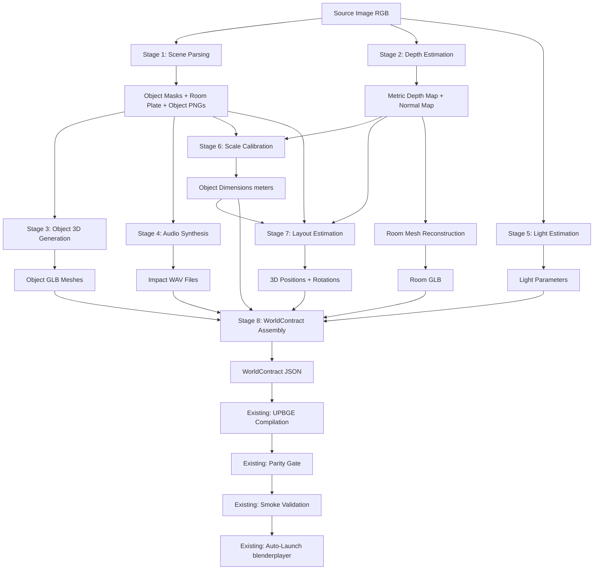
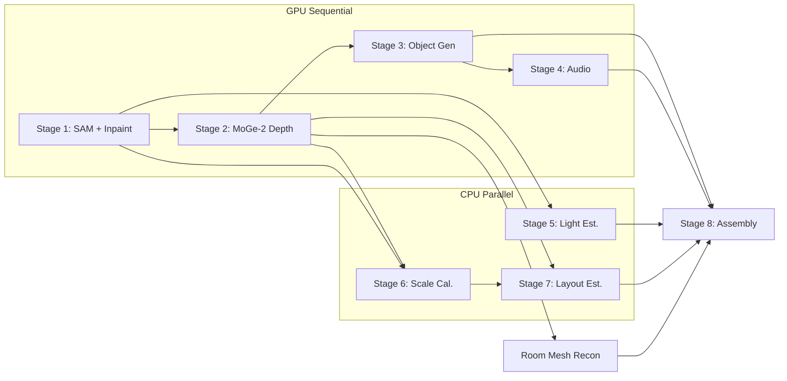
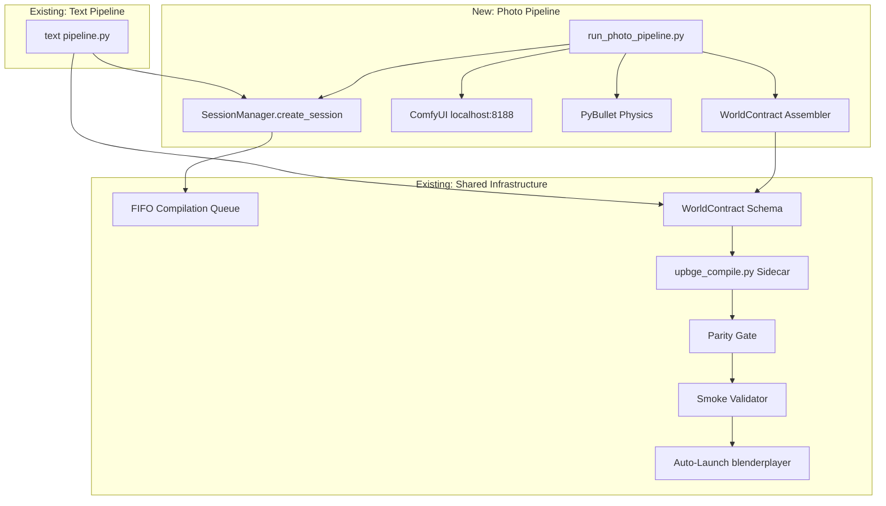

# Design Document: Photo-to-Playable-World Pipeline

## Overview

This design defines the architecture for transforming a single RGB photograph of an indoor scene into a fully playable 3D game world via UPBGE 0.50. The pipeline performs eight major stages — segmentation, depth estimation, 3D mesh generation, audio synthesis, light estimation, scale calibration, layout estimation, and WorldContract assembly — before handing off to the existing UPBGE compilation and auto-launch chain.

The photo pipeline operates as an alternative input mode alongside the existing text-to-world pipeline. Both pipelines converge at the WorldContract schema, reusing the same UPBGE compiler (`upbge_compile.py`), parity gates, smoke validation (`smoke_validator.py`), and blenderplayer auto-launch (`auto_launch.py`).

### Design Rationale

The key architectural decisions are:

1. **ComfyUI as the GPU inference server** — Stages 1-4 (segmentation, depth, 3D generation, audio) execute as ComfyUI workflow JSON submissions to localhost:8188. This avoids managing CUDA contexts directly and leverages ComfyUI's model management for VRAM sequencing.

2. **Sequential GPU stages, parallel CPU stages** — Only one GPU model is loaded at a time (SAM → MoGe-2 → Hunyuan3D → audio). CPU-bound stages (light estimation, scale calibration, layout) run in parallel where dependencies allow.

3. **WorldContract as the convergence point** — The photo pipeline produces the exact same `WorldContract` Pydantic model as the text pipeline. No schema changes required. The assembler maps photo-pipeline artifacts (meshes, depth, layout) into `RoomShell`, `WorldInstance`, `MaterialIntent`, `WorldLight`, `PhysicsIntent`, and `CameraBinding` entries.

4. **Graceful degradation over pipeline abort** — Every stage has a fallback. Object generation chains through Hunyuan3D → Unique3D → TripoSR → placeholder. Depth falls back to flat-floor heuristic. Audio falls back to a sound bank. The pipeline always produces a WorldContract as long as a room mesh exists.

5. **PyBullet for physics settle** — Pre-player gravity simulation uses PyBullet (faster than UPBGE headless for candidate evaluation). V-HACD compound shapes are generated during UPBGE compilation, but the settle step uses simplified convex hulls.

### Performance Budget (RTX 4090, 10 objects)

| Stage | Target | Notes |
|-------|--------|-------|
| Scene Parsing (SAM + Inpaint) | 30-60s | SAM ViT-H ~10s, Flux.1-Fill inpaint ~20-40s |
| Depth Estimation (MoGe-2) | 10-20s | Single forward pass |
| Object Generation (per object) | 30-90s | Hunyuan3D 2.0; 2 concurrent GPU tasks |
| Audio Synthesis (per object) | 5-15s | ComfyUI audio or sound bank lookup |
| Light Estimation | 2-5s | CPU heuristic or lightweight inverse rendering |
| Scale Calibration | <1s | Pure computation |
| Layout Estimation + Settle | 5-15s | Back-projection + PyBullet 500 iterations |
| WorldContract Assembly | <1s | Pydantic construction + validation |
| UPBGE Compilation | 30-60s | Existing sidecar (includes V-HACD, LOD) |
| Auto-Launch | <5s | blenderplayer subprocess |
| **Total (10 objects)** | **5-8 min** | Target; 15 min hard cap |

### VRAM Management Strategy

```
Stage 1: Load SAM ViT-H + Flux.1-Fill → segment + inpaint → unload
Stage 2: Load MoGe-2 → depth map → unload
Stage 3: Load Hunyuan3D 2.0 → per-object mesh gen → unload between objects if needed
Stage 4: Load audio model → per-object audio → unload
```

All model loading/unloading is handled by `comfy.model_management` via ComfyUI's workflow execution — submitting a new workflow naturally triggers the model swap.

## Architecture

### Pipeline Flow



### Stage Dependency Graph (Parallelism)



### Integration with Existing Infrastructure



## Components and Interfaces

### 1. Pipeline Orchestrator (`src/photo_pipeline/orchestrator.py`)

The top-level coordinator that manages stage execution, error handling, and session lifecycle.

```python
@dataclass
class PhotoPipelineConfig:
    comfyui_url: str = "http://localhost:8188"
    max_objects: int = 30
    min_mask_area_pct: float = 0.5
    object_gen_timeout_s: int = 120
    physics_settle_iterations: int = 500
    physics_settle_timeout_s: float = 5.0
    gpu_concurrency: int = 2
    cpu_concurrency: int = 4
    pipeline_timeout_s: int = 1200  # 20 minutes
    vhacd_timeout_s: int = 30
    vhacd_max_hulls: int = 16
    vhacd_voxel_resolution: int = 10000
    lod_levels: tuple[float, ...] = (1.0, 0.5, 0.25, 0.1)

@dataclass
class StageResult:
    stage_name: str
    success: bool
    duration_s: float
    reason_code: str
    diagnostics: str
    artifacts: dict[str, Path]  # artifact_name → file path
    fallback_used: str | None = None

@dataclass
class PipelineManifest:
    session_id: str
    source_type: Literal["photo"] = "photo"
    source_image_path: Path
    stages: list[StageResult]
    objects: list[ObjectManifestEntry]
    quality_classification: Literal["full", "degraded", "minimal"]
    total_duration_s: float
    world_contract_path: Path | None = None

class PhotoPipelineOrchestrator:
    async def run(self, image_path: Path, session_id: str) -> PipelineManifest: ...
    async def _validate_input(self, image_path: Path) -> None: ...
    async def _check_comfyui_health(self) -> None: ...
    async def _execute_stage(self, stage: PipelineStage, inputs: dict) -> StageResult: ...
    async def _emit_progress(self, stage: str, status: str) -> None: ...
```

### 2. Scene Parser (`src/photo_pipeline/stages/scene_parser.py`)

Invokes SAM ViT-H segmentation and Flux.1-Fill inpainting via ComfyUI workflows.

```python
@dataclass
class SegmentedObject:
    mask_id: str
    bbox: tuple[int, int, int, int]  # x, y, width, height in pixels
    area_px: int
    centroid_px: tuple[float, float]  # x, y in pixels
    object_png_path: Path

@dataclass
class SceneParseResult:
    room_plate_path: Path
    objects: list[SegmentedObject]
    background_mask_path: Path

class SceneParser:
    async def parse(self, source_image: Path, config: PhotoPipelineConfig) -> SceneParseResult: ...
    def _build_sam_workflow(self, image_path: Path) -> dict: ...
    def _build_inpaint_workflow(self, image_path: Path, masks: list) -> dict: ...
    def _filter_masks(self, masks: list, image_area: int, config: PhotoPipelineConfig) -> list: ...
    def _extract_object_pngs(self, source: Path, masks: list, output_dir: Path) -> list[Path]: ...
```

### 3. Depth Estimator (`src/photo_pipeline/stages/depth_estimator.py`)

Produces metric depth via MoGe-2 and derives normal maps.

```python
@dataclass
class DepthResult:
    depth_map_path: Path  # .npy float32 array, meters
    normal_map_path: Path  # .npy float32 array, [H, W, 3]
    valid_pixel_ratio: float  # 0.0-1.0
    depth_range_m: tuple[float, float]  # min, max valid depth

class DepthEstimator:
    async def estimate(self, source_image: Path, config: PhotoPipelineConfig) -> DepthResult: ...
    def _build_moge2_workflow(self, image_path: Path) -> dict: ...
    def _compute_normals(self, depth_map: np.ndarray) -> np.ndarray: ...
    def _validate_depth_map(self, depth_map: np.ndarray) -> float: ...  # returns valid ratio
```

### 4. Room Mesh Reconstructor (`src/photo_pipeline/stages/room_reconstructor.py`)

Converts depth map + room plate into a textured GLB mesh.

```python
@dataclass
class RoomMeshResult:
    mesh_path: Path  # GLB
    dimensions_m: tuple[float, float, float]  # width, height, depth
    vertex_count: int
    face_count: int
    used_heuristic: bool  # True if flat-floor fallback was used

class RoomReconstructor:
    async def reconstruct(
        self, depth_map: Path, room_plate: Path, config: PhotoPipelineConfig
    ) -> RoomMeshResult: ...
    def _point_cloud_to_mesh(self, depth: np.ndarray, texture: np.ndarray) -> trimesh.Trimesh: ...
    def _flat_floor_fallback(self, aspect_ratio: float) -> trimesh.Trimesh: ...
```

### 5. Object Generator (`src/photo_pipeline/stages/object_generator.py`)

3D mesh generation with fallback chain.

```python
@dataclass
class ObjectMeshResult:
    mesh_path: Path  # GLB
    method_used: Literal["hunyuan3d", "unique3d", "triposr", "placeholder"]
    generation_time_s: float
    face_count: int
    vertex_count: int

class ObjectGenerator:
    async def generate(
        self, object_png: Path, mask_id: str, config: PhotoPipelineConfig
    ) -> ObjectMeshResult: ...
    async def _try_hunyuan3d(self, object_png: Path) -> trimesh.Trimesh | None: ...
    async def _try_unique3d(self, object_png: Path) -> trimesh.Trimesh | None: ...
    async def _try_triposr(self, object_png: Path) -> trimesh.Trimesh | None: ...
    def _create_placeholder(self, object_png: Path) -> trimesh.Trimesh: ...
    def _validate_mesh(self, mesh: trimesh.Trimesh) -> bool: ...
```

### 6. Audio Synthesizer (`src/photo_pipeline/stages/audio_synthesizer.py`)

Per-object impact sound generation.

```python
@dataclass
class AudioResult:
    wav_path: Path
    method_used: Literal["comfyui_audio", "sound_bank", "default"]
    duration_s: float
    material_category: str  # wood, metal, glass, fabric, ceramic, plastic

class AudioSynthesizer:
    async def synthesize(
        self, object_png: Path, mask_id: str, config: PhotoPipelineConfig
    ) -> AudioResult: ...
    def _estimate_material(self, object_png: Path) -> str: ...
    def _lookup_sound_bank(self, material: str) -> Path | None: ...
    def _normalize_audio(self, wav_path: Path, target_dbfs: float = -3.0) -> None: ...
```

### 7. Light Estimator (`src/photo_pipeline/stages/light_estimator.py`)

Estimates scene lighting from the source image.

```python
@dataclass
class LightEstimateResult:
    sun_direction: tuple[float, float, float]  # normalized 3D vector (WorldContract coords)
    color_temperature_k: int  # 1800-12000
    intensity: float  # 0.0-100.0
    ambient_intensity: float  # 0.0-1.0
    ambient_color: str  # hex color
    confidence: float  # 0.0-1.0

class LightEstimator:
    async def estimate(self, source_image: Path) -> LightEstimateResult: ...
    def _analyze_shadows(self, image: np.ndarray) -> tuple[float, float, float]: ...
    def _estimate_color_temperature(self, image: np.ndarray) -> int: ...
    def _default_light(self) -> LightEstimateResult: ...
```

### 8. Scale Calibrator (`src/photo_pipeline/stages/scale_calibrator.py`)

Converts pixel measurements to real-world meters.

```python
@dataclass
class ScaleResult:
    dimensions_m: tuple[float, float, float]  # width, height, depth
    scale_factor: float
    confidence: float  # 0.0-1.0

class ScaleCalibrator:
    def calibrate(
        self,
        object: SegmentedObject,
        depth_map: np.ndarray,
        camera_fov_deg: float,
        image_size: tuple[int, int],
        room_dimensions_m: tuple[float, float, float],
    ) -> ScaleResult: ...
    def _pixel_to_meters(self, pixel_size: float, depth_m: float, fov_deg: float, image_dim: int) -> float: ...
    def _clamp_dimensions(self, dims: tuple, room_dims: tuple) -> tuple: ...
```

### 9. Layout Estimator (`src/photo_pipeline/stages/layout_estimator.py`)

Back-projects 2D positions to 3D and runs physics settle.

```python
@dataclass
class LayoutResult:
    position_m: tuple[float, float, float]
    rotation_deg: tuple[float, float, float]
    settled: bool  # True if physics converge
    pre_settle_position_m: tuple[float, float, float]

class LayoutEstimator:
    def estimate(
        self,
        objects: list[SegmentedObject],
        scales: list[ScaleResult],
        depth_map: np.ndarray,
        camera_fov_deg: float,
        image_size: tuple[int, int],
    ) -> list[LayoutResult]: ...
    def _back_project(self, centroid_px: tuple, depth_m: float, fov: float, img_size: tuple) -> tuple: ...
    def _physics_settle(self, positions: list, dimensions: list, config: PhotoPipelineConfig) -> list: ...
```

### 10. WorldContract Assembler (`src/photo_pipeline/stages/assembler.py`)

Maps all stage outputs into the existing WorldContract schema.

```python
class PhotoWorldContractAssembler:
    def assemble(
        self,
        room_mesh: RoomMeshResult,
        objects: list[ObjectMeshResult],
        audio: list[AudioResult],
        lights: LightEstimateResult,
        scales: list[ScaleResult],
        layouts: list[LayoutResult],
        segments: list[SegmentedObject],
        session_id: str,
        source_image: Path,
    ) -> WorldContract: ...
    def _build_room_shell(self, room_mesh: RoomMeshResult) -> RoomShell: ...
    def _build_instance(self, obj: ObjectMeshResult, scale: ScaleResult, layout: LayoutResult, seg: SegmentedObject) -> WorldInstance: ...
    def _build_physics_intent(self, obj: ObjectMeshResult, scale: ScaleResult, material: str) -> PhysicsIntent: ...
    def _build_lights(self, light_est: LightEstimateResult) -> list[WorldLight]: ...
    def _build_camera(self, source_image: Path, room_dims: tuple) -> CameraBinding: ...
    def _estimate_mass_kg(self, volume_m3: float, material: str) -> float: ...
```

### 11. ComfyUI Client (`src/photo_pipeline/comfyui_client.py`)

Shared HTTP client for submitting workflows and retrieving results.

```python
class ComfyUIClient:
    def __init__(self, base_url: str = "http://localhost:8188"): ...
    async def health_check(self) -> bool: ...
    async def submit_workflow(self, workflow: dict, timeout_s: int = 300) -> dict: ...
    async def get_output_image(self, prompt_id: str, node_id: str) -> Path: ...
    async def get_output_mesh(self, prompt_id: str, node_id: str) -> Path: ...
    async def wait_for_completion(self, prompt_id: str, timeout_s: int) -> dict: ...
```

### 12. Collision and LOD Generator (`src/photo_pipeline/stages/collision_lod.py`)

Generates V-HACD compound collision shapes and LOD variants.

```python
@dataclass
class CollisionResult:
    collision_mesh_path: Path
    method: Literal["vhacd", "convex_hull", "bounding_box"]
    hull_count: int

@dataclass
class LODResult:
    lod_paths: dict[int, Path]  # level → GLB path (0=full, 1=50%, 2=25%, 3=10%)
    face_counts: dict[int, int]

class CollisionLODGenerator:
    def generate_collision(self, mesh_path: Path, config: PhotoPipelineConfig) -> CollisionResult: ...
    def generate_lod(self, mesh_path: Path, config: PhotoPipelineConfig) -> LODResult: ...
    def _run_vhacd(self, mesh: trimesh.Trimesh, config: PhotoPipelineConfig) -> trimesh.Trimesh | None: ...
    def _decimate(self, mesh: trimesh.Trimesh, ratio: float) -> trimesh.Trimesh: ...
```

## Data Models

### Pipeline Manifest Schema

The pipeline manifest captures all intermediate results and degradation paths for debugging and re-execution.

```python
@dataclass
class ObjectManifestEntry:
    mask_id: str
    bbox_px: tuple[int, int, int, int]
    area_px: int
    centroid_px: tuple[float, float]
    object_png_path: Path
    mesh_path: Path | None
    mesh_method: Literal["hunyuan3d", "unique3d", "triposr", "placeholder"] | None
    mesh_gen_time_s: float
    audio_path: Path | None
    audio_method: Literal["comfyui_audio", "sound_bank", "default"] | None
    material_category: str
    scale_m: tuple[float, float, float]
    scale_confidence: float
    position_m: tuple[float, float, float]
    rotation_deg: tuple[float, float, float]
    settled: bool
    collision_method: Literal["vhacd", "convex_hull", "bounding_box"] | None
    lod_levels: int
    fallbacks_triggered: list[str]  # e.g. ["hunyuan3d_timeout", "unique3d_failed"]
```

### Session Metadata Extension

```python
# Added to existing WorldSession or stored alongside
@dataclass
class PhotoSessionMetadata:
    source_type: Literal["photo"] = "photo"
    source_image_path: Path
    source_image_hash: str  # SHA-256
    source_resolution: tuple[int, int]
    quality_classification: Literal["full", "degraded", "minimal"]
    object_count: int
    primary_methods_succeeded: int  # objects using primary generator
    fallbacks_used: int
    total_pipeline_duration_s: float
```

### ComfyUI Workflow Schemas

Each GPU stage uses a JSON workflow template. Templates are stored in `src/photo_pipeline/workflows/`:

| File | Stage | Model |
|------|-------|-------|
| `sam_segment.json` | Scene Parsing | SAM ViT-H |
| `flux_inpaint.json` | Scene Parsing | Flux.1-Fill |
| `moge2_depth.json` | Depth Estimation | MoGe-2 |
| `hunyuan3d_gen.json` | Object Generation | Hunyuan3D 2.0 |
| `unique3d_gen.json` | Object Generation (fallback) | Unique3D |
| `triposr_gen.json` | Object Generation (fallback) | TripoSR |
| `audio_impact.json` | Audio Synthesis | ComfyUI audio nodes |

### File Naming Convention (Session Output Directory)

```
output/sessions/{session_id}/
├── source.png                    # Input image (copied)
├── manifest.json                 # Pipeline manifest
├── masks/
│   ├── mask_001.png              # Per-object binary masks
│   ├── mask_002.png
│   └── background.png            # Combined background mask
├── room_plate.png                # Inpainted background
├── objects/
│   ├── obj_001.png               # Isolated object RGBA
│   ├── obj_001.glb               # Generated 3D mesh
│   ├── obj_001_collision.glb     # V-HACD collision mesh
│   ├── obj_001_lod0.glb          # LOD level 0 (full)
│   ├── obj_001_lod1.glb          # LOD level 1 (50%)
│   ├── obj_001_lod2.glb          # LOD level 2 (25%)
│   ├── obj_001_lod3.glb          # LOD level 3 (10%)
│   └── obj_001_impact.wav        # Impact audio
├── depth/
│   ├── depth_map.npy             # Metric depth (float32)
│   └── normal_map.npy            # Surface normals (float32)
├── room_mesh.glb                 # Reconstructed room geometry
├── world_contract.json           # Final WorldContract
├── compiler_plan.json            # UPBGE compiler plan
└── runtime_candidate.blend       # Compiled game file
```

### Material Density Heuristics (for mass estimation)

| Material Category | Density (kg/m³) | Typical Objects |
|-------------------|-----------------|-----------------|
| wood | 600 | tables, chairs, shelves |
| metal | 7800 | lamps, hardware, frames |
| glass | 2500 | vases, windows, mirrors |
| fabric | 200 | cushions, curtains, rugs |
| ceramic | 2300 | pottery, tiles, figurines |
| plastic | 950 | containers, electronics |

Objects estimated above 50kg or categorized as "architectural" are assigned `BodyMode.STATIC`.

### Camera Model for Back-Projection

The pipeline estimates camera intrinsics from the source image:
- **FOV**: Default 60° vertical (configurable), derived from EXIF if available
- **Principal point**: Image center
- **Coordinate system**: Right-handed Y-up, camera at origin looking along -Z

Back-projection formula for pixel (u, v) at depth d:
```
x = (u - cx) * d / fx
y = -(v - cy) * d / fy  # negated for Y-up
z = -d                    # camera looks along -Z
```

Where `fx = image_width / (2 * tan(fov_h/2))`, `fy = image_height / (2 * tan(fov_v/2))`.

## Correctness Properties

*A property is a characteristic or behavior that should hold true across all valid executions of a system — essentially, a formal statement about what the system should do. Properties serve as the bridge between human-readable specifications and machine-verifiable correctness guarantees.*

### Property 1: Invalid Input Rejection

*For any* byte sequence that is not a valid RGB image (corrupt header, unsupported format, grayscale-only, resolution outside 512×512 to 8192×8192, or file size exceeding 50MB), the input validator SHALL reject it with a descriptive error and no inference stage shall be invoked.

**Validates: Requirements 1.5**

### Property 2: Mask Area and Count Filtering

*For any* list of segmentation masks with random areas and any configuration (min_area_pct, max_count), all output masks SHALL have area >= (min_area_pct / 100) × image_area, and the total output count SHALL be <= max_count.

**Validates: Requirements 2.2**

### Property 3: Object PNG Extraction Produces Correct Transparency

*For any* source RGB image and any binary mask of matching dimensions, the extracted Object_PNG SHALL have RGBA format, identical width and height to the source, and transparent (alpha=0) pixels exactly where the mask value is 0.

**Validates: Requirements 2.4**

### Property 4: Normal Map Contains Unit Vectors

*For any* valid depth map (2D float32 array with all positive finite values), the computed normal map SHALL contain vectors with magnitude within [0.99, 1.01] at every pixel where depth gradients are computable.

**Validates: Requirements 3.2**

### Property 5: Depth Fallback Threshold

*For any* depth map where more than 50% of pixels have invalid (zero or infinite) depth values, the system SHALL use the flat-floor heuristic. For any depth map where 50% or fewer pixels are invalid, the system SHALL use the actual depth data for reconstruction.

**Validates: Requirements 3.6**

### Property 6: Mesh Validation Correctness

*For any* mesh, the validation function SHALL return True if and only if the mesh has at least 4 faces, at least 4 vertices, and the ratio of zero-area faces to total faces does not exceed 0.05.

**Validates: Requirements 4.6**

### Property 7: Placeholder Geometry Selection by Aspect Ratio

*For any* Object_PNG bounding box with dimensions (width, height), the placeholder geometry SHALL be deterministically selected based on aspect ratio (box for near-square, cylinder for tall/narrow, sphere for small uniform objects) and textured with the average color extracted from the non-transparent pixels.

**Validates: Requirements 4.4**

### Property 8: Audio Output Format Constraints

*For any* generated impact audio file, the output SHALL be mono (1 channel), 44100Hz sample rate, 16-bit depth, and duration between 0.1 and 2.0 seconds inclusive.

**Validates: Requirements 5.1**

### Property 9: Audio Normalization to Target Peak

*For any* input WAV data with at least one non-zero sample, after normalization the peak amplitude SHALL be within 0.1 dB of -3.0 dBFS.

**Validates: Requirements 5.5**

### Property 10: Material-to-Sound Mapping Completeness

*For any* valid material category in {wood, metal, glass, fabric, ceramic, plastic}, the sound bank lookup SHALL return a non-null path to an existing WAV file.

**Validates: Requirements 5.3**

### Property 11: Light Estimation Output Validity

*For any* valid RGB image (3-channel, non-zero dimensions), the light estimation SHALL produce: a sun_direction vector with magnitude within [0.99, 1.01], color_temperature in [1800, 12000] Kelvin, intensity in [0.0, 100.0], and at minimum one directional light and one ambient light term.

**Validates: Requirements 6.1, 6.2, 6.4**

### Property 12: Scale Calibration Produces Clamped Metric Dimensions

*For any* pixel footprint (> 0), positive depth value, valid camera FOV (> 0°, < 180°), and room dimensions, the scale calibrator SHALL produce object dimensions in meters where each axis is clamped to [0.01, room_dimension_on_that_axis].

**Validates: Requirements 7.1, 7.2**

### Property 13: Back-Projection Satisfies Camera Model Inverse

*For any* pixel coordinate (u, v) within image bounds, positive depth d, and valid camera parameters (FOV, image dimensions), the back-projected 3D point SHALL satisfy: re-projecting the 3D point through the same camera model yields the original pixel coordinate (u, v) within ±0.5 pixel tolerance.

**Validates: Requirements 7.3**

### Property 14: Physics Settle Convergence

*For any* set of objects with initial positions where at least one pair has bounding-box overlap, after physics settle (up to 500 iterations) the total interpenetration volume SHALL be less than or equal to the initial interpenetration volume (monotone non-increasing).

**Validates: Requirements 7.4, 10.2**

### Property 15: WorldContract Assembly Validity

*For any* valid combination of stage outputs (room mesh with positive dimensions, zero or more object meshes with valid transforms, light parameters within bounds, valid camera parameters), the assembled WorldContract SHALL pass all Pydantic schema validators including coordinate system check, ID uniqueness, and dangling reference integrity.

**Validates: Requirements 8.1, 8.2, 8.3**

### Property 16: Physics Mode Assignment from Material and Volume

*For any* object with estimated mass (volume × material_density) exceeding 50kg, the physics intent SHALL have body_mode=STATIC. For any object with estimated mass ≤ 50kg and not categorized as "architectural", the physics intent SHALL have body_mode=DYNAMIC with mass_kg equal to volume × density (within tolerance).

**Validates: Requirements 8.4**

### Property 17: Collision Method Selection by Face Count

*For any* mesh with face_count > 100, the collision generation SHALL use V-HACD decomposition (max 16 hulls). For any mesh with face_count ≤ 100, the collision generation SHALL use direct convex hull.

**Validates: Requirements 9.1, 9.2**

### Property 18: LOD Generation Invariants

*For any* input mesh, LOD generation SHALL produce exactly 4 levels where: LOD0 face_count equals the original, each subsequent level has face_count ≤ the previous level, and no level has fewer than 4 faces.

**Validates: Requirements 9.3, 9.4**

### Property 19: Quality Classification Determinism

*For any* pipeline result, classification SHALL be: "full" if all objects used their primary generation method, "degraded" if at least one fallback was triggered but at least one object mesh exists, "minimal" if zero object meshes were successfully generated (room-only).

**Validates: Requirements 12.6**

### Property 20: Pipeline Manifest JSON Round-Trip

*For any* valid PipelineManifest instance, serializing to JSON (sorted keys, no extra whitespace, UTF-8) then deserializing SHALL produce a structurally equal manifest where every field value compares equal.

**Validates: Requirements 13.1, 13.4**

### Property 21: GLB Mesh Data Round-Trip

*For any* valid mesh (vertices as float32 arrays, normals as float32 unit vectors, UV coordinates in [0,1]), writing to GLB format then reading back SHALL produce vertex positions, normals, and UV coordinates within 1e-6 absolute tolerance per component.

**Validates: Requirements 13.2**

### Property 22: Depth Map NumPy Round-Trip

*For any* float32 2D array (representing a depth map), saving via `np.save` then loading via `np.load` SHALL produce a bit-identical array.

**Validates: Requirements 13.3**

### Property 23: WorldContract Canonical Serialization Round-Trip

*For any* WorldContract instance produced by the photo pipeline assembler, calling `canonical_bytes()` SHALL produce bytes such that deserializing and re-serializing produces identical bytes (serialize → deserialize → serialize = identity).

**Validates: Requirements 13.5**

## Error Handling

### Stage-Level Error Handling

Each pipeline stage returns a `StageResult` with success/failure status, reason code, and diagnostics. The orchestrator handles errors based on severity:

| Error Type | Response | Example |
|------------|----------|---------|
| Input validation failure | Abort immediately, return error | Corrupt image, wrong format |
| ComfyUI unreachable | Abort immediately, return error | Server down at pipeline start |
| Stage failure with fallback | Use fallback, continue pipeline | Hunyuan3D timeout → try Unique3D |
| Stage failure, no fallback | Use placeholder, continue | All 3D generators fail → box primitive |
| Schema validation failure | Abort at assembly, return error | Dangling material reference |
| Pipeline timeout | Terminate all tasks, return partial result | Total time exceeds 20 min |

### Reason Codes

```python
class ReasonCode(str, Enum):
    # Success
    COMPLETED = "completed"
    COMPLETED_WITH_FALLBACK = "completed_with_fallback"
    
    # Input errors
    INVALID_IMAGE_FORMAT = "invalid_image_format"
    INVALID_IMAGE_RESOLUTION = "invalid_image_resolution"
    INVALID_IMAGE_SIZE = "invalid_image_size"
    
    # Infrastructure errors
    COMFYUI_UNREACHABLE = "comfyui_unreachable"
    COMFYUI_WORKFLOW_ERROR = "comfyui_workflow_error"
    
    # Stage errors
    SEGMENTATION_FAILED = "segmentation_failed"
    INPAINTING_FAILED = "inpainting_failed"
    DEPTH_ESTIMATION_FAILED = "depth_estimation_failed"
    OBJECT_GENERATION_FAILED = "object_generation_failed"
    OBJECT_GENERATION_TIMEOUT = "object_generation_timeout"
    AUDIO_SYNTHESIS_FAILED = "audio_synthesis_failed"
    LIGHT_ESTIMATION_FAILED = "light_estimation_failed"
    SCALE_CALIBRATION_FAILED = "scale_calibration_failed"
    LAYOUT_ESTIMATION_FAILED = "layout_estimation_failed"
    PHYSICS_SETTLE_TIMEOUT = "physics_settle_timeout"
    VHACD_TIMEOUT = "vhacd_timeout"
    
    # Assembly errors
    WORLDCONTRACT_VALIDATION_FAILED = "worldcontract_validation_failed"
    
    # Pipeline errors
    PIPELINE_TIMEOUT = "pipeline_timeout"
```

### VRAM Error Recovery

If a ComfyUI workflow fails due to VRAM exhaustion (CUDA OOM):
1. Request ComfyUI to free all models via `/free` endpoint
2. Wait 2 seconds for VRAM to release
3. Retry the failed workflow once
4. If retry fails, fall to next method in the chain

### Session State Preservation on Error

When a stage fails:
1. The stage's partial artifacts (if any) are preserved in the session directory for debugging
2. The pipeline manifest records the failure with diagnostics
3. The session state machine transitions to the appropriate state (never left in an inconsistent intermediate state)
4. Already-completed stages' artifacts remain untouched

## Testing Strategy

### Property-Based Testing (PBT)

The photo pipeline is well-suited to property-based testing because many stages involve pure mathematical transformations, format conversions, and serialization round-trips.

**Library:** [Hypothesis](https://hypothesis.readthedocs.io/) (already used in this project — `.hypothesis/examples/` directory exists)

**Configuration:**
- Minimum 100 iterations per property test (Hypothesis `settings(max_examples=100)`)
- Each property test tagged with a comment referencing its design property
- Tag format: `# Feature: photo-to-playable-world, Property N: <title>`

**Property tests cover:**
- Input validation (Property 1)
- Mask filtering (Property 2)
- Image extraction (Property 3)
- Normal computation (Property 4)
- Depth fallback logic (Property 5)
- Mesh validation (Property 6)
- Placeholder selection (Property 7)
- Audio format/normalization (Properties 8, 9, 10)
- Light estimation bounds (Property 11)
- Scale calibration (Property 12)
- Back-projection inverse (Property 13)
- Physics settle convergence (Property 14)
- WorldContract assembly (Property 15)
- Physics mode assignment (Property 16)
- Collision method selection (Property 17)
- LOD invariants (Property 18)
- Quality classification (Property 19)
- Serialization round-trips (Properties 20, 21, 22, 23)

### Unit Tests (Example-Based)

Unit tests cover specific scenarios, edge cases, and integration points:

- Fallback chain ordering (Hunyuan3D → Unique3D → TripoSR → placeholder)
- Timeout behavior (per-object and total pipeline)
- ComfyUI health check failure (immediate abort)
- Inpainter resolution mismatch fallback
- Empty segmentation (zero objects → room-only)
- Light estimation failure fallback (default overhead light)
- Physics settle timeout fallback (pre-settle positions)
- V-HACD timeout fallback (bounding box)
- Session source_type field ("photo" vs "text")
- Pipeline stage dependency ordering
- Manifest fallback_triggered recording

### Integration Tests

Integration tests require ComfyUI running and verify end-to-end behavior:

- Full pipeline with a sample indoor photo (happy path)
- Pipeline with a photo that produces few/no objects (degradation path)
- Existing text-to-world pipeline regression (no breakage)
- Session management isolation (photo and text sessions coexist)
- UPBGE compilation chain invocation with photo-derived WorldContract

### Performance Benchmarks

- Pipeline total time with 5, 10, and 15 objects
- Per-stage timing breakdown
- VRAM peak usage per stage
- Physics settle convergence time vs object count

