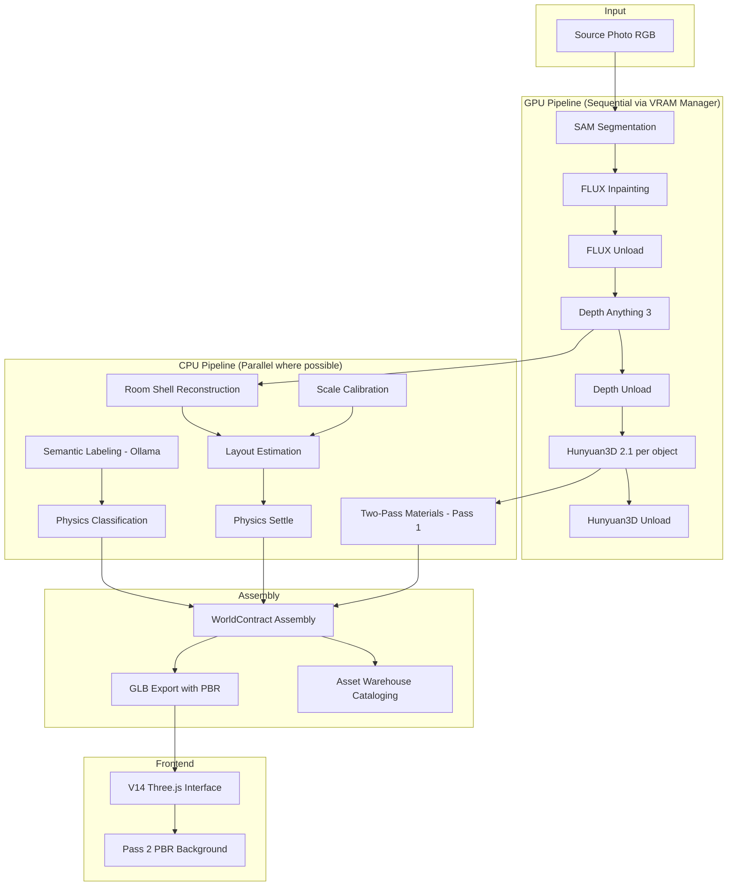
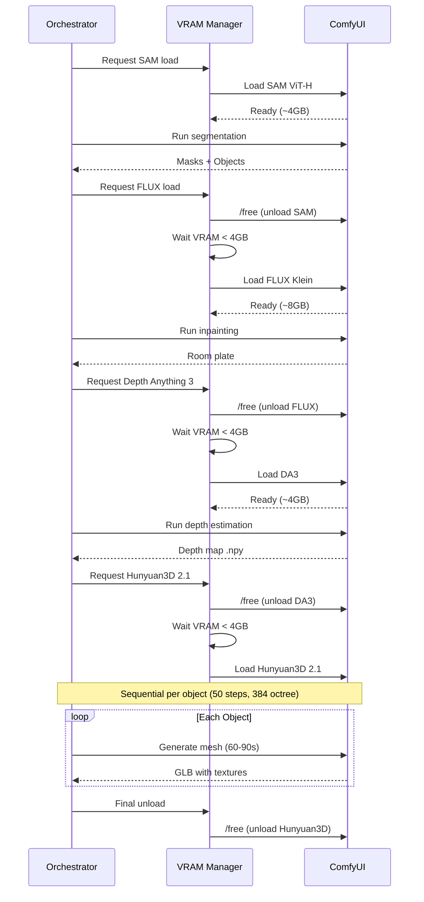

# Design Document: Photo-to-Real-3D-World V14

## Overview

The Photo-to-Real-3D-World V14 pipeline upgrades the existing photo-to-playable-world system from placeholder geometry to real textured 3D meshes. It introduces Hunyuan3D 2.1 mesh generation (with Trellis2 fallback), a persistent Asset Warehouse, a browser-based Three.js viewer (V14 interface), two-pass PBR material quality, dynamic physics classification, and strict VRAM management — all operating within the RTX 4090 24GB constraint.

The design extends the existing `src/photo_pipeline/` infrastructure, preserving the established patterns (frozen dataclasses, ComfyUI client, orchestrator with SSE events, fallback chains) while adding new stages and upgrading existing ones.

### Design Decisions

1. **Extend, don't replace**: The V14 pipeline builds on the existing `PhotoPipelineOrchestrator` pattern — new stages slot into the existing sequential/parallel execution model.
2. **Sequential GPU, parallel CPU**: VRAM safety is enforced by processing GPU-intensive stages one model at a time with explicit unload between transitions.
3. **Generator quality over speed**: Hunyuan3D runs at maximum quality (50 steps, octree_resolution=384) accepting 60-90s per object. No time caps that sacrifice quality.
4. **Browser-first rendering**: The V14 interface uses Three.js GLTFLoader for real mesh rendering, replacing the primitive box approach of V13.
5. **Append-only Asset Warehouse**: Every generated mesh is cataloged for future reference but never reused — always fresh generation per session.

---

## Architecture

### High-Level System Diagram



### VRAM Management Sequence



---

## Components and Interfaces

### New Components

#### 1. `src/photo_pipeline/stages/hunyuan3d_v2_generator.py`

Replaces the existing object generator's Hunyuan3D 2.0 workflow with the proven 2.1 chain.

```python
class Hunyuan3DV2Generator:
    """Real 3D mesh generation via Hunyuan3D 2.1 ComfyUI workflow.

    Workflow chain: ImageOnlyCheckpointLoader → ModelSamplingAuraFlow →
    CLIPVisionEncode → Hunyuan3Dv2Conditioning → KSampler(steps=50, cfg=7.0)
    → VAEDecodeHunyuan3D(octree_resolution=384) → VoxelToMesh → SaveGLB
    """

    def __init__(self, client: ComfyUIClient, output_dir: Path) -> None: ...

    async def generate(
        self,
        object_png: Path,
        mask_id: str,
        *,
        steps: int = 50,
        cfg: float = 7.0,
        octree_resolution: int = 384,
        stall_timeout_s: int = 180,
    ) -> ObjectMeshResult | None:
        """Generate a mesh. Returns None on failure (triggers fallback)."""
        ...

    def validate_output(self, mesh_path: Path) -> bool:
        """Validate: ≥100 faces, ≥50 vertices, has embedded texture data."""
        ...
```

#### 2. `src/photo_pipeline/stages/trellis2_generator.py`

Fallback generator using Microsoft Trellis2 4B.

```python
class Trellis2Generator:
    """Fallback 3D mesh generation via Trellis2 ComfyUI workflow.

    Workflow: Trellis2LoadModel → Trellis2PreProcessImage →
    Trellis2MeshWithVoxelGenerator(steps=18) →
    Trellis2SimplifyMesh(triangles=12000) → Trellis2ExportMesh(GLB)
    """

    def __init__(self, client: ComfyUIClient, output_dir: Path) -> None: ...

    async def generate(
        self,
        object_png: Path,
        mask_id: str,
        *,
        steps: int = 18,
        target_triangles: int = 12000,
    ) -> ObjectMeshResult | None:
        """Generate a mesh via Trellis2. Returns None on failure."""
        ...
```

#### 3. `src/photo_pipeline/vram_manager.py`

Centralized VRAM lifecycle management.

```python
@dataclass(frozen=True)
class VRAMState:
    current_model: str | None
    estimated_usage_gb: float
    system_ram_gb: float

class VRAMManager:
    """Enforces sequential model loading with VRAM budget on RTX 4090 24GB.

    Guarantees:
    - Only one large model loaded at a time
    - Explicit /free + wait between transitions
    - Flash attention enabled for all inference
    - System RAM monitoring (pause at 80GB/96GB)
    """

    def __init__(self, client: ComfyUIClient, max_vram_gb: float = 24.0) -> None: ...

    async def acquire_model(self, model_name: str, estimated_gb: float) -> None:
        """Unload current model, free VRAM, wait for <4GB, signal ready."""
        ...

    async def release_model(self) -> None:
        """Call /free, wait for VRAM to drop below 4GB."""
        ...

    async def check_system_ram(self) -> bool:
        """Returns False if system RAM > 80GB (pause needed)."""
        ...

    async def wait_for_ram_available(self) -> None:
        """Block until system RAM drops below 72GB."""
        ...
```

#### 4. `src/photo_pipeline/stages/room_shell_reconstructor.py`

Depth-displaced grid mesh reconstruction (replaces Poisson approach).

```python
class RoomShellReconstructor:
    """Reconstruct room environment from depth map using displaced-grid method.

    Algorithm:
    1. Create regular grid at image resolution (max 500 vertices per dimension)
    2. Displace each vertex along camera ray by its depth value
    3. Remove/split faces where depth gradient > 0.5m per cell
    4. Apply Room_Plate as UV-mapped texture
    5. Orient in WorldContract coords (Y-up, camera at origin, -Z forward)
    6. Face winding produces inward-facing normals
    """

    def __init__(self, output_dir: Path) -> None: ...

    def reconstruct(
        self,
        depth_map: np.ndarray,
        room_plate_path: Path,
        image_width: int,
        image_height: int,
        *,
        fov_v_deg: float = 60.0,
        max_grid_dim: int = 500,
        gradient_threshold_m: float = 0.5,
    ) -> RoomShellResult:
        """Produce a textured GLB mesh of the room shell."""
        ...

    def _create_grid(self, width: int, height: int, max_dim: int) -> np.ndarray:
        """Create regular vertex grid, downsampled if necessary."""
        ...

    def _displace_vertices(
        self, grid: np.ndarray, depth: np.ndarray, fov_v: float, w: int, h: int
    ) -> np.ndarray:
        """Back-project grid vertices using pinhole camera model."""
        ...

    def _remove_stretched_faces(
        self, vertices: np.ndarray, faces: np.ndarray, threshold: float
    ) -> np.ndarray:
        """Remove faces where adjacent vertex depth difference > threshold."""
        ...
```

#### 5. `src/photo_pipeline/stages/semantic_labeler.py`

Ollama vision-based semantic labeling.

```python
@dataclass(frozen=True)
class SemanticLabel:
    semantic_label: str           # e.g., "wooden dining chair"
    primary_material: str         # wood/metal/glass/fabric/ceramic/plastic
    category: str                 # props/architecture/foliage/hard-surface/set-dressing
    estimated_era: str            # e.g., "mid-century modern"
    condition: str                # new/worn/broken
    is_architectural: bool        # True for walls, doors, built-in items

class SemanticLabeler:
    """Assign semantic labels to objects via Ollama vision analysis."""

    MATERIAL_DENSITIES: dict[str, float] = {
        "wood": 600, "metal": 7800, "glass": 2500,
        "fabric": 200, "ceramic": 2300, "plastic": 950,
    }

    def __init__(self, ollama_url: str = "http://localhost:11434") -> None: ...

    async def label(self, object_png: Path, *, timeout_s: float = 10.0) -> SemanticLabel:
        """Send Object_PNG to Ollama, parse structured JSON response."""
        ...

    def fallback_label(
        self, width: int, height: int, area_px: int
    ) -> SemanticLabel:
        """Heuristic fallback when Ollama unavailable."""
        ...
```

#### 6. `src/photo_pipeline/asset_warehouse.py`

Persistent, append-only asset library.

```python
@dataclass(frozen=True)
class AssetRegistryEntry:
    name: str
    semantic_label: str
    category: str    # props/architecture/foliage/hard-surface/set-dressing
    era: str
    condition: str
    working_status: str
    material_type: str
    dimensions_m: tuple[float, float, float]
    weight_estimate_kg: float
    generation_method: str     # hunyuan3d_v2.1 / trellis2
    source_photo_hash: str     # SHA-256
    source_session_id: str
    face_count: int
    vertex_count: int
    has_pbr_textures: bool
    created_at: str            # ISO timestamp

class AssetWarehouse:
    """Persistent modular asset library organized by game industry taxonomy.

    Directory structure:
        assets/
        ├── props/
        ├── architecture/
        ├── foliage/
        ├── hard-surface/
        └── set-dressing/
    """

    CATEGORIES = ("props", "architecture", "foliage", "hard-surface", "set-dressing")
    BASE_DIR = Path("assets")

    def __init__(self, base_dir: Path | None = None) -> None: ...

    def save_asset(
        self,
        glb_path: Path,
        registry: AssetRegistryEntry,
    ) -> Path:
        """Copy GLB to category dir, write JSON registry. Returns saved path."""
        ...

    def _generate_filename(self, label: str, session_id: str, mask_id: str) -> str:
        """Generate {semantic_label_slug}_{session_short}_{mask_id}.glb"""
        ...

    def ensure_structure(self) -> None:
        """Create category directories if they don't exist."""
        ...
```

#### 7. `src/photo_pipeline/stages/material_processor.py`

Two-pass material quality system.

```python
@dataclass(frozen=True)
class MaterialPassResult:
    object_id: str
    pass_number: int              # 1 or 2
    has_base_color: bool
    has_metallic_roughness: bool
    has_normal_map: bool
    texture_resolution: tuple[int, int]

class MaterialProcessor:
    """Two-pass PBR material quality system.

    Pass 1: Accept native generator textures (Hunyuan3D/Trellis2) or
             photo-project for placeholder geometry. Available within 2s.
    Pass 2: Estimate metallic, roughness, normal from Object_PNG.
             Runs in background when GPU is free.
    """

    TEXTURE_SIZES: dict[str, tuple[int, int]] = {
        "small": (256, 256),    # < 2% image area
        "medium": (512, 512),   # 2-10% image area
        "large": (1024, 1024),  # > 10% image area
    }

    def apply_pass1(
        self,
        glb_path: Path,
        object_png: Path,
        generation_method: str,
        image_area_pct: float,
    ) -> MaterialPassResult:
        """Apply Pass 1 textures. For neural meshes: keep native textures.
        For placeholders: photo-project Object_PNG onto surface."""
        ...

    async def apply_pass2(
        self,
        glb_path: Path,
        object_png: Path,
        material_type: str,
    ) -> MaterialPassResult:
        """Estimate and apply PBR parameters (metallic, roughness, normal)."""
        ...

    def select_texture_size(self, area_pct: float) -> tuple[int, int]:
        """Select texture dimensions by object screen-space footprint."""
        if area_pct < 0.02:
            return self.TEXTURE_SIZES["small"]
        elif area_pct <= 0.10:
            return self.TEXTURE_SIZES["medium"]
        else:
            return self.TEXTURE_SIZES["large"]
```

#### 8. `src/photo_pipeline/stages/physics_classifier.py`

Dynamic physics classification based on estimated weight.

```python
@dataclass(frozen=True)
class PhysicsClassification:
    body_mode: str              # "DYNAMIC" or "STATIC"
    mass_kg: float
    volume_m3: float
    material_density: float
    friction: float
    restitution: float
    can_topple: bool
    override_reason: str | None  # e.g., "architectural_function"

class PhysicsClassifier:
    """Classify objects as dynamic or static based on estimated weight.

    Rules:
    - mass ≤ 25kg → DYNAMIC (grabbable/pushable)
    - mass > 25kg → STATIC (immovable)
    - Architectural objects → always STATIC regardless of mass
    """

    DENSITY_TABLE: dict[str, float] = {
        "wood": 600, "metal": 7800, "glass": 2500,
        "fabric": 200, "ceramic": 2300, "plastic": 950,
    }
    MASS_THRESHOLD_KG: float = 25.0

    def classify(
        self,
        dimensions_m: tuple[float, float, float],
        material: str,
        is_architectural: bool,
    ) -> PhysicsClassification:
        """Compute mass from volume × density, apply threshold."""
        volume = dimensions_m[0] * dimensions_m[1] * dimensions_m[2]
        density = self.DENSITY_TABLE.get(material, 950.0)
        mass = volume * density

        if is_architectural:
            return PhysicsClassification(
                body_mode="STATIC", mass_kg=0.0, volume_m3=volume,
                material_density=density, friction=0.6, restitution=0.1,
                can_topple=False, override_reason="architectural_function",
            )

        if mass <= self.MASS_THRESHOLD_KG:
            return PhysicsClassification(
                body_mode="DYNAMIC", mass_kg=mass, volume_m3=volume,
                material_density=density, friction=0.5, restitution=0.2,
                can_topple=True, override_reason=None,
            )
        else:
            return PhysicsClassification(
                body_mode="STATIC", mass_kg=0.0, volume_m3=volume,
                material_density=density, friction=0.6, restitution=0.1,
                can_topple=False, override_reason=None,
            )
```

#### 9. `src/photo_pipeline/stages/depth_anything3.py`

Depth estimation via Depth Anything 3.

```python
class DepthAnything3Estimator:
    """Metric depth estimation using Depth Anything 3 via ComfyUI.

    Produces a float32 depth map in meters at source image resolution.
    Validates ≥50% valid pixels (positive, finite, <20m for indoor).
    Falls back to MoGe-2 then flat-floor heuristic.
    """

    def __init__(self, client: ComfyUIClient, output_dir: Path) -> None: ...

    async def estimate(
        self,
        source_image: Path,
        config: PhotoPipelineConfig,
    ) -> DepthResult:
        """Run DA3, validate output, save .npy. Falls back on failure."""
        ...

    def validate_depth_map(self, depth: np.ndarray) -> float:
        """Return valid pixel ratio (positive, finite, <20m)."""
        valid = (depth > 0) & np.isfinite(depth) & (depth < 20.0)
        return float(np.sum(valid)) / depth.size
```

#### 10. `src/web/static/app_v14.js`

Three.js-based 3D viewer for the V14 interface.

```javascript
// Key interfaces (pseudocode)
class V14WorldViewer {
    constructor(containerId) { ... }

    // Load room shell mesh
    async loadRoomShell(glbUrl) { ... }

    // Progressively load object meshes
    async loadObject(objectId, glbUrl, position, rotation, scale) { ... }

    // Hot-swap material when Pass 2 completes
    updateMaterial(objectId, updatedGlbUrl) { ... }

    // Navigation modes
    enableOrbitControls() { ... }
    enableFirstPersonControls() { ... }

    // SSE integration
    connectSSE(sessionId) { ... }
}
```

### Updated Components

#### `src/photo_pipeline/orchestrator.py` → `V14Orchestrator`

The V14 orchestrator extends the existing `PhotoPipelineOrchestrator` with:
- VRAM Manager integration for explicit model lifecycle
- Hunyuan3D 2.1 (with Trellis2 fallback) replacing the 2.0 chain
- Depth Anything 3 replacing MoGe-2
- Semantic labeling stage
- Physics classification stage
- Two-pass material processing
- Asset Warehouse cataloging
- No hard time cap (stall detection only at 180s per object)

#### `src/web/app.py`

New endpoints:
- `GET /?v=14` — V14 interface (also default when no `?v=` supplied)
- `POST /api/session/v14/photo` — V14 photo pipeline endpoint
- `GET /api/session/{id}/mesh/{object_id}` — Serve GLB files
- `GET /api/session/{id}/room_shell` — Serve room shell GLB
- `SSE /api/session/{id}/v14/events` — V14-specific SSE stream
- `WS /api/session/{id}/v14/materials` — WebSocket for Pass 2 notifications

---

## Data Models

### New Data Models

```python
@dataclass(frozen=True)
class V14PipelineConfig(PhotoPipelineConfig):
    """Extended config for V14 pipeline."""
    hunyuan3d_steps: int = 50
    hunyuan3d_cfg: float = 7.0
    hunyuan3d_octree_resolution: int = 384
    hunyuan3d_stall_timeout_s: int = 180
    trellis2_steps: int = 18
    trellis2_target_triangles: int = 12000
    depth_model: str = "depth_anything_3"
    vram_free_target_gb: float = 4.0
    system_ram_pause_gb: float = 80.0
    system_ram_resume_gb: float = 72.0
    pass2_enabled: bool = True
    asset_warehouse_enabled: bool = True
    min_mesh_faces: int = 100
    min_mesh_vertices: int = 50


@dataclass(frozen=True)
class RoomShellResult:
    """Result of room shell reconstruction."""
    mesh_path: Path               # GLB with embedded Room_Plate texture
    dimensions_m: tuple[float, float, float]
    vertex_count: int
    face_count: int
    grid_resolution: tuple[int, int]  # actual grid dims used
    faces_removed_gradient: int   # faces removed at depth discontinuities
    used_fallback: bool           # True if flat-box fallback used


@dataclass(frozen=True)
class V14ObjectEntry:
    """Extended object manifest entry for V14."""
    mask_id: str
    semantic_label: SemanticLabel
    mesh_path: Path
    mesh_method: str              # hunyuan3d_v2.1 / trellis2 / placeholder
    mesh_generation_time_s: float
    face_count: int
    vertex_count: int
    dimensions_m: tuple[float, float, float]
    position_m: tuple[float, float, float]
    rotation_deg: tuple[float, float, float]
    physics: PhysicsClassification
    material_pass1: MaterialPassResult
    material_pass2: MaterialPassResult | None
    asset_warehouse_path: Path | None
    asset_registry_id: str | None


@dataclass(frozen=True)
class V14PipelineManifest:
    """Complete manifest for a V14 pipeline run."""
    session_id: str
    source_image_path: Path
    source_image_hash: str        # SHA-256
    interface_version: int        # 14
    stages: list[StageResult]
    room_shell: RoomShellResult
    objects: list[V14ObjectEntry]
    depth_model_used: str
    quality_classification: str   # full / degraded / minimal
    total_duration_s: float
    world_contract_path: Path | None
```

### Asset Registry JSON Schema

```json
{
  "name": "wooden_dining_chair_a1b2c3_obj_04",
  "semantic_label": "wooden dining chair",
  "category": "props",
  "era": "mid-century modern",
  "condition": "worn",
  "working_status": "not-applicable",
  "material_type": "wood",
  "dimensions_m": [0.45, 0.85, 0.45],
  "weight_estimate_kg": 4.5,
  "generation_method": "hunyuan3d_v2.1",
  "source_photo_hash": "a1b2c3d4e5f6...",
  "source_session_id": "sess_abc123",
  "face_count": 45000,
  "vertex_count": 23000,
  "has_pbr_textures": true,
  "created_at": "2025-01-15T10:30:00Z"
}
```

### WorldContract Mapping

V14 outputs map to existing WorldContract schema fields:

| V14 Concept | WorldContract Field |
|---|---|
| Real mesh GLB | `WorldInstance.geometry_strategy = "asset"`, `asset_registry_id` |
| Object position | `WorldInstance.transform.position_m` |
| Object rotation | `WorldInstance.transform.rotation_deg` |
| Object scale | `WorldInstance.dimensions` |
| PBR material | `MaterialIntent` (base_color, metallic, roughness) |
| Dynamic physics | `PhysicsIntent.body_mode = DYNAMIC`, `mass_kg`, `can_topple=True` |
| Static physics | `PhysicsIntent.body_mode = STATIC`, `mass_kg=0` |
| Collision shape | `PhysicsIntent.collision_shape = "mesh"` |
| Room shell | `RoomShell` dimensions + mesh asset reference |

---


## Correctness Properties

*A property is a characteristic or behavior that should hold true across all valid executions of a system — essentially, a formal statement about what the system should do. Properties serve as the bridge between human-readable specifications and machine-verifiable correctness guarantees.*

#### Reflection Notes

Before formulating properties, I consolidated the prework analysis to eliminate redundancy:

- 1.2 (mesh validation) and 11.5/15.2 (GLB round-trip) are distinct: validation checks thresholds, round-trip checks serialization fidelity.
- 6.1 (classification threshold), 6.3 (dynamic params), 6.4 (static params), and 6.5 (architectural override) can be combined into a single comprehensive physics classification property.
- 7.4 (append-only) and 10.3 (warehouse grows monotonically) are the same invariant — consolidated.
- 15.1 (registry round-trip), 15.3 (manifest round-trip), and 15.4 (depth map round-trip) are all serialization round-trips but for different data types — keep separate.
- 11.5 and 15.2 are the same property (GLB vertex round-trip) — consolidated.
- 14.3 (depth validation ≥50%) and 3.5 (depth fallback >50% invalid) are complementary threshold checks — consolidated into one depth validity property.
- 2.1 (no simultaneous models) and 14.2 (DA3 after FLUX unload) are the same invariant — consolidated.
- 3.6 (vertex count bounds) and 3.8 (inward normals) are distinct room shell invariants — keep separate.

### Property 1: Mesh Validation Correctness

*For any* trimesh object, the mesh validator SHALL accept it if and only if it has at least 100 faces, at least 50 vertices, and embedded texture data; otherwise it SHALL reject it.

**Validates: Requirements 1.2**

### Property 2: Placeholder Geometry Selection

*For any* bounding box (width, height) and pixel area, `select_placeholder_type` SHALL return "sphere" when area < 1000px, "cylinder" when aspect ratio < 0.5, "box" when aspect ratio > 2.0 or within [0.8, 1.2], and "box" as the default for remaining cases.

**Validates: Requirements 1.5**

### Property 3: VRAM Model Exclusion Invariant

*For any* sequence of model acquire/release operations on the VRAM Manager, at most one GPU model SHALL be loaded at any point in time — no two models from the set {SAM, FLUX, Depth_Anything_3, Hunyuan3D, Trellis2} are ever simultaneously resident.

**Validates: Requirements 2.1, 14.2**

### Property 4: System RAM Pause/Resume Threshold

*For any* system RAM usage measurement, the VRAM Manager SHALL pause new stage submissions if and only if usage exceeds 80GB, and SHALL resume only when usage drops below 72GB.

**Validates: Requirements 2.7**

### Property 5: Room Shell Vertex Count Bounds

*For any* valid depth map (≥50% valid pixels) at any resolution, the Room Shell reconstructor SHALL produce a mesh with vertex count between 10,000 and 250,000.

**Validates: Requirements 3.6**

### Property 6: Room Shell Inward-Facing Normals

*For any* Room Shell mesh produced by the displaced-grid method, all face normals SHALL point toward the camera origin (the dot product of each face normal with the vector from face centroid to origin SHALL be positive).

**Validates: Requirements 3.8**

### Property 7: Depth Gradient Face Removal

*For any* Room Shell mesh, no face SHALL exist where the depth difference between adjacent vertices exceeds 0.5 meters per grid cell — all such faces SHALL have been removed or split.

**Validates: Requirements 3.7**

### Property 8: Depth Validity Threshold

*For any* depth map, the depth validation function SHALL return a valid pixel ratio in [0.0, 1.0] where valid means positive, finite, and less than 20 meters. The system SHALL accept maps with ratio ≥ 0.50 and trigger fallback for ratio < 0.50.

**Validates: Requirements 3.5, 14.3**

### Property 9: Back-Projection Formula Correctness

*For any* pixel coordinate (u, v), positive depth value d, and camera intrinsics (fx, fy, cx, cy), the back-projection SHALL produce x = (u - cx) × d / fx, y = -(v - cy) × d / fy, z = -d.

**Validates: Requirements 4.1, 4.2**

### Property 10: Position Clamping to Room Bounds

*For any* 3D position and room shell bounding volume, the clamped position SHALL lie within the bounding volume minus a 0.05m margin on all axes.

**Validates: Requirements 4.4**

### Property 11: Physics Classification Correctness

*For any* object with dimensions (w, h, d) in meters, a material from the density table, and an is_architectural flag:
- IF is_architectural is True → body_mode=STATIC, mass_kg=0, friction=0.6, restitution=0.1, can_topple=False
- ELSE IF volume × density ≤ 25kg → body_mode=DYNAMIC, mass_kg=volume×density, friction=0.5, restitution=0.2, can_topple=True
- ELSE → body_mode=STATIC, mass_kg=0, friction=0.6, restitution=0.1, can_topple=False

**Validates: Requirements 6.1, 6.2, 6.3, 6.4, 6.5**

### Property 12: Pass 2 Priority Ordering

*For any* list of objects with different screen-space areas, the Pass 2 processing queue SHALL be ordered by area descending (largest objects processed first).

**Validates: Requirements 5.2**

### Property 13: PBR Value Ranges

*For any* Pass 2 material estimation result, metallic SHALL be in [0.0, 1.0] and roughness SHALL be in [0.0, 1.0].

**Validates: Requirements 5.3**

### Property 14: Texture Size Selection

*For any* object screen-space area percentage, texture dimensions SHALL be 256×256 for area < 2%, 512×512 for 2% ≤ area ≤ 10%, and 1024×1024 for area > 10%.

**Validates: Requirements 11.4**

### Property 15: GLB Embedded Textures (No External References)

*For any* GLB file produced by the pipeline, parsing the glTF JSON chunk SHALL reveal zero image entries with external `uri` fields — all textures SHALL reference `bufferView` indices (embedded).

**Validates: Requirements 11.1**

### Property 16: Asset Registry JSON Round-Trip

*For any* valid AssetRegistryEntry, serializing to JSON (sorted keys, 2-space indent, UTF-8) then deserializing SHALL produce a structurally equal object where every field value compares equal.

**Validates: Requirements 15.1, 15.5**

### Property 17: GLB Mesh Vertex Round-Trip

*For any* GLB file produced by the pipeline, loading with trimesh and re-exporting as GLB SHALL produce vertex positions and normals that differ by less than 1e-5 absolute tolerance per component.

**Validates: Requirements 11.5, 15.2**

### Property 18: Pipeline Manifest JSON Round-Trip

*For any* V14PipelineManifest instance, serializing to JSON (sorted keys, UTF-8) then deserializing SHALL produce a structurally equal manifest.

**Validates: Requirements 15.3**

### Property 19: Depth Map NumPy Round-Trip

*For any* float32 NumPy array representing a depth map, `np.save` followed by `np.load` SHALL produce a bit-identical array.

**Validates: Requirements 15.4**

### Property 20: Asset Warehouse Append-Only Invariant

*For any* sequence of `save_asset` calls to the Asset Warehouse, no previously saved GLB file or JSON registry file SHALL be modified or deleted — the file count in the warehouse SHALL monotonically increase.

**Validates: Requirements 7.4, 10.3**

### Property 21: Asset Warehouse Filename Uniqueness

*For any* two distinct (semantic_label, session_id, mask_id) tuples, the generated filename SHALL be different, preventing file collisions.

**Validates: Requirements 7.7**

### Property 22: Semantic Label Validation

*For any* JSON object returned by Ollama labeling, the validator SHALL accept it if and only if it contains all required fields (semantic_label, primary_material, category, estimated_era, condition, is_architectural) and category is one of the five valid taxonomy values.

**Validates: Requirements 13.5**

### Property 23: Heuristic Labeling Fallback Produces Valid Output

*For any* object dimensions (width, height, area), the heuristic labeling fallback SHALL produce a SemanticLabel with a valid category from the five-value taxonomy and a valid primary_material from the six-value material set.

**Validates: Requirements 13.3**

---

## Error Handling

### Failure Modes and Recovery

| Component | Failure Mode | Recovery Strategy |
|---|---|---|
| Hunyuan3D 2.1 | Timeout (>180s stall) | Fall to Trellis2 for that object |
| Hunyuan3D 2.1 | Invalid mesh (<100 faces) | Fall to Trellis2 for that object |
| Trellis2 | Generation failure | Fall to placeholder geometry |
| Trellis2 | Invalid mesh | Fall to placeholder geometry |
| ComfyUI | VRAM OOM | Call /free, wait 5s, retry once |
| ComfyUI | Unreachable | Pipeline fails immediately (critical) |
| Depth Anything 3 | Generation failure | Fall to MoGe-2, then flat-floor heuristic |
| Depth Anything 3 | >50% invalid pixels | Flat-box room fallback |
| Ollama | Unavailable/timeout | Heuristic labeling fallback |
| Ollama | Unparseable JSON | Heuristic labeling fallback |
| Pass 2 Materials | Estimation failure | Retain Pass 1 textures, log warning |
| System RAM | >80GB usage | Pause submissions until <72GB |
| Asset Warehouse | Disk write failure | Log error, continue (non-critical) |
| Room Shell | Mesh generation failure | Flat-box room fallback |

### Quality Classification

The pipeline classifies output quality based on degradation:

- **full**: All objects used Hunyuan3D or Trellis2, depth map valid, room shell from depth
- **degraded**: Some objects used placeholder geometry OR depth fallback triggered
- **minimal**: Majority of objects are placeholders AND flat-floor room

### Error Propagation Rules

1. **Critical failures** (pipeline halts): ComfyUI unreachable, source image invalid
2. **Degraded failures** (continue with fallback): Individual object generation, depth estimation, Ollama labeling
3. **Non-blocking failures** (log and continue): Pass 2 materials, Asset Warehouse write, SSE event delivery

---

## Testing Strategy

### Property-Based Testing (Hypothesis)

The V14 pipeline contains substantial pure logic suitable for PBT:
- Mesh validation (threshold checks)
- Physics classification (volume × density × threshold)
- Placeholder selection (aspect ratio rules)
- Back-projection math (pinhole camera model)
- Position clamping (bounding volume)
- Texture size selection (area thresholds)
- Serialization round-trips (JSON, GLB, NumPy)
- Room shell invariants (vertex bounds, normals, gradient removal)
- Asset warehouse invariants (append-only, filename uniqueness)
- VRAM manager state machine (model exclusion)

**Library**: Hypothesis (Python) — already in use in this project (`.hypothesis/` directory exists)

**Configuration**: Each property test runs minimum 100 iterations. Tests are tagged with:
```python
# Feature: photo-to-real-3d-world-v14, Property N: <property text>
```

### Unit Tests (pytest)

Example-based tests for:
- Fallback chain execution order (mock generators)
- Stage sequencing (VRAM-safe order)
- Configuration values (50 steps, cfg=7.0, octree_resolution=384)
- URL routing (?v=14 serves correct interface)
- WorldContract schema compatibility
- 180s stall detection trigger

### Integration Tests

- ComfyUI workflow submission (mocked server)
- Ollama labeling with structured prompt (mocked server)
- End-to-end pipeline with 3-5 objects (mocked GPU stages)
- SSE event delivery timing
- WebSocket material update notifications
- Asset Warehouse directory creation and file persistence

### Test Organization

```
tests/
├── test_v14_properties.py          # All 23 property-based tests
├── test_v14_mesh_validation.py     # Mesh validator unit tests
├── test_v14_physics_classifier.py  # Physics classification
├── test_v14_room_shell.py          # Room reconstruction
├── test_v14_vram_manager.py        # VRAM state machine
├── test_v14_asset_warehouse.py     # Warehouse operations
├── test_v14_semantic_labeler.py    # Ollama + heuristic fallback
├── test_v14_material_processor.py  # Two-pass materials
├── test_v14_orchestrator.py        # Pipeline integration
└── test_v14_web_interface.py       # API endpoints
```

### Dual Testing Balance

- **Property tests** cover universal invariants (23 properties, 100+ iterations each)
- **Unit tests** cover specific examples, configuration checks, and error paths
- **Integration tests** cover external service interaction (ComfyUI, Ollama, filesystem)

Property tests handle comprehensive input coverage through randomization; unit tests pin down specific concrete behaviors; integration tests verify the system works end-to-end with real (or mocked) external dependencies.
