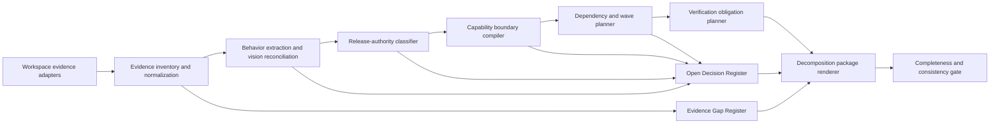

# Design Document

## Overview

This feature defines a documentation-only decomposition compiler for The Living Room. It converts heterogeneous workspace evidence into six reviewable planning views: a Traceability Matrix, Capability Catalog, Dependency Graph, Sequence Wave plan, Evidence Gap Register, and Open Decision Register. The compiler is a design method and record schema, not a new product runtime; its only deliverables are specification and planning documents.

The central design rule is that implementation presence is not release authority. The released baseline is interfaces V3 through V9 at commit `923b0f2`, supported by the clean V8 session `output/c1128426/`, clean V9 session `output/246bc783/`, and `.kiro/release-checklist.md`. At that commit, new V9 sessions selected `v9-camera-locked-photoreal-r2`. Current branch behavior that selects `v9-camera-locked-photoreal-r3`, exposes/defaults V10, adds strict placement validation, or adds bounded three-state Canon review remains experimental until matching release evidence exists.

## Goals

- Produce a complete, source-cited decomposition package from first-party workspace evidence.
- Preserve V3–V9 released behavior without silently promoting branch or dirty-tree behavior.
- Reconcile each behavior with the original Canon-first vision and record disagreements rather than hiding them.
- Assign every ground-truth behavior to exactly one primary capability owner while extracting shared contracts.
- Produce an acyclic, prerequisite-aware creation sequence with explicit parallel-authoring candidates.
- Define verification obligations, including characterization and property testing where deterministic logic permits it.
- Permit later requirements-only corrections when a follow-on specification discovers a boundary gap.

## Non-Goals

- Changing Product_Code, provider configuration, dependencies, generated artifacts, releases, commits, or interfaces.
- Qualifying V9 R3 or V10 for release.
- Resolving product decisions such as Plan-versus-Canon spatial authority inside this design.
- Treating current defaults, untracked files, logs, hooks, or generated outputs as release evidence by themselves.
- Creating follow-on capability specifications or implementation tasks in this phase.

## Research Findings

Research was limited to first-party sources because this design classifies the current workspace rather than selecting a new external technology. `PROTOTYPE_PLAN.md` and `README.md` establish the Canon-first vision. Commit `923b0f2`, `.kiro/release-checklist.md`, `src/workflow_provenance.py`, `src/camera_contract.py`, generated release sessions, git history/status, and KiroGraph memory establish the implementation and release state.

Key findings are: (1) V9's released projection contract is `camera-lock/v1`, including a right-handed perspective frame, 55-degree vertical FOV for the canonical fixture, 4:3 aspect, `1024×768` raster, orbit, and exact reset; (2) released V9 selected R2, whereas the current branch selects experimental R3 for new V9 sessions; (3) current normalization falls forward to experimental V10, whose profile has no release commit or clean qualification; (4) V10 placement and alignment logic is bounded and testable as deterministic logic, but its browser/provider outcomes remain integration concerns; and (5) the workspace has no conventional collected first-party test suite, so existing scripts are Validation_Evidence rather than automated coverage.

These findings drive a fail-closed release classifier, an explicit compatibility decision gate, and an evidence-confidence model. Local index incompleteness is recorded as a gap and direct source evidence remains usable; no external source can override first-party release policy.

## Architecture



The architecture is a staged transformation over immutable planning records. Each stage appends classifications, ownership, dependencies, or findings; it does not mutate source evidence. A finding keeps its evidence citations throughout the pipeline so reviewers can trace every rendered statement back to a path, commit, generated session, or persistent observation.

### Authority and Evidence Precedence

Release classification follows a stricter rule than behavior discovery:

1. **Release authority:** matching target commit plus a complete clean fresh-session Release_Evidence record under `.kiro/steering/ui-versioning.md` and `.kiro/release-checklist.md`.
2. **Executable corroboration:** collected tests, direct source inspection, generated artifacts, and successful probes establish implementation behavior but cannot independently establish release.
3. **Documented intent:** vision, README, research, steering, hook, and spec text establish intended contracts or configured automation.
4. **Persistent knowledge:** approved decisions and release summaries corroborate findings; conflicts or stale observations are surfaced for adjudication.
5. **Third-party and generated storage:** vendor internals, caches, repository internals, browser profiles, and binary storage are excluded unless a first-party contract explicitly depends on their observable boundary.

Failure to collect one source never invalidates successfully collected evidence. It lowers confidence and creates an Evidence_Gap entry. A release decision fails closed whenever its commit, clean session, canonical prompt, affected-stage inspection, retained-version checks, or successful terminal verdict is missing.

### Baseline Reconciliation

| Concern | Released authority | Current experimental state | Design treatment |
|---|---|---|---|
| Interface line | V3–V9 at `923b0f2` | V10 is accessible and defaulted | Keep V3–V9 as Release_Line; open a default-version decision for V10. |
| V9 Canon profile | `v9-camera-locked-photoreal-r2` for released new-session behavior | New V9 sessions select `v9-camera-locked-photoreal-r3` | Preserve R2 interpretation; block R3 progression under V9 absent a new release or explicit compatibility disposition. |
| Camera/frame | Released `camera-lock/v1`, fixed 4:3 `1024×768`, live/retained World initialization, orbit, exact reset | Reused by R3/V10 with additional logic | Treat projection, frame identity, and reset as shared released invariants. |
| Metric plan | Released normalization, revision, approval, and Blockout | V10 rotation-aware blockers and bounded placement | Catalog as experimental within the metric-plan boundary; do not redefine released warning behavior. |
| Canon review | Released V9 registration evidence and approval/rejection | V10 `aligned`/`misaligned`/`inconclusive`, bounded retries, manual acceptance | Catalog as experimental policy layered over immutable artifact bindings. |
| Provenance | Released snapshots, manifests, hashes, history, and sanitized metadata | Experimental profiles have `release_commit: None` | Preserve records; create a gap for absent profile-to-commit bindings. |

### Design Decisions

- **Records over prose inference:** tables are rendered from typed conceptual records so status, ownership, and citations can be checked mechanically.
- **Orthogonal statuses:** `Behavior_Status` answers relationship to vision; `Release_Status` answers support authority. Neither implies the other.
- **One primary owner, many consumers:** every behavior has exactly one owning Boundary_Record; cross-cutting contracts are consumed by references, not duplicated.
- **Unknown dependencies are not edges:** uncertain prerequisites belong in the Open Decision Register, preventing invented cycles or ordering.
- **Released and experimental variants coexist:** one boundary may describe both, but every invariant or behavior row carries an explicit release scope.
- **Incremental correction:** follow-on specs may propose requirements-only corrections to this decomposition; corrections preserve prior evidence and explain the changed boundary or edge.

## Components and Interfaces

### 1. Evidence Inventory Adapter

Discovers first-party implementation, tests, documentation, steering, hooks, manifests, git history, release records, representative generated artifacts, and Persistent_Knowledge. It emits one `EvidenceRecord` per selected item. Selection of generated evidence includes a reason such as clean release pass, representative failure, or historical compatibility fixture. Failed adapters return a gap rather than aborting the inventory.

### 2. Evidence Normalizer

Canonicalizes paths, commit identifiers, session identifiers, source kind, collection result, and environment limits. It assigns exactly one `Evidence_Status` and marks exclusions. An incomplete index can accelerate discovery but cannot be the sole source for a finding; direct evidence must corroborate index-affected claims.

### 3. Behavior Extractor and Vision Reconciler

Groups evidence into observable `BehaviorRecord` entries and compares each with the Vision_Baseline. It assigns exactly one of `aligned`, `extended`, `narrowed`, `conflicting`, `deferred`, or `absent`. Disagreement between sources creates a linked decision instead of choosing whichever source is newest.

### 4. Release Authority Classifier

Evaluates implementation presence separately from release qualification. Its conceptual interface is:

```text
classify_release(behavior, target_commit, release_policy, evidence)
  -> released | implemented_unreleased | experimental | retired | unknown
  + reasons[] + missing_release_elements[]
```

`released` is only possible when evidence identifies the evaluated commit and satisfies every applicable clean-pass element. Source code, generated sessions, or logs without that record produce `implemented_unreleased` or `experimental`. Partial and failed sessions are always excluded from Release_Evidence.

### 5. Boundary Compiler

Transforms behavior records into capability and shared-foundation `BoundaryRecord` entries. It uses behavioral cohesion and contract independence, not directory names. Each record has one observable outcome, complete contract fields, release scope, preservation disposition, and verification obligations. It rejects duplicate primary owners and unowned ground-truth behavior.

### 6. Shared Foundation Registry

Owns contracts consumed across capabilities: domain models; spatial units and coordinates; provider policies; session transitions; artifact identity; Camera_Contract and image-frame semantics; Workflow_Profile and compatibility rules; provenance; privacy; evidence traceability; release qualification; and Persistent_Knowledge. Conflicting definitions block only dependent sequencing. Once a linked decision is resolved, eligible planning resumes without a separate restart state.

### 7. Dependency and Wave Planner

Builds a graph from verified contract consumption. An edge `A --> B` means B consumes A's contract and A must be specified first. The planner verifies node coverage and acyclicity, computes topological waves, and marks nodes in the same reachable wave as parallel candidates when no unresolved edge connects them. Cycles reject the catalog; uncertain edges become decisions.

### 8. Verification Obligation Planner

Maps every future acceptance criterion to one or more of unit, property, integration, browser, runtime, compatibility, characterization, smoke, or release-qualification verification. Deterministic parsers, serializers, classifiers, graph transforms, and invariants are eligible for property tests. Provider, browser, GPU, Godot, and release-environment behavior use representative integration or smoke suites.

### 9. Package Renderer and Consistency Gate

Renders the Traceability Matrix, Capability Catalog, graph, waves, and registers into the requirements document. The gate checks required fields, source citations, kebab-case names, owner uniqueness, graph coverage, acyclicity, release-policy completeness, and acceptance-criterion verification mapping. `design.md` explains the method; `requirements.md` remains the authoritative decomposition package required by Requirement 12.1.

### 10. Review Controller

Presents unresolved gaps and decisions without mutating evidence. Review outcomes append a disposition and rationale. A decision may unlock dependent sequence nodes, but only a new matching release record may change a behavior to `released`.

## Data Models

The following are conceptual planning schemas. They define document structure and testable validation logic; they do not require Product_Code changes.

```python
EvidenceStatus = Literal[
    "released", "implemented_unreleased", "experimental",
    "documented_only", "generated_evidence", "workspace_automation", "third_party"
]
ReleaseStatus = Literal["released", "implemented_unreleased", "experimental", "retired", "unknown"]
BehaviorStatus = Literal["aligned", "extended", "narrowed", "conflicting", "deferred", "absent"]
Disposition = Literal["preserve", "revise", "retire", "investigate"]

class EvidenceRecord:
    evidence_id: str
    source: str
    source_kind: str
    evidence_status: EvidenceStatus
    collected: bool
    selection_basis: str | None
    environment_limits: list[str]
    supports: list[str]

class BehaviorRecord:
    behavior_id: str
    statement: str
    vision_sources: list[str]
    source_evidence_ids: list[str]
    behavior_status: BehaviorStatus
    release_status: ReleaseStatus
    release_scope: str
    primary_owner: str
    disposition: Disposition | None
    disagreements: list[str]

class BoundaryRecord:
    spec_name: str
    kind: Literal["Capability", "Shared_Foundation"]
    primary_outcome: str
    inputs: list[str]
    outputs: list[str]
    invariants: list[str]
    dependencies: list[str]
    exclusions: list[str]
    evidence_ids: list[str]
    behavior_ids: list[str]
    behavior_statuses: set[BehaviorStatus]
    release_statuses: set[ReleaseStatus]
    preservation_scope: str
    verification: list["VerificationObligation"]
```

```python
class DependencyEdge:
    prerequisite: str
    consumer: str
    consumed_contract: str
    evidence_ids: list[str]

class SequenceWave:
    number: int
    spec_names: list[str]
    parallel_candidates: list[set[str]]
    prerequisites_satisfied: bool

class EvidenceGap:
    gap_id: str
    missing_or_limited_evidence: str
    affected_findings: list[str]
    confidence_limit: str
    follow_up: str

class OpenDecision:
    decision_id: str
    question: str
    affected_specs: list[str]
    blocking_scope: list[str]
    options: list[str]
    resolution: str | None
    rationale: str | None

class VerificationObligation:
    requirement_refs: list[str]
    method: Literal[
        "unit", "property", "integration", "browser", "runtime",
        "compatibility", "characterization", "smoke", "release_qualification"
    ]
    fixture_or_generator: str
    oracle: str

class DecompositionPackage:
    evidence: list[EvidenceRecord]
    behaviors: list[BehaviorRecord]
    boundaries: list[BoundaryRecord]
    edges: list[DependencyEdge]
    waves: list[SequenceWave]
    gaps: list[EvidenceGap]
    decisions: list[OpenDecision]
```

### Cross-Record Invariants

- Every selected workspace item has exactly one Evidence_Status.
- Every ground-truth behavior has exactly one Behavior_Status, one Release_Status, one primary owner, at least one source citation, and any required preservation disposition.
- Every catalog name is kebab-case and every dependency endpoint exists in the catalog.
- Every Shared_Foundation consumer names the consumed contract.
- The graph covers every recommended specification and is acyclic.
- Every acceptance criterion in a future Capability_Spec has at least one VerificationObligation.
- A `released` behavior has matching-commit Release_Evidence; no failed or partial session can satisfy that invariant.
- V3–V9 at `923b0f2` remain the Release_Line until a later clean qualified release is recorded.
- R3/V10 records remain experimental and cannot overwrite R2/V9 preservation records.
- Product_Code and generated product artifacts are never outputs of DecompositionPackage rendering.

## Correctness Properties

*A property is a characteristic or behavior that should hold true across all valid executions of a system-essentially, a formal statement about what the system should do. Properties serve as the bridge between human-readable specifications and machine-verifiable correctness guarantees.*

This feature uses property-based testing for deterministic record classification, reconciliation, catalog validation, and graph planning. It does not use PBT for browser behavior, provider behavior, filesystem availability, release-environment execution, or the fixed facts of the V3–V10 baseline.

### Property 1: Evidence classification is total and degrades without data loss

For all evidence inventories and all combinations of successful, failed, pending, or unavailable adapters, every selected item has exactly one valid Evidence_Status, successful records remain available, excluded source kinds do not become first-party behavior, and every unavailable or uncorroborated category produces a linked Evidence_Gap with a confidence limit.

**Validates: Requirements 1.2, 1.3, 1.4, 1.5, 1.6, 1.7, 1.8**

### Property 2: Release and compatibility classification fails closed

For all behavior records, target commits, profile mappings, defaults, execution records, and release-evidence combinations, Release_Status remains independent of Behavior_Status, `released` is assigned only when every required qualification element exists for the matching commit, partial or failed executions never qualify, and any unqualified default or active/historical profile divergence creates a blocking decision or gap rather than a release claim.

**Validates: Requirements 2.1, 2.2, 2.3, 2.4, 2.8, 2.9, 7.6, 8.8, 8.9, 8.10, 9.8**

### Property 3: Vision reconciliation is total and evidence-preserving

For all ground-truth and vision behavior pairs, exactly one Behavior_Status is assigned according to equivalence, extension, narrowing, contradiction, deferral, or absence; deferred and absent items never become implemented without evidence; and conflicting sources retain their citations, release scope, affected owner, and required decision.

**Validates: Requirements 3.1, 3.2, 3.3, 3.4, 3.5, 3.6, 3.7**

### Property 4: Capability boundaries are complete and uniquely owned

For all sets of behavior records, responsibilities, and shared contracts, the compiled catalog contains one complete Boundary_Record per capability, assigns exactly one primary owner to every ground-truth behavior and each designated cross-cutting invariant, separates independently changeable responsibilities, extracts shared contracts without duplication, and remains unchanged under source-directory renaming.

**Validates: Requirements 4.1, 4.2, 4.3, 4.4, 4.5, 4.6, 4.7, 5.1, 5.2, 5.6, 5.7, 5.8, 9.1**

### Property 5: Dependency planning produces only valid resumable sequences

For all catalogs, verified dependency relations, uncertain relations, foundation conflicts, and conflict resolutions, an accepted Dependency_Graph contains every spec exactly once, is acyclic, orders every prerequisite before its consumer, places foundations before dependent behavior changes, emits contiguous complete waves, marks only independent nodes as parallel candidates, records uncertain relations as decisions rather than edges, blocks conflict-dependent nodes, and resumes eligible nodes after resolution without restart state.

**Validates: Requirements 5.3, 5.4, 5.5, 6.1, 6.2, 6.3, 6.4, 6.5, 6.6, 6.7, 6.8**

### Property 6: Released behavior changes have complete preservation impact

For all released behavior records and proposed intentional changes, aligned or approved-extension behavior is included in the preservation baseline, every extended, narrowed, or conflicting record has exactly one allowed disposition, retained interfaces and persisted Workflow_Profile identities remain interpretable, and every intentional change identifies all affected interfaces, profiles, artifacts, and Characterization_Test obligations.

**Validates: Requirements 7.1, 7.2, 7.3, 7.4, 7.5**

### Property 7: Verification planning is complete and method-appropriate

For all future acceptance criteria and boundary traits, every criterion maps to at least one verification method; untested released behavior requires characterization before refactoring; deterministic variable first-party logic selects property testing; external or environment-bound behavior selects integration or smoke testing; parsers and serializers receive parse, print, error, and round-trip coverage; and uncollected scripts never count as automated coverage.

**Validates: Requirements 8.1, 8.2, 8.3, 8.4, 8.5, 8.6, 8.7**

### Property 8: Versioned provenance and historical delivery preserve identity

For all interface changes, generation attempts, persisted session states, and historical artifact requests, the planning records require retained prior versions, a declared default, release qualification, complete prepared and terminal provenance, immutable snapshots plus a mutable index, sanitized response metadata, and successful delivery only when the current artifact hash equals the recorded hash.

**Validates: Requirements 9.2, 9.3, 9.4, 9.5, 9.6**

### Property 9: Observability and persistent knowledge remain truthful and privacy-safe

For all event, telemetry, hook, and persistent-knowledge records, prompt and revision-feedback content is excluded from event logging; telemetry has complete timing/status fields and reports insufficient evidence below its threshold; confirmed durable facts use stable keys and link to affected boundaries; conflicting observations require explicit adjudication; and configured hooks are never represented as successfully executed without evidence.

**Validates: Requirements 11.1, 11.2, 11.3, 11.4, 11.5, 11.6, 11.7, 11.8, 11.9, 11.10**

### Property 10: The rendered package is traceable and correction-safe

For all valid DecompositionPackage instances and requirements-only boundary corrections, every recommended spec name is kebab-case, every catalog record states preservation/experimental/future scope, every current-state finding has source evidence, generated evidence states environment limits, uncertain intent becomes an open decision, and corrections preserve documentation-only scope while recording why the boundary or dependency changed.

**Validates: Requirements 12.2, 12.3, 12.4, 12.5, 12.8, 12.9**

## Error Handling

The decomposition process distinguishes recoverable evidence limitations from package-invalidating consistency errors.

| Code | Condition | Handling |
|---|---|---|
| `EVIDENCE_ADAPTER_FAILED` | One evidence source cannot be inventoried | Continue with successful adapters; add source, affected findings, and confidence limit to Evidence_Gap_Register. |
| `INDEX_UNCORROBORATED` | Index is pending, stale, or failed | Require direct Source_Evidence for affected findings or leave the finding unresolved. |
| `EVIDENCE_STATUS_INVALID` | Item has zero or multiple Evidence_Status values | Reject the package until exactly one status is assigned. |
| `RELEASE_EVIDENCE_INCOMPLETE` | Clean-pass element is absent | Block `released`; preserve implementation classification and list missing elements. |
| `RELEASE_COMMIT_MISMATCH` | Evaluated and target commits differ | Block release assignment until matching-commit evidence exists. |
| `PROFILE_COMPATIBILITY_CONFLICT` | Active and released/historical mappings diverge | Preserve historical interpretation and create a blocking OpenDecision. |
| `VISION_EVIDENCE_CONFLICT` | Sources disagree on behavior or authority | Retain both citations and require a disposition; do not pick silently. |
| `BOUNDARY_INCOMPLETE` | Required contract field is missing | Reject that catalog record and all dependent sequencing. |
| `OWNER_CARDINALITY` | Behavior or exclusive foundation has zero/multiple owners | Reject the catalog until ownership is unique. |
| `FOUNDATION_CONFLICT` | Shared definitions disagree | Block dependent nodes only; resume them when the linked decision is resolved. |
| `DEPENDENCY_CYCLE` | Directed cycle exists | Reject wave generation and report the cycle to reviewers. |
| `DEPENDENCY_UNCERTAIN` | Prerequisite lacks evidence | Omit the edge and create an OpenDecision. |
| `ARTIFACT_INTEGRITY_MISMATCH` | Current and recorded hashes differ | Require immediate integrity failure and prohibit successful delivery. |
| `SCOPE_VIOLATION` | Design process attempts code, release, task, dependency, provider, or artifact mutation | Stop the phase and revert/exclude the out-of-scope mutation. |

Error records retain source citations and affected spec names. Resolving a gap does not rewrite prior evidence; it appends corroboration or a decision. Resolving a release error requires new qualifying evidence, not a manual status edit.

## Testing Strategy

### Property-Based Tests

Use Python's Hypothesis library with pytest for the deterministic planning validators. The implementation phase should add a reviewed exact Hypothesis version to the development dependency set; this design does not mutate dependencies. Each correctness property is implemented by exactly one property test with at least 100 generated examples. Generators cover evidence adapters and statuses, behavior/release combinations, catalog ownership, DAGs and cycles, conflict-resolution transitions, verification traits, provenance records, hashes, event payloads, and package corrections.

Each test includes a tag comment in this exact format:

```python
# Feature: spec-driven-project-decomposition, Property 5: Dependency planning produces only valid resumable sequences
@given(...)
@settings(max_examples=100)
def test_dependency_planning_property(...):
    ...
```

Shrunk counterexamples must retain the random seed and minimal failing record set in test output. Property generators treat fixed V9/V10 identifiers as ordinary strings except in the golden baseline tests below; this prevents tests from merely restating the current fixture.

### Unit and Golden-Record Tests

Example tests cover facts that do not benefit from randomization:

- V3–V9 is the Release_Line at `923b0f2`.
- Released V9 new-session behavior selects `v9-camera-locked-photoreal-r2`; current R3 is experimental.
- V10 profile/default, strict geometry validation, and bounded Canon review are experimental.
- V9 Camera_Contract and Canon binding fields are complete.
- The package/interface/commit/profile relationship is explicitly represented.
- `behavior-characterization-and-traceability` is the recommended next specification.

Focused unit tests cover each stable error code, empty catalogs, one-node graphs, self-cycles, duplicate owners, null release commits, hash mismatch, empty wiki, empty/platform-specific hooks, malformed kebab-case names, sensitive event fields, and requirements-only correction scope.

### Integration and Characterization Tests

A fixture workspace exercises evidence adapters against source files, git history, generated session metadata, release records, steering, hooks, and a stub Persistent_Knowledge service. One adapter is failed at a time to verify graceful degradation. Direct-source characterization fixtures preserve the released V3–V9 baseline, especially V8/V9 restoration, V9 R2 profile interpretation, Camera_Contract identity, exact reset evidence, immutable provenance, artifact integrity, and release-session exclusion rules.

Provider, real browser, GPU, Godot, and clean release-loop behavior are not repeatedly invoked by this feature's property suite. Their future Boundary_Record entries require representative integration, browser, runtime, compatibility, and release-qualification suites. Existing ad hoc scripts remain Validation_Evidence until collected by the project runner with assertions.

### Document and Scope Validation

Smoke checks parse `requirements.md` and verify the six required decomposition deliverables, source citations, required catalog columns, 22 kebab-case recommendations, numbered waves, Evidence Gap Register, Open Decision Register, and recommended next spec. Spec diagnostics validate `design.md` structure and requirement references. A changed-path check confirms this design phase modifies only `design.md`; it must not create `tasks.md`, alter Product_Code, change generated artifacts, update dependencies, or claim a new release.

### Review Gates

1. **Evidence gate:** categories are present or explicitly gapped; index limitations are corroborated.
2. **Classification gate:** every behavior has independent behavior/release status and citations.
3. **Compatibility gate:** V3–V9 and R2 remain preserved; R3/V10 remain experimental pending decisions and release evidence.
4. **Boundary gate:** complete records, unique ownership, and shared foundations.
5. **Graph gate:** full node coverage, no cycles, valid waves, and explicit uncertain dependencies.
6. **Verification gate:** every future criterion has a planned method appropriate to its cost and dependency type.
7. **Scope gate:** documentation/planning changes only.

A failed gate prevents design approval but does not alter Product_Code or released behavior. If review finds an evidence, boundary, or dependency gap, return to requirements clarification and make a requirements-only correction before creating follow-on specifications.