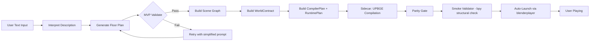
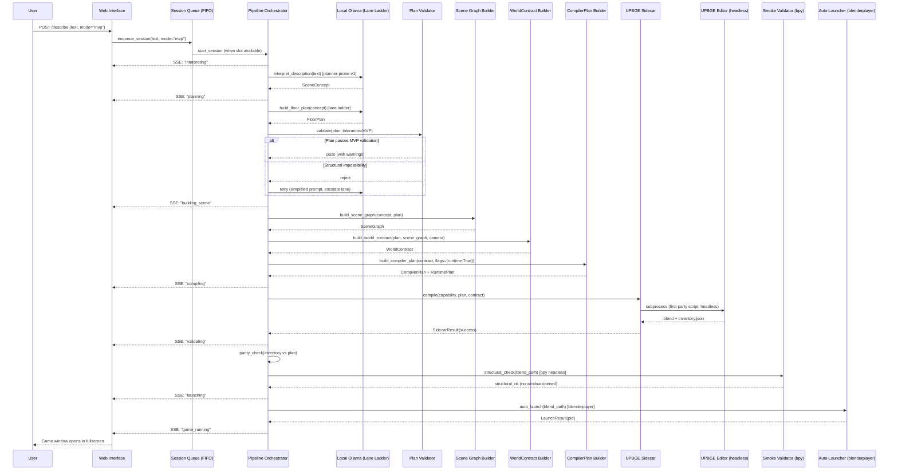

# Design Document: Text-to-Playable-World MVP

## Overview

This design defines the **shortest viable path** from a user's text sentence to a running 3D game. The user types a room description in the web interface, and within **180 seconds** (happy path, up to 240s with retries) they are walking around inside that room with WASD + mouse controls and opening doors.

The MVP achieves this by:
1. **Shortening the pipeline** — cutting quality-assurance stages (canon image, composition, alignment, human QA) that block delivery without adding structural correctness
2. **Relaxing plan validation** — accepting plans with minor geometric imperfections rather than rejecting them
3. **Model routing via lane ladder** — using the fine-tuned `planner-probe-v1` (8B) as the primary planner, escalating through local models only when needed
4. **Auto-launching via blenderplayer** — invoking blenderplayer (UPBGE's standalone game player) directly after parity + structural smoke pass
5. **Structural smoke validation** — verifying the .blend via `bpy` (headless) without entering game mode or opening a visible window

**Scope boundaries:**
- Object grab interaction is a **Phase 2 stretch goal**, NOT core MVP
- Runtime smoke testing (blenderplayer frame-loop verification) is **deferred to Phase 2**
- Audio and textures are out of scope
- Single-user, single-compilation-at-a-time with FIFO queue for concurrent requests

### Design Rationale

The 0% pass rate of the current V11 pipeline stems from overly-strict validation gates, NOT from broken components. The compiler script works. The runtime templates work. The world contract builder works. The blocker is that LLM-generated plans fail strict validation before reaching compilation. The fix is to let imperfect-but-structurally-sound plans through — and to leverage the fine-tuned `planner-probe-v1` model that was trained specifically on this task.

### Time Budget Breakdown (180s happy path / 240s with retries)

| Stage | Budget | Notes |
|-------|--------|-------|
| LLM plan generation (per attempt) | ≤20s | `planner-probe-v1` ~5s, fallbacks ~15-20s |
| LLM attempts (up to 3) | ≤60s | Only on retry path |
| Scene graph + WorldContract | ≤10s | Pure computation |
| Sidecar compilation | ≤60s | UPBGE headless |
| Parity gate | ≤5s | JSON comparison |
| Smoke validator (bpy structural) | ≤15s | Headless .blend inspection |
| Auto-launch | ≤10s | blenderplayer subprocess |
| Margin | ~20s | Network/IO jitter |

## Architecture

### Shortened Pipeline (MVP Mode)



**Key difference from old design:** Stage K is a headless `bpy`-based structural check (opens .blend in UPBGE_Editor background mode, verifies logic bricks wired, player controller exists, Character physics configured). It does NOT enter game mode, does NOT open a visible window, does NOT launch blenderplayer. The only game window the user sees is from Stage L.

### Full Pipeline (V11 Mode — Preserved)


### Mode Selection

Sessions are created with a `mode` parameter:
- `"mvp"` (default): shortened pipeline, relaxed validation, lane ladder model routing
- `"full"`: existing V11 behavior, strict validation, all gates

## Model Routing — Lane Ladder

The MVP uses a **cheapest-first, escalate-on-failure** model routing strategy. The fine-tuned `planner-probe-v1` (8B, trained on the flywheel corpus specifically for floor plan generation) is the primary planner. This is the flywheel paying off — the fine-tuned model should produce valid plans most of the time, making retries rare.

### Lane Priority (local-first)

| Priority | Model | Size | Latency | Use Case |
|----------|-------|------|---------|----------|
| 1 (primary) | `planner-probe-v1:latest` | 8B Q4_K_M | ~5s | Fine-tuned for this exact task |
| 2 (fallback) | `gpt-oss:20b` | 20B MXFP4 | ~15s | Proven V11 baseline |
| 3 (fallback) | `qwen3.6:27b` | 27B Q4_K_M | ~20s | Stronger reasoning |
| 4 (cloud, last resort) | Cloud lanes | Various | ~10-30s | Only after 3 local failures |

### Escalation Logic

```python
LANE_LADDER: list[LaneDef] = [
    LaneDef(model="planner-probe-v1:latest", timeout_s=20, local=True),
    LaneDef(model="gpt-oss:20b", timeout_s=25, local=True),
    LaneDef(model="qwen3.6:27b", timeout_s=30, local=True),
]
CLOUD_FALLBACK: list[LaneDef] = [
    LaneDef(model="glm-5.2:cloud", timeout_s=30, local=False),
    LaneDef(model="kimi-k2.6:cloud", timeout_s=30, local=False),
]
```

**Retry strategy within the lane ladder:**
1. Attempt 1: `planner-probe-v1` with full prompt
2. Attempt 2 (on structural failure): same model, simplified prompt (remove relationship constraints)
3. Attempt 3 (on structural failure): escalate to next lane, further simplified prompt

Cloud models are only invoked if ALL local attempts exhaust (3 lanes × progressive simplification). Cloud lanes are pre-approved (John, 2026-07-23) at zero marginal cost within Ollama Pro caps.

## Components and Interfaces

### Component Interaction Diagram



### Modified Components

| Component | File | Change |
|-----------|------|--------|
| Pipeline Orchestrator | `src/pipeline.py` | Add MVP mode branch, FIFO queue, session isolation, lane ladder routing |
| Plan Validator | `src/floor_plan/validator.py` | Add `mvp_tolerance` parameter to `validate_floor_plan()` |
| Web Interface | `src/web/app.py` | Add `mode` param, SSE progress events, auto-launch trigger |
| Auto-Launcher | `src/auto_launch.py` | **NEW** — subprocess invocation of `blenderplayer` |
| Smoke Validator | `src/smoke_validator.py` | **NEW** — bpy structural check (headless, no game mode) |
| Session Manager | `src/session_manager.py` | **NEW** — FIFO queue, isolation, TTL cleanup |
| Sidecar | `src/upbge_sidecar.py` | No changes to compilation logic |
| Capabilities | `src/upbge_capabilities.py` | Add `blenderplayer_path` field, dual-executable discovery |
| CompilerPlan Builder | `src/upbge_compiler.py` | No changes needed |
| Runtime Templates | `src/upbge_runtime.py` | No changes needed |
| First-Party Script | `src/assembler/upbge_compile.py` | No changes needed |

### New Component: Smoke Validator (`src/smoke_validator.py`)

The Smoke_Validator opens the .blend in UPBGE_Editor (headless, via `bpy`) and verifies structural correctness. It does **NOT** enter game mode, does **NOT** open a visible window, does **NOT** launch blenderplayer.

```python
@dataclass(frozen=True)
class SmokeValidationResult:
    passed: bool
    checks: tuple[SmokeCheck, ...]  # individual check results
    reason_code: str  # "structural_ok", "missing_controller", "physics_misconfigured", etc.
    duration_ms: int

@dataclass(frozen=True)
class SmokeCheck:
    name: str  # "player_controller_exists", "character_physics", "logic_bricks_wired", "scene_loads"
    passed: bool
    detail: str

def run_structural_smoke(
    capability: UPBGECapabilityReport,
    blend_path: Path,
    runtime_plan: RuntimePlan,
    *,
    timeout_s: float = 15.0,
) -> SmokeValidationResult:
    """Open .blend in UPBGE_Editor headless and verify structural correctness.
    
    Checks performed (all via bpy, no game mode):
    1. Player controller text datablock exists and is non-empty
    2. At least one object has Character physics type configured
    3. All RuntimePlan-referenced logic brick controllers are wired to target objects
    4. Scene loads without bpy errors
    
    Does NOT enter game mode.
    Does NOT open a visible window.
    Does NOT launch blenderplayer.
    """
```

**Probe script (run inside UPBGE_Editor --background):**
```python
# Executed via: upbge --background blend_path --python smoke_probe.py
import bpy, json, sys

results = {"scene_loads": True, "checks": []}
try:
    # Check 1: player controller text datablock
    controller_names = [t.name for t in bpy.data.texts if "player" in t.name.lower()]
    has_controller = len(controller_names) > 0 and any(
        len(bpy.data.texts[n].as_string().strip()) > 0 for n in controller_names
    )
    results["checks"].append({"name": "player_controller_exists", "passed": has_controller})
    
    # Check 2: Character physics type
    char_objects = [o for o in bpy.data.objects if getattr(o.game, 'physics_type', '') == 'CHARACTER']
    results["checks"].append({"name": "character_physics", "passed": len(char_objects) > 0})
    
    # Check 3: Logic brick controllers wired
    # (checks that game objects have controllers referencing the text datablocks)
    wired = any(
        c.type == 'PYTHON' and c.text in bpy.data.texts
        for obj in bpy.data.objects for c in obj.game.controllers
    )
    results["checks"].append({"name": "logic_bricks_wired", "passed": wired})
    
except Exception as e:
    results["scene_loads"] = False
    results["error"] = str(e)

print("SMOKE_RESULT=" + json.dumps(results))
```

### New Component: Auto-Launcher (`src/auto_launch.py`)

```python
@dataclass(frozen=True)
class LaunchResult:
    success: bool
    pid: int | None
    executable: str  # path to blenderplayer
    blend_path: str
    reason_code: str  # "launched", "blenderplayer_not_found", "process_exited", "file_missing"
    diagnostics: str
    fallback_instructions: str | None  # Platform-specific manual launch instructions

def auto_launch_game(
    capability: UPBGECapabilityReport,
    blend_path: Path,
    *,
    fullscreen: bool = True,
    timeout_s: float = 10.0,
) -> LaunchResult:
    """Launch blenderplayer on the compiled .blend file.
    
    Strategy:
    1. Verify blend_path exists and is non-zero
    2. Discover blenderplayer from capability.blenderplayer_path
    3. Start subprocess (non-blocking — game runs independently)
    4. Wait up to timeout_s for process to NOT exit (confirms it's running)
    5. Return LaunchResult with PID for tracking
    
    CRITICAL: Uses blenderplayer (standalone game player), NOT the UPBGE editor.
    blenderplayer takes a .blend and runs it directly in game mode — no editor UI,
    no Python startup hacks, no import bge issues.
    """
```

**Launch Command Construction:**

```
blenderplayer path/to/file.blend           # windowed
blenderplayer -f 0 0 path/to/file.blend    # fullscreen
```

**Why blenderplayer and NOT the UPBGE editor:**
- `import bge` is NOT available from Blender's startup Python context — it only exists inside the BGE runtime
- `upbge --python-expr "import bge; bge.logic.startGame()"` does NOT work reliably
- `blenderplayer` is the purpose-built tool for exactly this use case: run a .blend as a game
- The .blend already has logic bricks wired (Always → Python → `bge.logic.startGame()`), which auto-starts the game on load in blenderplayer

**Dual-executable architecture:**

| Job | Executable | Context | API Available |
|-----|-----------|---------|---------------|
| Compile (build .blend) | UPBGE editor (`upbge`) | `bpy` Python API, headless mode | `bpy`, `mathutils` |
| Smoke validate | UPBGE editor (`upbge`) | `bpy` Python API, headless mode | `bpy`, `mathutils` |
| Launch (run as game) | `blenderplayer` | `bge` runtime, fullscreen game mode | `bge`, `mathutils` |

Both executables are discovered and probed independently by the Capability_Report.

### Capability_Report Changes (`src/upbge_capabilities.py`)

The `UPBGECapabilityReport` must independently probe BOTH executables:

```python
@dataclass(frozen=True)
class UPBGECapabilityReport:
    # Existing fields (editor)...
    schema_version: str = CAPABILITY_SCHEMA_VERSION
    available: bool = False
    verified: bool = False
    compatible: bool = False
    executable_path: str | None = None  # UPBGE editor path
    # ... existing fields ...
    
    # NEW: blenderplayer discovery
    blenderplayer_path: str | None = None
    blenderplayer_available: bool = False
    blenderplayer_verified: bool = False
    blenderplayer_reason_code: str = "not_probed"
    blenderplayer_diagnostics: tuple[str, ...] = ()
```

**Discovery logic for blenderplayer:**
1. Look alongside the editor executable (same directory)
2. Look for `blenderplayer.exe` (Windows) or `blenderplayer` (Linux/Mac)
3. Probe: run `blenderplayer --version` or a minimal .blend test file
4. Confirm clean exit (no crash, no GPU errors)

**States:**
- Editor present + blenderplayer present → full MVP (compile + launch)
- Editor present + blenderplayer absent → compile works, launch unavailable → download-link fallback
- Editor absent → pipeline cannot compile → immediate failure

### MVP Tolerance Mode — Plan Validation Changes

**Current behavior** (`validate_floor_plan` with `strict=True`):
- Rejects ANY overlap between furniture items
- Rejects ANY item with center outside room bounds
- Rejects clearance violations of any magnitude

**MVP tolerance behavior** (new `tolerance="mvp"` parameter):

| Check | Strict | MVP Tolerance |
|-------|--------|---------------|
| Item vertex outside room bounds | REJECT | REJECT (structural) |
| Room dimension = 0 | REJECT | REJECT (structural) |
| Missing room width/depth/height | REJECT | REJECT (structural) |
| Duplicate stable IDs | REJECT | REJECT (structural) |
| Item overlap ≤ 0.1m | REJECT | WARN (non-critical) |
| Relationship target offset ≤ 0.2m | REJECT | WARN (non-critical) |
| Clearance violation ≤ 0.15m | REJECT | WARN (non-critical) |
| Item overlap > 0.1m | REJECT | REJECT |
| Clearance violation > 0.15m | REJECT | REJECT |

```python
def validate_floor_plan(
    plan: FloorPlan,
    *,
    strict: bool = False,
    tolerance: Literal["strict", "mvp"] | None = None,
) -> PlanValidationReport:
    effective_mode = tolerance or ("strict" if strict else "mvp")
    ...
```

### Retry Logic with Progressive Prompt Simplification

When MVP validation rejects a plan:

| Attempt | Model | Prompt Modification |
|---------|-------|-------------------|
| 1 | `planner-probe-v1` | Full prompt (PLAN_SYSTEM + V11_PLAN_SYSTEM) |
| 2 | `planner-probe-v1` | Remove relationship constraints |
| 3 | `gpt-oss:20b` | Remove relationship + clearance constraints, keep room bounds + items |

If all 3 attempts fail, escalate to `qwen3.6:27b` with maximally simplified prompt. If that also fails, report failure with structural impossibilities list.

### Pipeline Orchestrator — MVP Branch

```python
async def run_mvp(self, session: WorldSession) -> MVPPipelineResult:
    """Shortened pipeline: interpret → plan → scene graph → contract → compile → smoke → launch."""
    # Stage 1: Interpret
    concept = await self._interpret(session.description)
    self._emit_sse(session.id, "planning")
    
    # Stage 2: Generate + Validate Plan (lane ladder with retry)
    plan = await self._generate_plan_lane_ladder(concept, tolerance="mvp")
    self._emit_sse(session.id, "building_scene")
    
    # Stage 3: Build Scene Graph (skip canon image entirely)
    scene_graph = await build_scene_graph(concept, plan)
    
    # Stage 4: Build WorldContract
    camera = build_camera_contract(plan)
    contract = build_world_contract(plan, scene_graph, camera)
    
    # Stage 5: Build CompilerPlan + RuntimePlan
    compiler_plan = build_compiler_plan(
        contract, flags=CompilerOutputFlags(blend=True, runtime=True)
    )
    self._emit_sse(session.id, "compiling")
    
    # Stage 6: Sidecar Compilation
    result = run_upbge_sidecar(capability, canonical_contract, session.output_dir)
    
    # Stage 7: Parity Gate
    self._emit_sse(session.id, "validating")
    parity_ok = validate_upbge_inventory(result, compiler_plan)
    
    # Stage 8: Smoke Validator (bpy structural check — NO game window)
    smoke = run_structural_smoke(capability, result.blend_path, compiler_plan.runtime_plan)
    
    # Stage 9: Auto-Launch (blenderplayer — game window opens)
    self._emit_sse(session.id, "launching")
    launch = auto_launch_game(capability, result.blend_path)
    self._emit_sse(session.id, "game_running")
    
    quality = _determine_quality_label(smoke, parity_ok)
    return MVPPipelineResult(
        success=True,
        artifact_path=result.blend_path,
        launch_result=launch,
        quality_label=quality,
        warnings=plan_warnings,
    )

def _determine_quality_label(smoke: SmokeValidationResult, parity: bool) -> str:
    if parity and smoke.passed:
        return "smoke_structural"  # all bpy checks passed
    elif parity and not smoke.passed:
        return "smoke_skipped"     # parity OK but smoke failed/timed out — proceed anyway
    else:
        return "parity_only"       # should not reach here (parity failure = hard stop)
```

### Web Interface Changes

The `/describe` endpoint adds:
- `mode` parameter (default: `"mvp"`)
- SSE progress events for MVP stages: `interpreting`, `planning`, `building_scene`, `compiling`, `validating`, `launching`, `game_running`
- Auto-launch trigger on successful compilation (no user click required)
- Download link always available after successful compile (secondary action)
- Fallback to download link with instructions if launch fails

Existing V3-V10 routes and behavior remain unchanged (Req 10.6).

### SSE Progress Delivery

```python
# SSE event format
data: {"stage": "compiling", "progress": 0.6, "elapsed_s": 45, "message": "Building 3D scene..."}

# Stage progression:
STAGES = ["interpreting", "planning", "building_scene", "compiling", "validating", "launching", "game_running"]
```

Events are delivered within 2 seconds of stage transitions (Req 9.1). The web client displays a progress indicator showing the current stage and elapsed time.

## Session Lifecycle (Req 12)

### FIFO Compilation Queue

Only ONE active UPBGE compilation may run at any time. The system enforces this via a session queue:

```python
@dataclass
class SessionQueue:
    """FIFO compilation queue — max 1 active compilation."""
    _lock: asyncio.Lock
    _active: WorldSession | None = None
    _pending: deque[WorldSession] = field(default_factory=deque)
    
    async def enqueue(self, session: WorldSession) -> None:
        """Add session to queue. If no active compilation, start immediately."""
        async with self._lock:
            if self._active is None:
                self._active = session
                # Start pipeline execution
            else:
                self._pending.append(session)
                # Session waits; SSE reports "queued" status
    
    async def complete(self, session_id: str) -> None:
        """Mark active compilation done, start next in queue."""
        async with self._lock:
            self._active = None
            if self._pending:
                next_session = self._pending.popleft()
                self._active = next_session
                # Start pipeline execution for next session
```

### Session Isolation

Each session gets an isolated output directory:

```
output/sessions/{session_uuid}/
├── input/
│   ├── world_contract.json
│   └── compiler_plan.json
├── output/
│   ├── scene.blend          # Playable artifact
│   └── inventory.json       # Scene inventory
├── session.json             # Session metadata
└── tmp/                     # Compilation temporaries
```

- Intermediate files are written exclusively within the session directory
- Sessions NEVER reference or modify files in other sessions' directories
- Session IDs are random UUIDs — no directory reuse even for identical descriptions

### Cleanup Policy (TTL)

| Artifact Type | Retention | Rationale |
|---------------|-----------|-----------|
| Final .blend (Playable_Artifact) | 7 days | User may want to replay/share |
| Session metadata (session.json) | 7 days | Debugging, corpus capture |
| Intermediate compiler inputs | 24 hours | Only needed for debugging |
| Temporary compilation files | Immediate (on session complete) | No value after compilation |

Cleanup runs as a periodic background task (every hour), scanning session directories and removing expired files.

### Concurrent Session Behavior

- New description submitted while previous game running → new session starts independently
- Previous game process is NOT terminated (user closes manually)
- Each session has its own queue slot — the FIFO only gates compilation, not the full pipeline
- Pre-compilation stages (interpret, plan, validate, scene graph) can proceed concurrently
- Only the sidecar compilation stage is serialized

### Restart Behavior

- If the server process restarts, in-progress compilations are NOT resumed
- Sessions mid-compilation at shutdown are marked `failed` with `reason_code: "server_restart"`
- User can retry by submitting the same description (creates a new session)
- The queue is rebuilt empty on restart — no persistence of queue state

```python
class SessionManager:
    """Manages session lifecycle, isolation, and cleanup."""
    
    def create_session(self, description: str, mode: SessionMode) -> WorldSession:
        session_id = str(uuid.uuid4())
        output_dir = OUTPUT_BASE / "sessions" / session_id
        output_dir.mkdir(parents=True, exist_ok=True)
        return WorldSession(
            id=session_id,
            description=description,
            mode=mode,
            output_dir=output_dir,
            created_at=datetime.now(timezone.utc),
        )
    
    async def cleanup_expired(self) -> int:
        """Remove artifacts past TTL. Returns count of cleaned sessions."""
        ...
    
    def mark_failed_on_restart(self) -> int:
        """Mark any incomplete sessions as failed with server_restart reason."""
        ...
```

## Data Models

### Session Mode Extension

```python
class SessionMode(str, Enum):
    MVP = "mvp"
    FULL = "full"

class WorldSession(BaseModel):
    id: str
    description: str
    state: PipelineState
    mode: SessionMode = SessionMode.MVP
    output_dir: Path
    created_at: datetime
    completed_at: datetime | None = None
    quality_label: str | None = None  # "smoke_structural", "smoke_skipped", "parity_only"
    game_pid: int | None = None  # PID of launched blenderplayer process
```

### LaunchResult

```python
@dataclass(frozen=True)
class LaunchResult:
    success: bool
    pid: int | None
    executable: str
    blend_path: str
    reason_code: str  # "launched", "process_exited", "executable_not_found", etc.
    diagnostics: str
    fallback_instructions: str | None  # Platform-specific manual launch instructions
```

### MVPPipelineResult

```python
@dataclass(frozen=True) 
class MVPPipelineResult:
    success: bool
    artifact_path: Path | None
    launch_result: LaunchResult | None
    quality_label: str  # "smoke_structural", "smoke_skipped", "parity_only"
    warnings: list[PlanValidationWarning]
    failure_stage: str | None
    failure_reason_code: str | None
    failure_diagnostic: str | None
    duration_ms: int
    model_used: str  # Which lane produced the accepted plan
    attempts: int  # How many plan generation attempts were needed
```

### PlanValidationWarning

```python
@dataclass(frozen=True)
class PlanValidationWarning:
    warning_type: str  # "overlap", "relationship_offset", "clearance"
    affected_id: str
    measured_deviation: float
    threshold: float
```

### LaneDef (Model Routing)

```python
@dataclass(frozen=True)
class LaneDef:
    model: str
    timeout_s: float
    local: bool
    priority: int = 0
```

### WorldContract / CompilerPlan / RuntimePlan

**No changes.** These schemas remain identical. MVP mode only affects orchestration, model routing, and validation thresholds upstream of contract construction.

## Correctness Properties

*A property is a characteristic or behavior that should hold true across all valid executions of a system — essentially, a formal statement about what the system should do. Properties serve as the bridge between human-readable specifications and machine-verifiable correctness guarantees.*

### Property 1: Input Length Validation

*For any* string input, the pipeline SHALL reject it with a validation error (without invoking any LLM stage) if and only if its character count is less than 3 or greater than 500.

**Validates: Requirements 1.6**

### Property 2: MVP Tolerance — Non-Critical Acceptance vs Structural Rejection

*For any* floor plan, MVP_Tolerance validation SHALL accept the plan (possibly with warnings) if and only if NO structural impossibility exists (no vertex outside room bounds, no zero-dimension room, no missing room dimensions, no duplicate IDs). Plans containing only non-critical violations (overlaps ≤ 0.1m, relationship offsets ≤ 0.2m, clearance violations ≤ 0.15m) SHALL pass with warnings.

**Validates: Requirements 2.2**

### Property 3: Warnings Recorded in Manifest

*For any* plan accepted under MVP_Tolerance that contains non-critical warnings, EVERY warning (type, affected ID, measured deviation) SHALL appear in the resulting Compiler_Manifest output.

**Validates: Requirements 2.5**

### Property 4: Player Movement Speed Normalization

*For any* combination of WASD key inputs and configured maximum speed, the resulting movement vector magnitude SHALL never exceed the configured maximum speed. Specifically, diagonal movement (two keys pressed) SHALL produce a normalized direction vector such that `speed * normalized_direction.length <= max_speed`.

**Validates: Requirements 4.2**

### Property 5: Vertical Look Angle Clamping

*For any* sequence of mouse Y-axis movements applied to the camera, the resulting vertical look angle SHALL remain within the bounds [-85°, +85°] regardless of the cumulative delta magnitude.

**Validates: Requirements 4.3**

### Property 6: Obstructed Spawn Repositioning

*For any* room geometry where the default spawn point (floor center at 1.7m) is obstructed by static geometry, the repositioning algorithm SHALL produce a spawn point that is (a) within the room bounds, (b) at the configured eye height, and (c) not intersecting any static collider.

**Validates: Requirements 4.7**

### Property 7: Door Interaction Parameter Validation

*For any* door interaction intent, the RuntimePlan builder SHALL accept it if and only if: `open_angle_deg` is within [-180, 180] and non-zero, `speed_deg_s` is within (0, 720], the subject has explicit physics intent, and the body mode is NOT trigger. For all invalid parameters, a structured error identifying the invalid field SHALL be returned.

**Validates: Requirements 5.1, 5.5**

### Property 8: Door Animation Step Convergence

*For any* door state (current_angle, target_angle, speed_deg_s, frame_rate), the per-frame rotation step SHALL advance toward the target angle without overshooting, and the step magnitude SHALL equal `min(|target - current|, speed_deg_s / frame_rate)`.

**Validates: Requirements 5.3**

### Property 9: Sidecar Structured Failure

*For any* invalid sidecar state (missing capability, non-zero exit code, absent output files, exceeded limits), the sidecar SHALL return a `SidecarResult` with `success=False`, a non-empty `reason_code`, and — for process failures — the exit code and up to 2MB of captured output.

**Validates: Requirements 7.2, 7.4, 7.7**

### Property 10: Parity Gate ID Verification

*For any* CompilerPlan with expected object IDs `E` and scene inventory with actual IDs `A`, the parity gate SHALL pass if and only if `E ⊆ A` AND `|A| == |E|`. When it fails, the failure result SHALL list every ID in `E \ A` (the set difference).

**Validates: Requirements 8.1, 8.2**

### Property 11: Quality Label Determination

*For any* combination of (parity_passed: bool, smoke_passed: bool), the quality label SHALL be: `"smoke_structural"` when both pass, `"smoke_skipped"` when parity passes but smoke fails or times out, and `"parity_only"` when smoke was not run. A parity failure is a hard stop (no quality label assigned).

**Validates: Requirements 8.5**

### Property 12: WorldContract Serialization Round-Trip

*For any* valid WorldContract instance, serializing to canonical JSON bytes and then deserializing SHALL produce a structurally equal WorldContract where every field value compares equal by Pydantic model equality.

**Validates: Requirements 11.1**

### Property 13: CompilerPlan Deterministic Hash

*For any* valid WorldContract and compiler configuration, building the CompilerPlan twice with identical inputs SHALL produce an identical SHA-256 content hash.

**Validates: Requirements 11.2**

### Property 14: RuntimePlan Template Hash Integrity

*For any* valid RuntimePlan, each template source embedded in the plan SHALL produce a SHA-256 hash matching the corresponding entry in `template_hashes`.

**Validates: Requirements 11.3**

### Property 15: Canonical JSON Format Constraints

*For any* data passed to the canonical JSON serializer: (a) non-finite numbers (NaN, Infinity, -Infinity) SHALL be rejected with an error, (b) output keys SHALL be sorted lexicographically, (c) separators SHALL be `,` and `:` with no whitespace, and (d) encoding SHALL be UTF-8.

**Validates: Requirements 11.4**

### Property 16: Deserialization Validation Errors

*For any* byte sequence that does not conform to the WorldContract canonical schema (missing required fields, unknown fields, type mismatches), deserialization SHALL raise a validation error identifying the first non-conforming element rather than silently coercing values.

**Validates: Requirements 11.5**

### Property 17: Pipeline Error Reporting Preserves Session State

*For any* pipeline stage failure, the pipeline SHALL produce a result containing the failure stage name, a machine-readable reason code, and a human-readable diagnostic message, AND the session state SHALL remain uncorrupted (session still queryable, no partial writes to artifact storage).

**Validates: Requirements 1.5**

### Property 18: Session Isolation Invariant

*For any* set of sessions (even with identical descriptions), each session SHALL have a unique UUID-based ID, an exclusive output directory derived from that ID, and SHALL never reference or modify files in another session's directory.

**Validates: Requirements 12.2, 12.5**

### Property 19: FIFO Queue Ordering

*For any* sequence of session submissions arriving while a compilation is active, the sessions SHALL be served in FIFO order — no session submitted later SHALL begin compilation before a session submitted earlier.

**Validates: Requirements 12.1**

## Error Handling

### Failure Taxonomy

| Failure Class | Source | MVP Response |
|---------------|--------|--------------|
| `input_invalid` | User input too short/long | Immediate rejection, no LLM invoked |
| `model_plan_rejected` | LLM plan fails MVP validation (structural) | Retry up to 2x with simplified prompts + lane escalation |
| `model_plan_warning` | LLM plan has non-critical issues | Accept with warnings, continue pipeline |
| `model_timeout` | LLM generation exceeds timeout | Escalate to next lane |
| `scene_graph_error` | Scene graph builder fails | Report stage + reason, session preserved |
| `contract_error` | WorldContract assembly fails | Report stage + reason, session preserved |
| `compiler_limit` | CompilerPlan exceeds resource limits | Report which limit exceeded |
| `sidecar_capability` | UPBGE editor not found/incompatible | Report missing capability |
| `blenderplayer_not_found` | blenderplayer absent from installation | Compile succeeds, launch unavailable → download fallback |
| `sidecar_timeout` | UPBGE process exceeds wall-time | Terminate, clean up, report |
| `sidecar_crash` | UPBGE exits non-zero | Capture output, report exit code |
| `parity_failure` | Compiled scene missing expected objects | List missing IDs — hard stop |
| `smoke_structural_fail` | bpy structural check finds issues | Log warning, proceed with `smoke_skipped` label |
| `launch_failure` | blenderplayer won't start | Fall back to download link with instructions |
| `queue_timeout` | Session waited too long in FIFO queue | Report, user can retry |
| `server_restart` | Server restarted mid-compilation | Mark session failed, user retries |

### Error Propagation Pattern

Every stage returns either a success result or a structured failure. Failures do NOT throw exceptions that could corrupt session state:

```python
@dataclass(frozen=True)
class StageFailure:
    stage: str
    reason_code: str
    diagnostic: str
    recoverable: bool
    
    def to_user_message(self) -> str:
        """Human-readable explanation for the web interface."""
```

### Decision Matrix

| Failure | Action |
|---------|--------|
| `model_plan_rejected` | Retry with simplified prompt + escalate lane |
| `smoke_structural_fail` | Continue with `smoke_skipped` quality label |
| `launch_failure` | Present download link (pipeline still successful) |
| `parity_failure` | Hard stop — no artifact published |
| `sidecar_crash` | Hard stop — capture diagnostics |
| All retries exhausted | Report structural impossibilities to user |

### Graceful Degradation Chain

```
Full success: game auto-launches (smoke_structural)
    ↓ smoke validator fails/times out
Degraded: game auto-launches anyway (smoke_skipped)
    ↓ launch fails
Degraded: download link with instructions (still success)
    ↓ parity fails
Hard failure: report missing objects, no artifact published
    ↓ compilation fails
Hard failure: report sidecar error, no artifact
    ↓ plan generation exhausts all lanes + retries
Hard failure: report structural impossibilities
```

## Testing Strategy

### Property-Based Testing (Hypothesis)

This feature is well-suited for property-based testing because the core logic involves:
- Input validation with clear boundaries (string lengths, numeric ranges)
- Set operations (parity ID matching)
- Mathematical invariants (movement normalization, angle clamping)
- Serialization round-trips
- Validation functions with classifiable outputs (pass/warn/reject)
- Session isolation invariants (unique IDs, disjoint paths)

**Library:** [Hypothesis](https://hypothesis.readthedocs.io/) (already in use — `.hypothesis/` directory exists in workspace, 230+ passing tests)

**Configuration:**
- Minimum 100 examples per property test
- Each test tagged with property reference comment
- Deadline set to 5000ms (allows for Pydantic model construction)

**Tag format:** `# Feature: text-to-playable-world-mvp, Property {N}: {title}`

### Test File Organization

| Test File | Properties Covered | Type |
|-----------|-------------------|------|
| `tests/test_mvp_input_validation.py` | Property 1 | Property |
| `tests/test_mvp_tolerance.py` | Properties 2, 3 | Property |
| `tests/test_player_controller_math.py` | Properties 4, 5, 6 | Property |
| `tests/test_door_interaction_validation.py` | Properties 7, 8 | Property |
| `tests/test_sidecar_failure.py` | Property 9 | Property |
| `tests/test_parity_gate.py` | Properties 10, 11 | Property |
| `tests/test_serialization_roundtrip.py` | Properties 12, 13, 14, 15, 16 | Property |
| `tests/test_pipeline_error_handling.py` | Property 17 | Property |
| `tests/test_session_isolation.py` | Properties 18, 19 | Property |
| `tests/test_mvp_integration.py` | E2E flow | Integration |
| `tests/test_auto_launch.py` | Launch subprocess | Integration |
| `tests/test_smoke_validator.py` | Structural smoke | Integration |
| `tests/test_web_mvp_routes.py` | Web endpoints + SSE | Example |
| `tests/test_lane_ladder.py` | Model routing logic | Example |
| `tests/test_session_queue.py` | FIFO behavior | Example |

### Unit Tests (Example-Based)

- Session creation with default MVP mode
- Plan retry mechanism with lane escalation (mock LLM)
- Auto-launch fallback to download link
- Web interface SSE stage progress events
- V3-V10 route preservation (regression)
- Mode switching between MVP and full
- Quality label assignment for all (parity, smoke) combinations
- Session cleanup TTL enforcement
- Restart marks in-progress sessions as failed

### Integration Tests

- Full MVP pipeline with mock LLM (deterministic plan from flywheel corpus)
- UPBGE compilation + parity gate (requires UPBGE installed)
- Smoke validator structural check (requires UPBGE installed)
- Auto-launch + process monitoring (requires blenderplayer)
- Web interface E2E (FastAPI TestClient)
- FIFO queue serialization under concurrent requests
- Capability_Report dual-executable discovery

### What We DON'T Test with PBT

- UPBGE internal behavior (rendering, physics engine)
- LLM output quality (stochastic, handled by ratchet loop / flywheel)
- Web UI visual appearance
- Timing constraints (hardware-dependent)
- blenderplayer game-loop behavior (Phase 2 runtime smoke)
- ComfyUI / canon image generation (skipped in MVP)

### Implementation Effort Estimate (Target: 8 hours)

| Task | Hours | Notes |
|------|-------|-------|
| MVP tolerance in validator | 0.75 | Add tolerance param, threshold logic |
| Lane ladder model routing | 1.0 | LaneDef, escalation logic, Ollama integration |
| Pipeline MVP branch + retry logic | 1.5 | Orchestration, SSE events, mode branching |
| Smoke validator module | 1.0 | bpy probe script, subprocess, result parsing |
| Auto-launcher module | 0.75 | blenderplayer subprocess, PID tracking |
| Session manager (queue + isolation + TTL) | 1.0 | FIFO queue, directory management, cleanup |
| Capability_Report blenderplayer discovery | 0.5 | Dual-probe, new fields |
| Web interface mode + SSE + auto-launch trigger | 0.75 | Endpoint changes, event stream |
| Property tests (19 properties) | 2.0 | Hypothesis generators, assertions |
| Integration test with mock LLM | 0.5 | Deterministic plan from corpus |
| End-to-end verification | 0.5 | Full path with real UPBGE |
| **Total** | **~10.25** | Stretch beyond 8h; prioritize critical path |

**Critical path for 8-hour target (defer non-critical):**

| Priority | Task | Hours |
|----------|------|-------|
| P0 | MVP tolerance + pipeline branch + retry | 2.25 |
| P0 | Auto-launcher + capability blenderplayer | 1.25 |
| P0 | Smoke validator | 1.0 |
| P0 | Session manager (basic queue + isolation) | 0.75 |
| P0 | Web interface SSE + launch trigger | 0.75 |
| P1 | Lane ladder routing | 1.0 |
| P1 | Core property tests (Properties 1-5, 10-12) | 1.0 |
| **P0+P1 Total** | | **8.0** |

**Deferred to follow-up:**
- Full 19-property PBT suite (remaining ~1h)
- TTL cleanup automation
- Integration test suite
- Lane ladder cloud fallback

## Summary of Critical Fixes Applied

| Fix | Old (Wrong) | New (Correct) |
|-----|-------------|---------------|
| Smoke pattern | `run_runtime_smoke()` launching blenderplayer | `run_structural_smoke()` via bpy headless, no game window |
| Timing | ~120 seconds | 180s happy path, 240s with retries |
| Scope | "picking up objects" in overview | Grab is Phase 2 stretch goal |
| Quality labels | `smoke_full/smoke_partial/parity_only` | `smoke_structural/smoke_skipped/parity_only` |
| Sidecar | "No changes needed" | blenderplayer_path field + dual discovery |
| Session lifecycle | Not covered | FIFO queue, isolation, TTL, restart behavior |
| Model routing | Single LLM assumption | Lane ladder with fine-tuned planner-probe-v1 primary |
