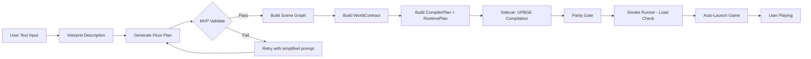
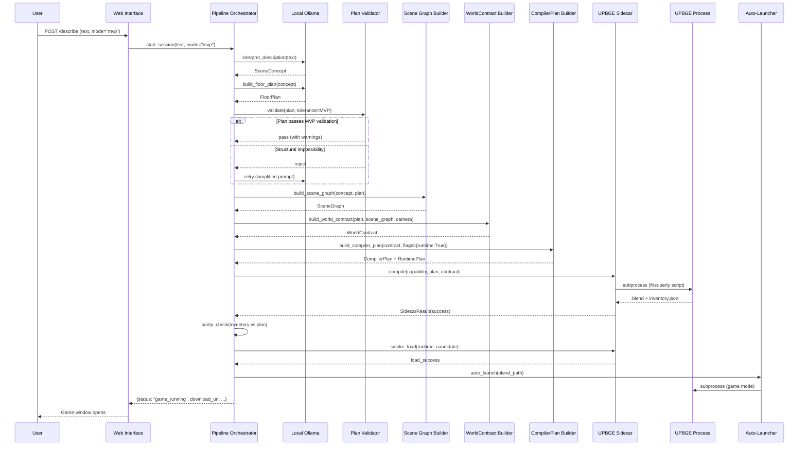

# Design Document: Text-to-Playable-World MVP

## Overview

This design defines the **shortest viable path** from a user's text sentence to a running 3D game. The user types a room description in the web interface, and within ~120 seconds they are walking around inside that room with WASD + mouse controls, opening doors, picking up objects.

The MVP achieves this by:
1. **Shortening the pipeline** — cutting 10+ quality-assurance stages (canon image, composition, alignment, human QA) that block delivery without adding structural correctness
2. **Relaxing plan validation** — accepting plans with minor geometric imperfections rather than rejecting them
3. **Auto-launching** — invoking UPBGE in game mode directly after compilation succeeds

All existing components (LLM interpreter, floor plan builder, scene graph builder, world contract, compiler plan builder, first-party UPBGE compile script, runtime templates, sidecar, web interface) are reused without redesign. The changes are surgical: new tolerance thresholds, skipped stages, and one new function (auto-launch).

### Design Rationale

The 0% pass rate of the current V11 pipeline stems from overly-strict validation gates, NOT from broken components. The compiler script works. The runtime templates work. The world contract builder works. The blocker is that LLM-generated plans fail strict validation before reaching compilation. The fix is to let imperfect-but-structurally-sound plans through.

## Architecture

### Shortened Pipeline (MVP Mode)



### Full Pipeline (V11 Mode — Preserved)


### Mode Selection

Sessions are created with a `mode` parameter:
- `"mvp"` (default): shortened pipeline, relaxed validation
- `"full"`: existing V11 behavior, strict validation, all gates

## Components and Interfaces

### Component Interaction Diagram



### Modified Components

| Component | File | Change |
|-----------|------|--------|
| Pipeline Orchestrator | `src/pipeline.py` | Add MVP mode branch that skips canon/composition/alignment/semantic-commands/QA stages |
| Plan Validator | `src/floor_plan/validator.py` | Add `mvp_tolerance` parameter to `validate_floor_plan()` |
| Web Interface | `src/web/app.py` | Add `mode` param to session creation, auto-launch trigger on completion |
| Auto-Launcher | `src/auto_launch.py` | **NEW** — subprocess invocation of UPBGE in game mode |
| Sidecar | `src/upbge_sidecar.py` | No changes needed (already supports `runtime=True`) |
| CompilerPlan Builder | `src/upbge_compiler.py` | No changes needed |
| Runtime Templates | `src/upbge_runtime.py` | No changes needed |
| First-Party Script | `src/assembler/upbge_compile.py` | No changes needed |

### New Component: Auto-Launcher (`src/auto_launch.py`)

```python
@dataclass(frozen=True)
class LaunchResult:
    success: bool
    pid: int | None
    executable: str
    blend_path: str
    reason_code: str
    diagnostics: str

def auto_launch_game(
    capability: UPBGECapabilityReport,
    blend_path: Path,
    *,
    fullscreen: bool = True,
    timeout_s: float = 10.0,
) -> LaunchResult:
    """Launch UPBGE in game mode on the compiled .blend file.
    
    Strategy:
    1. Verify blend_path exists and is non-zero
    2. Construct launch command using capability.executable_path
    3. Start subprocess (non-blocking — game runs independently)
    4. Wait up to timeout_s for process to NOT exit (confirms it's running)
    5. Return LaunchResult with PID for tracking
    """
```

**Launch Command Construction:**

UPBGE supports game-mode launch via embedded Python:
```
upbge --python-expr "import bge; bge.logic.startGame()" path/to/file.blend
```

Alternative (if the above fails on the installed version):
```
upbge -b path/to/file.blend --python-expr "
import bpy
bpy.ops.view3d.game_start()
"
```

The auto-launcher tries the primary command first. If the process exits within `timeout_s` (indicating failure), it tries the alternative. The capability probe will be extended to detect which invocation pattern works.

### MVP Tolerance Mode — Plan Validation Changes

**Current behavior** (`validate_floor_plan` with `strict=True`):
- Rejects ANY overlap between furniture items
- Rejects ANY item with center outside room bounds
- Rejects clearance violations of any magnitude
- Rejects relationship target mismatches > 0

**MVP tolerance behavior** (new `tolerance="mvp"` parameter):

| Check | Strict | MVP Tolerance |
|-------|--------|---------------|
| Item vertex outside room bounds | REJECT | REJECT (structural) |
| Room dimension = 0 | REJECT | REJECT (structural) |
| Missing room width/depth/height | REJECT | REJECT (structural) |
| Duplicate stable IDs | REJECT | REJECT (structural) |
| Item overlap ≤ 0.1m | REJECT | WARN (non-critical) |
| Relationship target offset ≤ 0.2m | REJECT | WARN (non-critical) |
| Clearance violation ≤ 0.15m | REJECT | WARN (non-critical) |
| Item overlap > 0.1m | REJECT | REJECT |
| Clearance violation > 0.15m | REJECT | REJECT |

**Implementation approach:**
```python
def validate_floor_plan(
    plan: FloorPlan,
    *,
    strict: bool = False,
    tolerance: Literal["strict", "mvp"] | None = None,
) -> PlanValidationReport:
    # tolerance parameter overrides strict bool for clarity
    effective_mode = tolerance or ("strict" if strict else "mvp")
    ...
```

### Retry Logic

When MVP validation rejects a plan:
1. **Attempt 1**: Full prompt (existing `PLAN_SYSTEM` + `V11_PLAN_SYSTEM`)
2. **Attempt 2**: Remove relationship constraints from prompt
3. **Attempt 3**: Remove clearance/circulation constraints, keep only room bounds + item list

Each retry uses the same LLM but progressively simpler prompts. If all 3 attempts fail, the pipeline reports failure with the list of structural impossibilities from the final attempt.

### Pipeline Orchestrator — MVP Branch

The `WorldBuilder` class in `src/pipeline.py` gains a mode-aware execution path:

```python
async def run_mvp(self) -> PipelineResult:
    """Shortened pipeline: interpret → plan → scene graph → contract → compile → launch."""
    # Stage 1: Interpret
    concept = await self._interpret(self.description)
    
    # Stage 2: Generate + Validate Plan (with retry)
    plan = await self._generate_plan_with_retry(concept, tolerance="mvp")
    
    # Stage 3: Build Scene Graph (skip canon image entirely)
    scene_graph = await build_scene_graph(concept, plan)
    
    # Stage 4: Build WorldContract
    camera = build_camera_contract(plan)
    contract = build_world_contract(plan, scene_graph, camera)
    
    # Stage 5: Build CompilerPlan + RuntimePlan
    compiler_plan = build_compiler_plan(
        contract, 
        flags=CompilerOutputFlags(blend=True, runtime=True)
    )
    
    # Stage 6: Sidecar Compilation
    result = run_upbge_sidecar(capability, contract, compiler_plan)
    
    # Stage 7: Parity Gate (lightweight — just ID matching)
    parity_ok = validate_upbge_inventory(result, compiler_plan)
    
    # Stage 8: Smoke Load Check
    smoke = run_runtime_smoke(result.blend_path, timeout_s=30)
    
    # Stage 9: Auto-Launch
    launch = auto_launch_game(capability, result.blend_path)
    
    return PipelineResult(
        success=True,
        artifact_path=result.blend_path,
        launch_result=launch,
        quality_label="smoke_partial" if not smoke.interactive_ok else "smoke_full",
    )
```

### Web Interface Changes

The `/describe` endpoint adds:
- `mode` parameter (default: `"mvp"`)
- Progress SSE events for MVP stages: `interpreting`, `planning`, `building_scene`, `compiling`, `validating`, `launching`
- Auto-launch trigger on successful compilation (no user click required)
- Fallback to download link if launch fails

Existing V3-V10 routes and behavior remain unchanged (requirement 10.6).

## Data Models

### Session Mode Extension

```python
class SessionMode(str, Enum):
    MVP = "mvp"
    FULL = "full"

class WorldSession(BaseModel):
    # Existing fields preserved...
    id: str
    description: str
    state: PipelineState
    # New field:
    mode: SessionMode = SessionMode.MVP
```

### LaunchResult

```python
@dataclass(frozen=True)
class LaunchResult:
    success: bool
    pid: int | None
    executable: str
    blend_path: str
    reason_code: str  # "launched", "process_exited", "executable_not_found", etc.
    diagnostics: str
    fallback_instructions: str | None  # Platform-specific manual launch instructions
```

### PipelineResult (MVP)

```python
@dataclass(frozen=True) 
class MVPPipelineResult:
    success: bool
    artifact_path: Path | None
    launch_result: LaunchResult | None
    quality_label: str  # "smoke_full", "smoke_partial", "parity_only"
    warnings: list[PlanValidationWarning]
    failure_stage: str | None
    failure_reason_code: str | None
    failure_diagnostic: str | None
    duration_ms: int
```

### PlanValidationWarning

```python
@dataclass(frozen=True)
class PlanValidationWarning:
    warning_type: str  # "overlap", "relationship_offset", "clearance"
    affected_id: str
    measured_deviation: float
    threshold: float
```

### WorldContract / CompilerPlan / RuntimePlan

**No changes.** These schemas remain identical. MVP mode only affects orchestration and validation thresholds upstream of contract construction.

## Correctness Properties

*A property is a characteristic or behavior that should hold true across all valid executions of a system — essentially, a formal statement about what the system should do. Properties serve as the bridge between human-readable specifications and machine-verifiable correctness guarantees.*

### Property 1: Input Length Validation

*For any* string input, the pipeline SHALL reject it with a validation error (without invoking any LLM stage) if and only if its character count is less than 3 or greater than 500.

**Validates: Requirements 1.5**

### Property 2: MVP Tolerance — Non-Critical Acceptance vs Structural Rejection

*For any* floor plan, MVP_Tolerance validation SHALL accept the plan (possibly with warnings) if and only if NO structural impossibility exists (no vertex outside room bounds, no zero-dimension room, no missing room dimensions, no duplicate IDs). Plans containing only non-critical violations (overlaps ≤ 0.1m, relationship offsets ≤ 0.2m, clearance violations ≤ 0.15m) SHALL pass.

**Validates: Requirements 2.2**

### Property 3: Warnings Recorded in Manifest

*For any* plan accepted under MVP_Tolerance that contains non-critical warnings, EVERY warning (type, affected ID, measured deviation) SHALL appear in the resulting Compiler_Manifest output.

**Validates: Requirements 2.5**

### Property 4: Player Movement Speed Normalization

*For any* combination of WASD key inputs and configured maximum speed, the resulting movement vector magnitude SHALL never exceed the configured maximum speed. Specifically, diagonal movement (two keys pressed) SHALL produce a normalized direction vector such that `speed * normalized_direction.length <= max_speed`.

**Validates: Requirements 4.2, 4.3**

### Property 5: Vertical Look Angle Clamping

*For any* sequence of mouse Y-axis movements applied to the camera, the resulting vertical look angle SHALL remain within the bounds [-85°, +85°] regardless of the cumulative delta magnitude.

**Validates: Requirements 4.3**

### Property 6: Obstructed Spawn Repositioning

*For any* room geometry where the default spawn point (floor center at 1.7m) is obstructed by static geometry, the repositioning algorithm SHALL produce a spawn point that is (a) within the room bounds, (b) at the configured eye height, and (c) not intersecting any static collider.

**Validates: Requirements 4.7**

### Property 7: Door Interaction Parameter Validation

*For any* door interaction intent, the RuntimePlan builder SHALL accept it if and only if: `open_angle_deg` is within [-180, 180] and non-zero, `speed_deg_s` is within (0, 720], the subject has explicit physics intent, and the body mode is NOT trigger. For all invalid parameters, a structured error identifying the invalid field SHALL be returned.

**Validates: Requirements 5.1, 5.3, 5.5**

### Property 8: Door Animation Step Convergence

*For any* door state (current_angle, target_angle, speed_deg_s, frame_rate), the per-frame rotation step SHALL advance toward the target angle without overshooting, and the step magnitude SHALL equal `min(|target - current|, speed_deg_s / frame_rate)`.

**Validates: Requirements 5.3**

### Property 9: Grab Interaction Constraints

*For any* object with mass `m` and grab mass limit `L`, the grab component SHALL refuse the grab if and only if `m > L`. *For any* successful grab with hold_distance `d` and camera forward vector `f`, the held object position SHALL equal `camera_position + f * d`.

**Validates: Requirements 6.3, 6.5**

### Property 10: Sidecar Structured Failure

*For any* invalid sidecar state (missing capability, non-zero exit code, absent output files, exceeded limits), the sidecar SHALL return a `SidecarResult` with `success=False`, a non-empty `reason_code`, and — for process failures — the exit code and up to 2MB of captured output.

**Validates: Requirements 7.2, 7.4, 7.7**

### Property 11: Parity Gate ID Verification

*For any* CompilerPlan with expected object IDs `E` and scene inventory with actual IDs `A`, the parity gate SHALL pass if and only if `E ⊆ A`. When it fails, the failure result SHALL list every ID in `E \ A` (the set difference).

**Validates: Requirements 8.1, 8.2**

### Property 12: WorldContract Serialization Round-Trip

*For any* valid WorldContract instance, serializing to canonical JSON bytes and then deserializing SHALL produce a structurally equal WorldContract where every field value compares equal by Pydantic model equality.

**Validates: Requirements 11.1**

### Property 13: CompilerPlan Deterministic Hash

*For any* valid WorldContract and compiler configuration, building the CompilerPlan twice with identical inputs SHALL produce an identical SHA-256 content hash.

**Validates: Requirements 11.2**

### Property 14: RuntimePlan Template Hash Integrity

*For any* valid RuntimePlan, each template source embedded in the plan SHALL produce a SHA-256 hash matching the corresponding entry in `template_hashes`.

**Validates: Requirements 11.3**

### Property 15: Canonical JSON Format Constraints

*For any* data passed to the canonical JSON serializer: (a) non-finite numbers (NaN, Infinity, -Infinity) SHALL be rejected with an error, (b) output keys SHALL be sorted lexicographically, (c) separators SHALL be `,` and `:` with no whitespace, and (d) encoding SHALL be UTF-8.

**Validates: Requirements 11.4**

### Property 16: Deserialization Validation Errors

*For any* byte sequence that does not conform to the WorldContract canonical schema (missing required fields, unknown fields, type mismatches), deserialization SHALL raise a validation error identifying the first non-conforming element rather than silently coercing values.

**Validates: Requirements 11.5**

### Property 17: Pipeline Error Reporting Preserves Session State

*For any* pipeline stage failure, the pipeline SHALL produce a result containing the failure stage name, a machine-readable reason code, and a human-readable diagnostic message, AND the session state SHALL remain uncorrupted (session still queryable, no partial writes to artifact storage).

**Validates: Requirements 1.4**

## Error Handling

### Failure Taxonomy

| Failure Class | Source | MVP Response |
|---------------|--------|--------------|
| `input_invalid` | User input too short/long | Immediate rejection, no LLM invoked |
| `model_plan_rejected` | LLM plan fails MVP validation (structural) | Retry up to 2x with simplified prompts; report impossibilities |
| `model_plan_warning` | LLM plan has non-critical issues | Accept with warnings, continue pipeline |
| `scene_graph_error` | Scene graph builder fails | Report stage + reason, session preserved |
| `contract_error` | WorldContract assembly fails | Report stage + reason, session preserved |
| `compiler_limit` | CompilerPlan exceeds resource limits | Report which limit exceeded |
| `sidecar_capability` | UPBGE not found/incompatible | Report missing capability, suggest installation |
| `sidecar_timeout` | UPBGE process exceeds wall-time | Terminate, clean up, report |
| `sidecar_crash` | UPBGE exits non-zero | Capture output, report exit code |
| `parity_failure` | Compiled scene missing expected objects | List missing IDs |
| `smoke_load_fail` | Runtime candidate won't load | Report, still offer download |
| `launch_failure` | Auto-launch fails | Fall back to download link with instructions |

### Error Propagation Pattern

Every stage returns either a success result or a structured failure. Failures do NOT throw exceptions that could corrupt session state. Instead:

```python
@dataclass(frozen=True)
class StageFailure:
    stage: str
    reason_code: str
    diagnostic: str
    recoverable: bool
    
    def to_user_message(self) -> str:
        """Human-readable explanation for the web interface."""
```

The pipeline orchestrator catches failures at each stage boundary and decides:
1. **Retry** (for `model_plan_rejected` in MVP mode, up to 2 retries)
2. **Continue with degraded quality** (for `smoke_load_fail` → publish with `smoke_partial`)
3. **Fallback** (for `launch_failure` → present download link)
4. **Report and stop** (for all other failures)

### Graceful Degradation Chain

```
Full success: game auto-launches
    ↓ launch fails
Degraded: download link with instructions
    ↓ smoke fails  
Degraded: download link with "smoke_partial" label
    ↓ parity fails
Hard failure: report missing objects, no artifact published
    ↓ compilation fails
Hard failure: report sidecar error, no artifact
    ↓ plan generation exhausts retries
Hard failure: report structural impossibilities
```

## Testing Strategy

### Property-Based Testing (Hypothesis)

This feature is well-suited for property-based testing because the core logic involves:
- Input validation with clear boundaries (string lengths, numeric ranges)
- Set operations (parity ID matching)
- Mathematical invariants (movement normalization, angle clamping)
- Serialization round-trips
- Validation functions with classifiable outputs (pass/warn/reject)

**Library:** [Hypothesis](https://hypothesis.readthedocs.io/) (already in use — `.hypothesis/` directory exists in workspace)

**Configuration:**
- Minimum 100 examples per property test
- Each test tagged with property reference comment
- Deadline set to 5000ms (allows for Pydantic model construction)

**Tag format:** `# Feature: text-to-playable-world-mvp, Property {N}: {title}`

### Test File Organization

| Test File | Properties Covered | Type |
|-----------|-------------------|------|
| `tests/test_mvp_input_validation.py` | Property 1 | Property |
| `tests/test_mvp_tolerance.py` | Properties 2, 3 | Property |
| `tests/test_player_controller_math.py` | Properties 4, 5, 6 | Property |
| `tests/test_door_interaction_validation.py` | Properties 7, 8 | Property |
| `tests/test_grab_interaction_validation.py` | Property 9 | Property |
| `tests/test_sidecar_failure.py` | Property 10 | Property |
| `tests/test_parity_gate.py` | Property 11 | Property |
| `tests/test_serialization_roundtrip.py` | Properties 12, 13, 14, 15, 16 | Property |
| `tests/test_pipeline_error_handling.py` | Property 17 | Property |
| `tests/test_mvp_integration.py` | E2E flow | Integration |
| `tests/test_auto_launch.py` | Launch subprocess | Integration |
| `tests/test_web_mvp_routes.py` | Web endpoints | Example |

### Unit Tests (Example-Based)

- Session creation with default MVP mode
- Plan retry mechanism (mock LLM)
- Auto-launch fallback to download link
- Web interface stage progress events
- V3-V10 route preservation (regression)
- Mode switching between MVP and full

### Integration Tests

- Full MVP pipeline with mock LLM (deterministic plan)
- UPBGE compilation + parity gate (requires UPBGE installed)
- Auto-launch + process monitoring (requires UPBGE installed)
- Web interface E2E (FastAPI TestClient)

### What We DON'T Test with PBT

- UPBGE internal behavior (rendering, physics engine)
- LLM output quality (stochastic, handled by ratchet loop)
- Web UI visual appearance
- Timing constraints (hardware-dependent)

### Implementation Effort Estimate

| Task | Hours |
|------|-------|
| MVP tolerance in validator | 1.0 |
| Pipeline MVP branch + retry logic | 1.5 |
| Auto-launcher module | 1.0 |
| Web interface mode + auto-launch trigger | 1.0 |
| Property tests (17 properties) | 2.0 |
| Integration test with mock LLM | 1.0 |
| End-to-end verification | 0.5 |
| **Total** | **8.0** |
