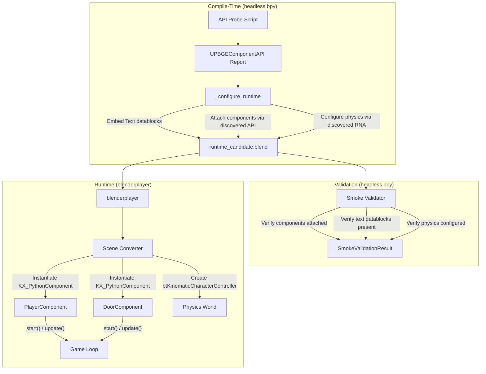
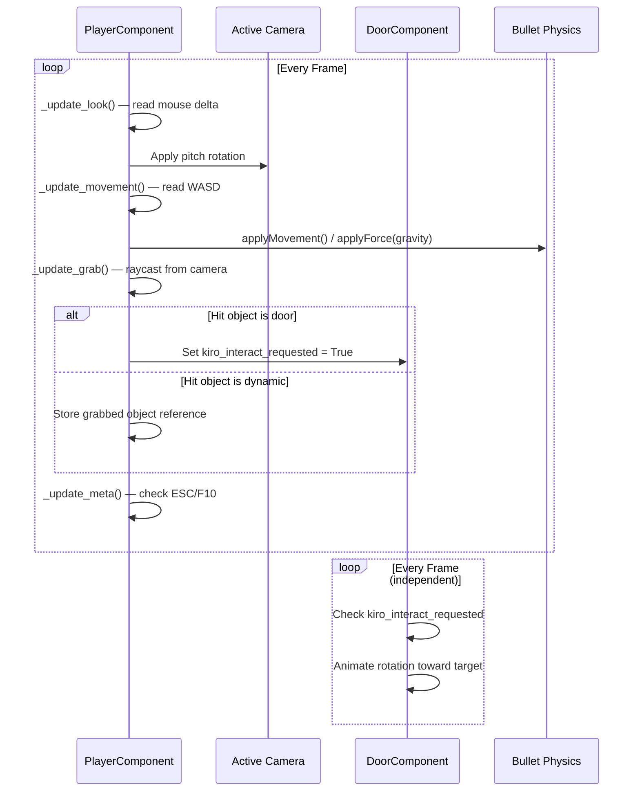
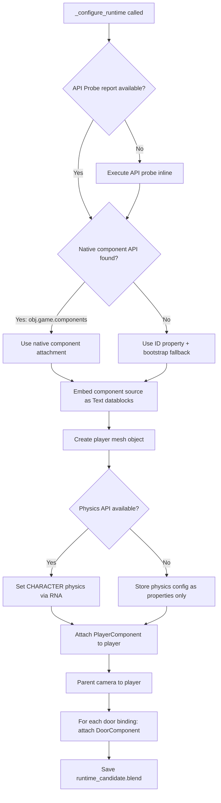
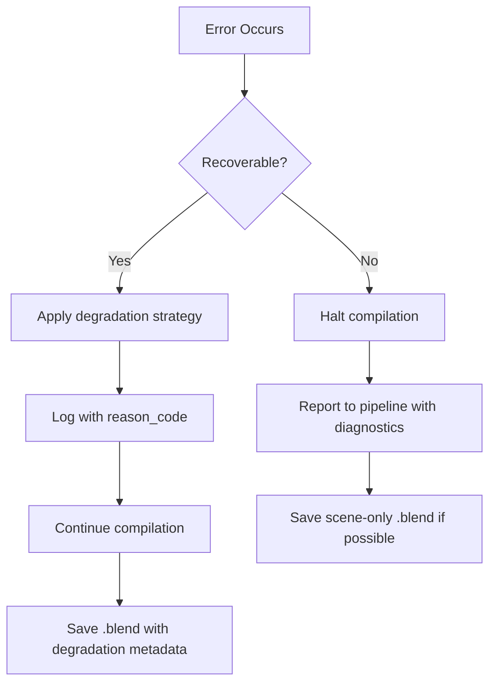

# Design Document: UPBGE 0.50 Walkable Runtime

## Overview

This design migrates the walkable runtime from UPBGE's legacy logic brick system (Always sensor → Python controller) to the `KX_PythonComponent` system available in UPBGE 0.50. The core challenge is that `bpy.types.Object.game` — the compile-time API for physics configuration, logic brick wiring, and component attachment — was removed in UPBGE 0.50 (based on Blender 5.0.1).

The solution has three layers:

1. **API Discovery (Probe)**: A headless introspection script run inside UPBGE 0.50 to discover the actual available API surface before compilation proceeds.
2. **Component Migration**: Rewriting the three runtime scripts (Player, Door, Grab) as `KX_PythonComponent` subclasses with proper `args`, `start()`, `update()` lifecycle.
3. **Compile-time Attachment**: Updating `_configure_runtime()` to use the discovered API (or fallback) to attach components and configure physics without `obj.game`.

### Design Decisions (Informed by Adversarial Analysis)

**Decision 1 — Component Attachment**: Use a probe-first strategy with a fallback chain:
1. Check for UPBGE 0.50 RNA path (e.g., `Object.upbge.components` or `Object.game_components`)
2. If unavailable, use custom ID properties + embedded Text datablocks with a component registration bootstrap
3. Store probe results as a `UPBGEComponentAPI` capability report for the compile step

**Rationale**: The RNA path is architecturally correct (the scene converter reads it natively), but its existence is uncertain. Custom properties + bootstrap is guaranteed to work for storage but requires runtime verification.

**Decision 2 — Physics Configuration**: The probe must discover the physics RNA path. Physics type (CHARACTER, STATIC, DYNAMIC) must be set at compile-time DNA level for the scene converter to instantiate the correct Bullet controller. Runtime-only approaches are rejected because `btKinematicCharacterController` integration requires converter-time setup.

**Rationale**: Setting physics_type post-scene-conversion is architecturally unsound — the converter is the gatekeeper for CHARACTER physics instantiation. If no compile-time physics API exists, the system degrades to a No-Collision object with component-driven velocity (graceful degradation).

**Decision 3 — Component Architecture**: Single monolithic `PlayerComponent` with internal method decomposition + separate `DoorComponent` on door objects. Grab logic lives inside `PlayerComponent` (not split out).

**Rationale**: Grab is frame-coupled to look direction and movement state. Splitting it into a separate component introduces update-order dependencies, property polling overhead, and silent coupling via string-keyed properties. The door boundary is real (door owns its own state machine). Pure utility functions are factored out for testability.

---

## Architecture

### High-Level System Diagram



### Component Interaction Diagram



---

## Components and Interfaces

### API Probe Module

The probe is a standalone Python script executed inside UPBGE 0.50 via `--background --python`. It introspects the actual API surface and produces a structured JSON report.

```python
# src/assembler/api_probe_050.py
"""UPBGE 0.50 API Discovery Probe.

Executed headlessly inside UPBGE 0.50 to discover:
1. Component attachment API (RNA path or operator)
2. Physics configuration API (replacement for obj.game.physics_type)
3. Available bpy.types.Object properties related to UPBGE

Output: JSON report on stdout with PROBE_RESULT= prefix marker.
"""

import bpy
import json
import sys

PROBE_RESULT_MARKER = "PROBE_RESULT="

def _discover_component_api():
    """Check for component attachment mechanisms."""
    result = {
        "has_game_attr": hasattr(bpy.types.Object, "game"),
        "has_components_attr": False,
        "has_upbge_attr": False,
        "component_api_path": None,
        "component_add_method": None,
        "available_upbge_properties": [],
    }

    # Check all RNA properties for UPBGE-related names
    for prop in bpy.types.Object.bl_rna.properties:
        name = prop.identifier.lower()
        if any(kw in name for kw in ("game", "component", "upbge", "logic")):
            result["available_upbge_properties"].append(prop.identifier)

    # Check for direct component collection
    if hasattr(bpy.types.Object, "components"):
        result["has_components_attr"] = True
        result["component_api_path"] = "bpy.types.Object.components"

    if hasattr(bpy.types.Object, "upbge"):
        result["has_upbge_attr"] = True

    # Check game sub-property for components
    if result["has_game_attr"]:
        game_type = getattr(bpy.types, "GameObjectSettings", None)
        if game_type:
            if hasattr(game_type, "components"):
                result["component_api_path"] = "obj.game.components"
                result["component_add_method"] = "obj.game.components.new()"

    # Check for operators
    result["has_logic_ops"] = hasattr(bpy.ops, "logic")
    if result["has_logic_ops"]:
        logic_ops = [op for op in dir(bpy.ops.logic) if "component" in op.lower()]
        result["component_operators"] = logic_ops

    return result


def _discover_physics_api():
    """Check for physics configuration mechanisms."""
    result = {
        "has_game_physics": False,
        "physics_api_path": None,
        "physics_type_enum": [],
        "collision_bounds_enum": [],
    }

    if hasattr(bpy.types.Object, "game"):
        game_type = getattr(bpy.types, "GameObjectSettings", None)
        if game_type and hasattr(game_type, "physics_type"):
            result["has_game_physics"] = True
            result["physics_api_path"] = "obj.game.physics_type"

    # Check for alternative paths
    for prop in bpy.types.Object.bl_rna.properties:
        if "physics" in prop.identifier.lower():
            result.setdefault("alternative_physics_props", []).append(prop.identifier)

    return result


def main():
    report = {
        "schema_version": "upbge-api-probe/v1",
        "blender_version": list(bpy.app.version),
        "blender_version_string": bpy.app.version_string,
        "upbge_detected": "upbge" in bpy.app.version_string.lower()
                          or hasattr(bpy.types, "GameObjectSettings"),
        "component_api": _discover_component_api(),
        "physics_api": _discover_physics_api(),
    }
    print(PROBE_RESULT_MARKER + json.dumps(report, sort_keys=True), flush=True)
    sys.exit(0)

if __name__ == "__main__":
    main()
```

#### Probe Result Data Model

```python
@dataclass(frozen=True)
class UPBGEComponentAPI:
    """Discovered UPBGE 0.50 API surface for component attachment."""
    has_game_attr: bool
    has_components_attr: bool
    component_api_path: str | None        # e.g., "obj.game.components" or "obj.components"
    component_add_method: str | None      # e.g., "obj.game.components.new()"
    has_logic_ops: bool
    physics_api_path: str | None          # e.g., "obj.game.physics_type"
    has_game_physics: bool
    blender_version: tuple[int, int, int]
    upbge_detected: bool
    fallback_required: bool               # True if no native component API found
```

---

### PlayerComponent (KX_PythonComponent)

```python
# Embedded as Text datablock: kiro_player_first_person.py
import bge
import math
from mathutils import Vector


class PlayerComponent(bge.types.KX_PythonComponent):
    """First-person WASD + mouse-look player controller with grab interaction."""

    args = {
        "move_speed": 4.0,
        "look_speed": 0.0025,
        "gravity": 9.81,
        "max_grab_distance": 3.0,
        "grab_hold_distance": 1.5,
    }

    def start(self, args):
        self.move_speed = max(0.1, min(float(args["move_speed"]), 20.0))
        self.look_speed = max(0.0001, min(float(args["look_speed"]), 0.02))
        self.gravity = max(0.0, min(float(args["gravity"]), 50.0))
        self.max_grab_distance = float(args["max_grab_distance"])
        self.grab_hold_distance = float(args["grab_hold_distance"])
        self.paused = False
        self.grabbed_object = None
        self.grab_rules = {}
        # Load grab rules from object property if available
        import json
        rules_json = self.object.get("kiro_grab_rules_json", "{}")
        try:
            self.grab_rules = json.loads(rules_json)
        except (json.JSONDecodeError, TypeError):
            pass

    def update(self):
        if self._check_exit():
            return
        if self._check_pause():
            return
        if self.paused:
            return
        self._update_look()
        self._update_movement()
        self._update_grab()

    def _check_exit(self) -> bool:
        keyboard = bge.logic.keyboard.events
        if keyboard.get(bge.events.F10KEY) == bge.logic.KX_INPUT_JUST_ACTIVATED:
            bge.logic.endGame()
            return True
        return False

    def _check_pause(self) -> bool:
        keyboard = bge.logic.keyboard.events
        if keyboard.get(bge.events.ESCKEY) == bge.logic.KX_INPUT_JUST_ACTIVATED:
            self.paused = not self.paused
            return True
        return False

    def _update_look(self):
        mouse = bge.logic.mouse
        delta_x = mouse.position[0] - 0.5
        delta_y = mouse.position[1] - 0.5
        # Yaw on player object (world Z)
        self.object.applyRotation((0.0, 0.0, -delta_x * self.look_speed * 100.0), False)
        # Pitch on camera (local X)
        camera = bge.logic.getCurrentScene().active_camera
        euler = camera.localOrientation.to_euler()
        euler.x = max(-1.5, min(1.5, euler.x - delta_y * self.look_speed * 100.0))
        camera.localOrientation = euler.to_matrix()
        # Re-center mouse
        bge.render.setMousePosition(
            bge.render.getWindowWidth() // 2,
            bge.render.getWindowHeight() // 2
        )

    def _update_movement(self):
        keyboard = bge.logic.keyboard.events
        direction = Vector((0.0, 0.0, 0.0))
        direction.y += keyboard.get(bge.events.WKEY, 0) > 0
        direction.y -= keyboard.get(bge.events.SKEY, 0) > 0
        direction.x -= keyboard.get(bge.events.AKEY, 0) > 0
        direction.x += keyboard.get(bge.events.DKEY, 0) > 0
        if direction.length > 0.0:
            direction.normalize()
        speed = self.move_speed
        self.object.applyMovement(
            (direction.x * speed / 60.0, direction.y * speed / 60.0, 0.0), True
        )
        # Gravity
        mass = max(self.object.mass, 1.0)
        self.object.applyForce((0.0, 0.0, -self.gravity * mass), False)

    def _update_grab(self):
        keyboard = bge.logic.keyboard.events
        scene = bge.logic.getCurrentScene()
        if keyboard.get(bge.events.EKEY) == bge.logic.KX_INPUT_JUST_ACTIVATED:
            if self.grabbed_object:
                self.grabbed_object = None
                return
            camera = scene.active_camera
            ray_to = camera.worldPosition + camera.getAxisVect(
                (0.0, 0.0, -self.max_grab_distance)
            )
            hit, _point, _normal = self.object.rayCast(
                ray_to, camera.worldPosition, self.max_grab_distance
            )
            if hit and "kiro_open_angle_deg" in hit:
                hit["kiro_interact_requested"] = True
            elif hit and hit.get("kiro_body_mode") == "dynamic":
                stable_id = hit.get("kiro_stable_id", "")
                rule = self.grab_rules.get(stable_id)
                if rule:
                    max_mass = float(rule.get("max_mass_kg", 0))
                    obj_mass = float(hit.get("kiro_mass_kg", 0))
                    if obj_mass <= max_mass:
                        self.grabbed_object = hit
                        self.grab_hold_distance = float(
                            rule.get("hold_distance_m", 1.5)
                        )
        # Hold logic
        if self.grabbed_object and self.grabbed_object.name in scene.objects:
            camera = scene.active_camera
            target = camera.worldPosition + camera.getAxisVect(
                (0.0, 0.0, -self.grab_hold_distance)
            )
            self.grabbed_object.setLinearVelocity(
                (target - self.grabbed_object.worldPosition) * 10.0, False
            )
        elif self.grabbed_object:
            self.grabbed_object = None
```

### DoorComponent (KX_PythonComponent)

```python
# Embedded as Text datablock: kiro_interaction_door.py
import bge
import math


class DoorComponent(bge.types.KX_PythonComponent):
    """Door toggle with rotation animation, triggered by kiro_interact_requested."""

    args = {
        "open_angle_deg": 90.0,
        "speed_deg_s": 120.0,
        "initially_open": False,
    }

    def start(self, args):
        self.open_angle_deg = float(args["open_angle_deg"])
        self.speed_deg_s = float(args["speed_deg_s"])
        self.initially_open = bool(args["initially_open"])
        # Record the closed angle from current orientation
        self.closed_angle = self.object.localOrientation.to_euler().z
        self.is_open = self.initially_open

    def update(self):
        # Check for interaction request
        if self.object.get("kiro_interact_requested", False):
            self.object["kiro_interact_requested"] = False
            self.is_open = not self.is_open
        # Animate toward target
        target = self.closed_angle + (
            math.radians(self.open_angle_deg) if self.is_open else 0.0
        )
        euler = self.object.localOrientation.to_euler()
        step = math.radians(self.speed_deg_s) / 60.0
        diff = target - euler.z
        euler.z += max(-step, min(step, diff))
        self.object.localOrientation = euler.to_matrix()
```

### GrabComponent (Legacy Compatibility Stub)

The grab logic is integrated into `PlayerComponent._update_grab()`. A separate `GrabComponent` is not used. The `GRAB_COMPONENT_SOURCE` template is preserved for backward compatibility with existing `RuntimePlan` structures but its functionality is merged into the player.

---

## The Updated `_configure_runtime()` Flow



### Low-Level: Compile Function Signatures

```python
def _configure_runtime_050(
    bpy,
    plan: dict,
    object_by_id: dict[str, Any],
    camera_obj: Any,
    api_report: UPBGEComponentAPI,
) -> Any:
    """UPBGE 0.50 component-based runtime configuration.

    Returns the player object. Raises ValueError on unrecoverable failures.
    Stores degradation info on player["kiro_degradation_*"] properties.
    """
    ...

def _attach_component_050(
    bpy,
    obj: Any,
    component_class_name: str,
    text_datablock_name: str,
    args: dict[str, Any],
    api_report: UPBGEComponentAPI,
) -> bool:
    """Attach a KX_PythonComponent to an object using the discovered API.

    Returns True if native attachment succeeded, False if fallback was used.
    """
    ...

def _configure_physics_050(
    bpy,
    obj: Any,
    physics_type: str,
    collision_shape: str,
    mass: float,
    api_report: UPBGEComponentAPI,
) -> bool:
    """Configure physics on an object using the discovered API.

    Returns True if physics was configured, False if degraded (no-collision).
    """
    ...

def _embed_component_source(bpy, module_name: str, source: str) -> str:
    """Embed component source as a Text datablock. Returns the text name."""
    text_name = module_name + ".py"
    existing = bpy.data.texts.get(text_name)
    if existing:
        bpy.data.texts.remove(existing)
    text = bpy.data.texts.new(text_name)
    text.write(source)
    return text_name
```

### Fallback Component Bootstrap Script

When native component API is unavailable, this bootstrap script is embedded and set as the game's startup script:

```python
# Embedded as: kiro_component_bootstrap.py
"""Bootstrap for component instantiation when native API is unavailable.

Reads kiro_component_* properties from objects and instantiates the
referenced KX_PythonComponent subclasses manually.
"""
import bge
import importlib
import json


def bootstrap():
    scene = bge.logic.getCurrentScene()
    for obj in scene.objects:
        module_name = obj.get("kiro_component_module")
        class_name = obj.get("kiro_component_class")
        if not module_name or not class_name:
            continue
        try:
            module = importlib.import_module(module_name)
            cls = getattr(module, class_name)
            args_json = obj.get("kiro_component_args", "{}")
            args = json.loads(args_json) if isinstance(args_json, str) else {}
            # Instantiate via UPBGE's runtime component API
            component = cls(obj)
            component.start(args)
            obj.components.append(component)
        except Exception as e:
            print(f"[kiro bootstrap] Failed to attach {class_name} to {obj.name}: {e}")
```

---

## Updated Smoke Validator Checks

The smoke validator transitions from checking logic bricks to checking component attachment:

| Old Check | New Check | Method |
|---|---|---|
| `logic_bricks_wired` | `components_attached` | Verify `obj.game.components` has entries OR `obj["kiro_component_class"]` is set |
| `player_controller_exists` | `player_component_attached` | Player object has PlayerComponent registered |
| `character_physics` | `physics_configured` | Player has CHARACTER physics OR has `kiro_physics_type=CHARACTER` property |
| `scene_loads` | `scene_loads` | Unchanged — .blend opens without error |
| *(new)* | `text_datablocks_present` | All required `.py` Text datablocks exist in `bpy.data.texts` |
| *(new)* | `door_components_attached` | Door objects have DoorComponent registered |

### Updated Smoke Probe Script Logic

```python
# src/assembler/smoke_probe_050.py (replaces/augments smoke_probe.py)

def check_player_component(player_obj, api_report):
    """Verify player has component attached via native or fallback mechanism."""
    # Native path
    if hasattr(player_obj, 'game') and hasattr(player_obj.game, 'components'):
        for comp in player_obj.game.components:
            if 'Player' in comp.name or 'player' in comp.module:
                return {"passed": True, "detail": f"Native component: {comp.name}"}
    # Fallback path
    if player_obj.get("kiro_component_class") == "PlayerComponent":
        module = player_obj.get("kiro_component_module", "")
        return {"passed": True, "detail": f"Fallback component: {module}.PlayerComponent"}
    return {"passed": False, "detail": "No player component found via native or fallback API"}


def check_text_datablocks(bpy, required_modules):
    """Verify all required component source Text datablocks are embedded."""
    missing = []
    for module_name in required_modules:
        text_name = module_name + ".py"
        if bpy.data.texts.get(text_name) is None:
            missing.append(text_name)
    if missing:
        return {"passed": False, "detail": f"Missing text datablocks: {', '.join(missing)}"}
    return {"passed": True, "detail": f"All {len(required_modules)} text datablocks present"}


def check_physics_configured(player_obj, api_report):
    """Verify player has CHARACTER physics or stored physics intent."""
    if hasattr(player_obj, 'game') and hasattr(player_obj.game, 'physics_type'):
        if player_obj.game.physics_type == 'CHARACTER':
            return {"passed": True, "detail": "Native CHARACTER physics configured"}
    # Fallback: check stored intent
    if player_obj.get("kiro_physics_type") == "CHARACTER":
        return {
            "passed": True,
            "detail": "Physics stored as property (runtime bootstrap required)"
        }
    return {"passed": False, "detail": "No CHARACTER physics configured"}


def check_door_components(bpy, door_object_ids, api_report):
    """Verify door objects have DoorComponent attached."""
    results = []
    for obj_id in door_object_ids:
        obj = bpy.data.objects.get(obj_id)
        if obj is None:
            results.append(f"{obj_id}: object not found")
            continue
        has_component = False
        if hasattr(obj, 'game') and hasattr(obj.game, 'components'):
            for comp in obj.game.components:
                if 'Door' in comp.name:
                    has_component = True
        if not has_component and obj.get("kiro_component_class") == "DoorComponent":
            has_component = True
        if not has_component:
            results.append(f"{obj_id}: no door component")
    if results:
        return {"passed": False, "detail": "; ".join(results)}
    return {"passed": True, "detail": f"All {len(door_object_ids)} doors have components"}
```

---

## Data Models

### UPBGEComponentAPI (Probe Result)

```python
@dataclass(frozen=True)
class UPBGEComponentAPI:
    """Discovered UPBGE 0.50 API surface."""
    schema_version: str = "upbge-api-probe/v1"
    blender_version: tuple[int, int, int] = (5, 0, 1)
    upbge_detected: bool = False

    # Component attachment
    has_game_attr: bool = False
    has_components_attr: bool = False
    component_api_path: str | None = None
    component_add_method: str | None = None
    has_logic_ops: bool = False

    # Physics
    has_game_physics: bool = False
    physics_api_path: str | None = None

    # Derived
    @property
    def fallback_required(self) -> bool:
        return self.component_api_path is None

    @property
    def physics_available(self) -> bool:
        return self.has_game_physics and self.physics_api_path is not None
```

### Updated RuntimePlan Extension

The existing `RuntimePlan` dataclass gains awareness of the component system:

```python
@dataclass(frozen=True)
class RuntimePlanV2(RuntimePlan):
    """Extended runtime plan with UPBGE 0.50 component metadata."""
    component_system: str = "kx_python_component"  # "logic_brick" | "kx_python_component"
    component_class_names: tuple[tuple[str, str], ...] = ()  # (template_id, class_name)
    bootstrap_required: bool = False
```

### Component Attachment Record

```python
@dataclass(frozen=True)
class ComponentAttachment:
    """Record of a component attached to an object during compilation."""
    object_id: str
    component_class: str
    module_name: str
    text_datablock: str
    args: dict[str, Any]
    native_attached: bool      # True if used native API, False if fallback
    physics_configured: bool   # True if physics set via RNA
```

### SmokeCheck Extensions

```python
# New check names for UPBGE 0.50
SMOKE_CHECK_NAMES_050 = (
    "scene_loads",
    "player_component_attached",
    "text_datablocks_present",
    "physics_configured",
    "door_components_attached",
)
```

---


## Correctness Properties

*A property is a characteristic or behavior that should hold true across all valid executions of a system — essentially, a formal statement about what the system should do. Properties serve as the bridge between human-readable specifications and machine-verifiable correctness guarantees.*

### Property 1: Probe Report Parsing Round-Trip

*For any* valid JSON probe output containing fields (`has_game_attr`, `has_components_attr`, `component_api_path`, `physics_api_path`, `blender_version`), parsing into a `UPBGEComponentAPI` dataclass and serializing back to dict SHALL preserve all field values.

**Validates: Requirements 1.2**

### Property 2: Movement Direction Relative to Orientation

*For any* keyboard state (combination of W/A/S/D pressed) and any player orientation (yaw angle), the computed movement vector SHALL have direction consistent with the pressed keys relative to the player's local coordinate frame, and magnitude equal to `move_speed / 60.0` when any key is pressed, or zero when no movement keys are pressed.

**Validates: Requirements 2.2, 2.7**

### Property 3: Mouse Look Delta with Pitch Clamping

*For any* mouse position delta (dx, dy) and any current camera pitch angle, the resulting pitch SHALL be clamped to [-1.5, 1.5] radians, and the yaw change SHALL be proportional to `dx * look_speed * 100.0`.

**Validates: Requirements 2.3**

### Property 4: Gravity Force Computation

*For any* gravity value g ∈ [0.0, 50.0] and mass m ≥ 1.0, the applied force vector SHALL be exactly `(0.0, 0.0, -g * max(m, 1.0))`.

**Validates: Requirements 2.4**

### Property 5: Pause Toggle Idempotence

*For any* initial pause state (True or False), toggling pause twice SHALL return to the original pause state. Furthermore, while paused, movement and look updates SHALL produce zero state change.

**Validates: Requirements 2.5**

### Property 6: Movement Round-Trip

*For any* valid move_speed ∈ [0.1, 20.0] and any unit direction vector, applying movement in that direction for N frames followed by movement in the opposite direction for N frames SHALL result in a final position within 0.01 units of the starting position (assuming no collision or gravity interference).

**Validates: Requirements 2.9**

### Property 7: Door State Toggle

*For any* door in state `is_open`, setting `kiro_interact_requested = True` and executing one update cycle SHALL result in `is_open = !is_open` and `kiro_interact_requested = False`.

**Validates: Requirements 3.3**

### Property 8: Door Rotation Convergence

*For any* `open_angle_deg` ∈ [-180, 180] \ {0} and `speed_deg_s` ∈ (0, 720], iterating the door animation update for at most `ceil(|open_angle_deg| / speed_deg_s * 60) + 1` frames SHALL produce a final rotation within `speed_deg_s / 60.0` radians of the target angle.

**Validates: Requirements 3.6**

### Property 9: Interaction Hit Classification

*For any* raycast hit object, the grab/interact system SHALL:
- Set `kiro_interact_requested = True` on the hit object if it has `kiro_open_angle_deg` property (door trigger)
- Grab the hit object if it has `kiro_body_mode == "dynamic"` AND its mass ≤ the rule's `max_mass_kg` AND a grab rule exists for its `kiro_stable_id`
- Take no action otherwise

These three cases SHALL be mutually exclusive and exhaustive for any hit object.

**Validates: Requirements 4.2, 4.3, 4.4, 4.5**

### Property 10: Held Object Velocity Direction

*For any* grabbed object position P and camera state (position C, forward direction F, hold_distance D), the applied velocity vector SHALL point from P toward (C + F * D), with magnitude proportional to the distance.

**Validates: Requirements 4.6**

### Property 11: Interaction Binding to Component Attachment

*For any* set of interaction bindings in a RuntimePlan (door bindings and grab bindings), the compiler SHALL produce exactly one component attachment per binding, with `args` values matching the binding's parameters.

**Validates: Requirements 5.2, 5.3**

### Property 12: Text Datablock Embedding Completeness

*For any* set of component templates in a RuntimePlan, the compiler SHALL embed exactly one Text datablock per template, with name `"kiro_" + template_id.replace(".", "_") + ".py"` and content matching the template source byte-for-byte.

**Validates: Requirements 5.4, 10.1**

### Property 13: Validator Correctness

*For any* .blend state (mocked as a set of objects with/without components and text datablocks), the smoke validator SHALL:
- Report `passed=True` only when ALL mandatory checks pass
- Report the specific `reason_code` corresponding to the first failing check
- Include a non-empty `detail` string for every failing check

**Validates: Requirements 7.1, 7.2, 7.3, 7.4, 7.5**

### Property 14: Graceful Degradation Save

*For any* compilation state where component attachment fails (API unavailable, version mismatch, etc.), the compiler SHALL still produce a saved .blend file containing the scene geometry (without game logic), and SHALL NOT raise an unhandled exception.

**Validates: Requirements 9.1**

### Property 15: Degradation Reason Codes

*For any* degradation event (component failure, physics failure, blenderplayer missing), the system SHALL produce a reason_code from the defined set: `{"component_api_unavailable", "physics_api_unavailable", "blenderplayer_not_found", "probe_timeout", "probe_parse_error", "version_mismatch"}`, and the reason_code SHALL be a non-empty string.

**Validates: Requirements 9.4, 9.5**

### Property 16: Module Path ↔ Text Datablock Consistency

*For any* component attachment (native or fallback), the module path stored on the object SHALL reference a Text datablock name that exists in `bpy.data.texts`. Formally: `module_name + ".py" ∈ {t.name for t in bpy.data.texts}`.

**Validates: Requirements 10.2**

### Property 17: Component Source Import Restriction

*For any* component source template, parsing its AST and extracting all import targets SHALL yield only modules from the allowed set: `{"bge", "mathutils", "math", "json"}` plus Python standard library modules. No import of `bpy` or third-party packages SHALL appear.

**Validates: Requirements 10.4, 10.5**

---

## Error Handling

### Error Categories and Recovery

| Error Category | Trigger | Response | Reason Code |
|---|---|---|---|
| Probe timeout | UPBGE takes >15s to respond | Abort probe, report failure, attempt compilation without probe | `probe_timeout` |
| Probe parse error | Stdout doesn't contain valid JSON | Report failure, attempt compilation with conservative fallback | `probe_parse_error` |
| Component API missing | Probe reports no native API | Use fallback (ID properties + bootstrap), set degradation flag | `component_api_unavailable` |
| Physics API missing | Probe reports no physics RNA | Skip physics config, store intent as properties, warn | `physics_api_unavailable` |
| Version mismatch | Probe version != expected | Halt compilation with clear diagnostic | `version_mismatch` |
| blenderplayer missing | Binary not found at expected path | Report auto-launch unavailable, still produce .blend | `blenderplayer_not_found` |
| Component attachment failure | Native API call raises exception | Fall back to ID properties, continue | `component_attachment_failed` |
| Blend save failure | Disk full, permissions, etc. | Raise unrecoverable error with path details | `blend_save_failed` |

### Error Propagation Flow



### Degradation Metadata on Player Object

When degradation occurs, the player object stores diagnostic properties:

```python
player["kiro_degradation_component"] = "fallback"  # or "native"
player["kiro_degradation_physics"] = "stored_intent"  # or "configured"
player["kiro_degradation_reason"] = "component_api_unavailable"
player["kiro_game_api_available"] = False
```

---

## Testing Strategy

### Dual Testing Approach

This feature uses both **property-based tests** (Hypothesis) and **example-based unit tests** to achieve comprehensive coverage:

- **Property-based tests**: Validate universal correctness properties (Properties 1–17) across many generated inputs. Minimum 100 iterations per property.
- **Example-based unit tests**: Cover specific edge cases, integration points, and error paths.
- **Integration tests**: Verify end-to-end flows with the actual UPBGE binary (run separately, not in CI).

### Property-Based Testing Configuration

**Library**: [Hypothesis](https://hypothesis.readthedocs.io/) (Python)

**Configuration**:
```python
from hypothesis import settings, given, strategies as st

@settings(max_examples=200, deadline=None)
```

**Tag format**: Each property test is tagged with:
```python
# Feature: upbge-050-walkable-runtime, Property N: <property_text>
```

### Test Organization

| Test File | Covers | Type |
|---|---|---|
| `tests/test_probe_parsing.py` | Property 1 (probe report parsing) | PBT |
| `tests/test_player_movement.py` | Properties 2, 3, 4, 5, 6 (movement/look/gravity/pause) | PBT |
| `tests/test_door_component.py` | Properties 7, 8 (door toggle, convergence) | PBT |
| `tests/test_grab_interaction.py` | Properties 9, 10 (hit classification, velocity) | PBT |
| `tests/test_compiler_050.py` | Properties 11, 12, 14 (attachment, embedding, degradation) | PBT |
| `tests/test_smoke_validator_050.py` | Property 13 (validator correctness) | PBT |
| `tests/test_degradation.py` | Property 15 (reason codes) | PBT |
| `tests/test_module_consistency.py` | Properties 16, 17 (path consistency, import restriction) | PBT |
| `tests/integration/test_probe_live.py` | Req 1.1, 1.4 (live probe against UPBGE) | Integration |
| `tests/integration/test_blenderplayer.py` | Req 8.1–8.6 (launch and persistence) | Integration |

### Key Testing Patterns

**Movement testing**: Factor pure computation (`compute_movement_vector(keys, orientation, speed)`) into a testable function. The component's `_update_movement` calls this, making the logic unit-testable without a BGE mock.

**Door convergence testing**: Simulate the door's `update()` loop in pure Python (no BGE dependency) since it's just trigonometry. Verify convergence within bounded frames.

**Validator testing**: Mock `bpy.data.objects` and `bpy.data.texts` as dictionaries. Generate random .blend states and verify validator logic.

**Probe parsing testing**: Generate random JSON payloads matching the probe schema and verify round-trip parsing/serialization.
